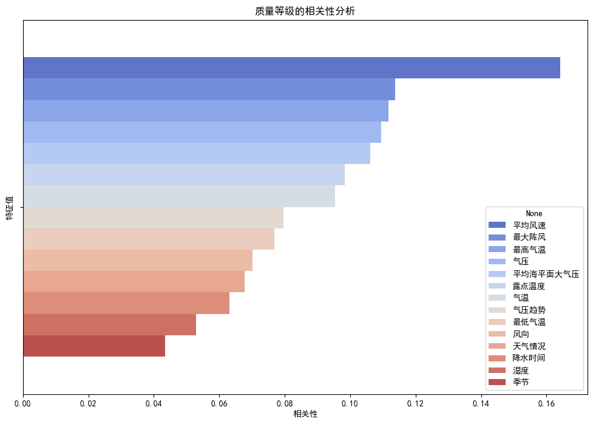
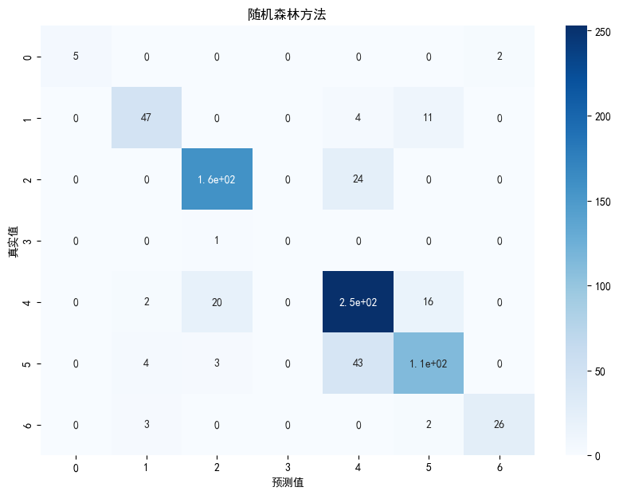
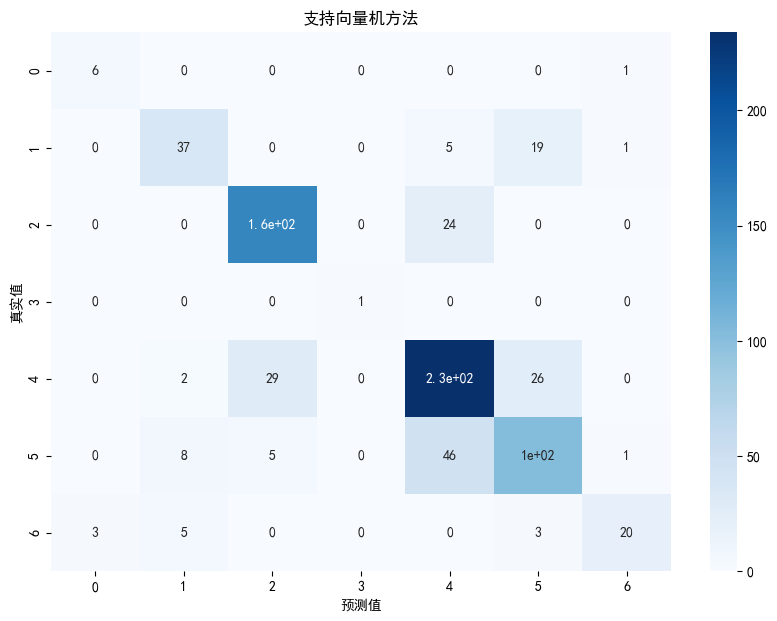

```python
import numpy as np
import pandas as pd
import matplotlib.pyplot as plt   ##绘图库

plt.rcParams['font.sans-serif'] = ['SimHei']  # 指定默认字体为新宋体。
plt.rcParams['axes.unicode_minus'] = False  # 解决保存图像时'-'显示为方块的问题。

from sklearn.model_selection import train_test_split   ## 划分

import torch

from sklearn.model_selection import train_test_split   #训练集测试集划分
from sklearn.ensemble import RandomForestClassifier    #随机森林相关库
from sklearn.metrics import accuracy_score, recall_score, precision_score, f1_score        #模型精度评分
from sklearn.metrics import confusion_matrix           #混淆矩阵表
from sklearn import svm  #支持向量机

# 检查是否有可用的 GPU
if torch.cuda.is_available():
    device = torch.device("cuda")  # 使用GPU
    print("Using GPU:", torch.cuda.get_device_name(0))
else:
    device = torch.device("cpu")  # 使用 CPU
    print("Using CPU")

```

    Using GPU: NVIDIA GeForce MX450
    


```python
# 加载 csv文件
merged_data = pd.read_csv('merged_data.csv')

data = merged_data.drop(['AQI','PM2.5','PM10','NO2','CO','SO2','O3_8h'],axis=1)
# 检查结果
data
```


<div>
<style scoped>
    .dataframe tbody tr th:only-of-type {
        vertical-align: middle;
    }

    .dataframe tbody tr th {
        vertical-align: top;
    }

    .dataframe thead th {
        text-align: right;
    }
</style>
<table border="1" class="dataframe">
  <thead>
    <tr style="text-align: right;">
      <th></th>
      <th>日期</th>
      <th>气温</th>
      <th>气压</th>
      <th>平均海平面大气压</th>
      <th>气压趋势</th>
      <th>湿度</th>
      <th>风向</th>
      <th>平均风速</th>
      <th>最大阵风</th>
      <th>天气情况</th>
      <th>最低气温</th>
      <th>最高气温</th>
      <th>露点温度</th>
      <th>降水时间</th>
      <th>季节</th>
      <th>质量等级</th>
    </tr>
  </thead>
  <tbody>
    <tr>
      <th>0</th>
      <td>2013-12-02</td>
      <td>3.162</td>
      <td>759.712</td>
      <td>764.462</td>
      <td>-0.013</td>
      <td>45.875</td>
      <td>7.375</td>
      <td>1.375</td>
      <td>7.177</td>
      <td>5.500</td>
      <td>6.896</td>
      <td>18.301</td>
      <td>-8.588</td>
      <td>10.717</td>
      <td>冬</td>
      <td>轻度污染</td>
    </tr>
    <tr>
      <th>1</th>
      <td>2013-12-03</td>
      <td>5.488</td>
      <td>761.725</td>
      <td>766.425</td>
      <td>0.100</td>
      <td>39.000</td>
      <td>8.000</td>
      <td>1.625</td>
      <td>7.177</td>
      <td>4.750</td>
      <td>7.209</td>
      <td>18.314</td>
      <td>-8.900</td>
      <td>10.717</td>
      <td>冬</td>
      <td>良</td>
    </tr>
    <tr>
      <th>2</th>
      <td>2013-12-04</td>
      <td>5.250</td>
      <td>760.300</td>
      <td>764.988</td>
      <td>-0.138</td>
      <td>45.375</td>
      <td>9.375</td>
      <td>1.250</td>
      <td>7.177</td>
      <td>1.750</td>
      <td>7.134</td>
      <td>18.714</td>
      <td>-6.675</td>
      <td>10.717</td>
      <td>冬</td>
      <td>轻度污染</td>
    </tr>
    <tr>
      <th>3</th>
      <td>2013-12-05</td>
      <td>6.150</td>
      <td>763.275</td>
      <td>767.975</td>
      <td>0.250</td>
      <td>30.000</td>
      <td>6.875</td>
      <td>2.250</td>
      <td>7.177</td>
      <td>3.875</td>
      <td>7.759</td>
      <td>18.551</td>
      <td>-10.912</td>
      <td>10.717</td>
      <td>冬</td>
      <td>良</td>
    </tr>
    <tr>
      <th>4</th>
      <td>2013-12-06</td>
      <td>2.925</td>
      <td>760.325</td>
      <td>765.075</td>
      <td>-0.275</td>
      <td>52.750</td>
      <td>4.875</td>
      <td>1.250</td>
      <td>7.177</td>
      <td>1.000</td>
      <td>7.121</td>
      <td>18.239</td>
      <td>-6.350</td>
      <td>10.717</td>
      <td>冬</td>
      <td>中度污染</td>
    </tr>
    <tr>
      <th>...</th>
      <td>...</td>
      <td>...</td>
      <td>...</td>
      <td>...</td>
      <td>...</td>
      <td>...</td>
      <td>...</td>
      <td>...</td>
      <td>...</td>
      <td>...</td>
      <td>...</td>
      <td>...</td>
      <td>...</td>
      <td>...</td>
      <td>...</td>
      <td>...</td>
    </tr>
    <tr>
      <th>3676</th>
      <td>2023-12-26</td>
      <td>-2.050</td>
      <td>770.638</td>
      <td>773.938</td>
      <td>0.925</td>
      <td>54.125</td>
      <td>8.250</td>
      <td>1.500</td>
      <td>7.147</td>
      <td>0.500</td>
      <td>-9.475</td>
      <td>2.588</td>
      <td>-10.862</td>
      <td>12.000</td>
      <td>冬</td>
      <td>良</td>
    </tr>
    <tr>
      <th>3677</th>
      <td>2023-12-27</td>
      <td>-3.888</td>
      <td>771.538</td>
      <td>774.850</td>
      <td>-0.538</td>
      <td>67.750</td>
      <td>7.250</td>
      <td>1.125</td>
      <td>4.250</td>
      <td>0.000</td>
      <td>-8.900</td>
      <td>5.348</td>
      <td>-9.450</td>
      <td>12.000</td>
      <td>冬</td>
      <td>良</td>
    </tr>
    <tr>
      <th>3678</th>
      <td>2023-12-28</td>
      <td>-3.012</td>
      <td>769.138</td>
      <td>772.438</td>
      <td>-0.038</td>
      <td>69.875</td>
      <td>6.625</td>
      <td>1.000</td>
      <td>3.750</td>
      <td>0.375</td>
      <td>-9.100</td>
      <td>3.750</td>
      <td>-8.288</td>
      <td>12.000</td>
      <td>冬</td>
      <td>轻度污染</td>
    </tr>
    <tr>
      <th>3679</th>
      <td>2023-12-29</td>
      <td>-2.800</td>
      <td>765.112</td>
      <td>768.400</td>
      <td>-0.938</td>
      <td>78.125</td>
      <td>5.625</td>
      <td>1.125</td>
      <td>4.147</td>
      <td>2.000</td>
      <td>-6.302</td>
      <td>3.975</td>
      <td>-6.300</td>
      <td>12.000</td>
      <td>冬</td>
      <td>轻度污染</td>
    </tr>
    <tr>
      <th>3680</th>
      <td>2023-12-30</td>
      <td>-1.238</td>
      <td>760.250</td>
      <td>763.512</td>
      <td>0.225</td>
      <td>75.125</td>
      <td>2.625</td>
      <td>1.125</td>
      <td>3.875</td>
      <td>2.000</td>
      <td>-6.562</td>
      <td>2.950</td>
      <td>-5.625</td>
      <td>12.000</td>
      <td>冬</td>
      <td>优</td>
    </tr>
  </tbody>
</table>
<p>3681 rows × 16 columns</p>
</div>


```python
import matplotlib.pyplot as plt
import seaborn as sns
from sklearn.preprocessing import LabelEncoder

# 初始化标签编码器
le = LabelEncoder()

# 对质量等级进行编码
data['质量等级'] = le.fit_transform(data['质量等级'])
data['季节'] = le.fit_transform(data['季节'])

# 选择特定的特征列
selected_features = ['气温', '气压', '平均海平面大气压', '气压趋势', '湿度', '风向', '平均风速', '最大阵风', '天气情况', '最低气温', '最高气温', '露点温度', '降水时间', '季节', '质量等级']

# 计算选定特征列的相关性
correlation = data[selected_features].corr()['质量等级']

correlation = correlation.abs()

# 按照绝对值降序排序
correlation = correlation.reindex(correlation.abs().sort_values(ascending=False).index)

# 创建一个条形图
plt.figure(figsize=(12, 8))
sns.barplot(x=correlation[1:], hue = correlation.index[1:], legend = 'auto', palette='coolwarm')

# 添加标题和标签
plt.title('质量等级的相关性分析')
plt.xlabel('相关性')
plt.ylabel('特征值')

# 显示图表
plt.show()

print(correlation)
```


    

    


    质量等级        1.000000
    平均风速        0.164287
    最大阵风        0.113761
    最高气温        0.111750
    气压          0.109454
    平均海平面大气压    0.106138
    露点温度        0.098350
    气温          0.095311
    气压趋势        0.079601
    最低气温        0.076747
    风向          0.070087
    天气情况        0.067813
    降水时间        0.063081
    湿度          0.052930
    季节          0.043512
    Name: 质量等级, dtype: float64
    

划分训练集，尽可能地减少对难预测的空气污染物成分的依赖


```python
# 将data的值复制到df当中
df = merged_data


# 执行独热编码转换类别字段
df = pd.get_dummies(df, columns=['季节'])


# 预测前，将数据集划分为训练集和验证集，尽可能地减少对难预测的空气污染物成分的依赖
X = df.drop(columns=['质量等级','日期','AQI','O3_8h','NO2','SO2'])
y = df['质量等级']
X_train, X_test, y_train, y_test = train_test_split(X, y, test_size=0.2, random_state=42)


```

使用随机森林的默认状态进行调试

随机森林参数调优


```python

# 使用随机森林分类器进行训练
# classifier = RandomForestClassifier(n_estimators=120, random_state=42)
## 参数调优 
classifier = RandomForestClassifier(n_estimators=50, 
                                    min_samples_leaf=5, 
                                    min_samples_split=10, 
                                    random_state=42)

classifier.fit(X_train, y_train)

# 进行预测并检查准确率
predictions = classifier.predict(X_test)
accuracy = accuracy_score(y_test, predictions)
print("预测的准确率是：", accuracy)
# 概率
predicted_proba = classifier.predict_proba(X_test)

# 计算混淆矩阵并创建热力图
cm = confusion_matrix(y_test, predictions)
plt.figure(figsize=(10, 7))
sns.heatmap(cm, annot = True, cmap = 'Blues')
plt.title('随机森林方法')
plt.xlabel('预测值')
plt.ylabel('真实值')


# 训练集上的预测
train_predictions = classifier.predict(X_train)
# 计算准确率、召回率、精确率 和 F1分数
accuracy_train = classifier.score(X_train, y_train)
recall_train = recall_score(y_train, train_predictions, average='weighted')
precision_train = precision_score(y_train, train_predictions, average='weighted',zero_division=1)
f1_train = f1_score(y_train, train_predictions, average='weighted')
accuracy_test = accuracy
recall_test = recall_score(y_test, predictions, average='weighted')
precision_test = precision_score(y_test, predictions, average='weighted',zero_division=1)
f1_test = f1_score(y_test, predictions, average='weighted')
# 创建 DataFrame
performance = pd.DataFrame({
    '准确率': [accuracy_train, accuracy_test],
    '召回率': [recall_train, recall_test],
    '精确率': [precision_train, precision_test],
    'F1': [f1_train, f1_test]
}, index = ['训练集', '测试集'])
# 显示 performance
performance_styler = performance.style.set_properties(**{'text-align': 'center'})
display(performance_styler)
# 构建预测结果对照表
results = pd.DataFrame({
    '真实值': y_test,
    '预测值': predictions
})

# 获得类别列表，按照模型内部的顺序
class_list = classifier.classes_

# 将预测的概率与其对应的类别关联起来
for i, quality_level in enumerate(class_list):
    results[f'{quality_level}预测概率'] = predicted_proba[:, i]

# 使用 .head() 方法获取前20条数据
results_head = results.head(20)

# 设置数据显示为居中格式
results_styler = results_head.style.set_properties(**{'text-align': 'center'})

# 显示居中对齐的前100条数据
display(results_styler)


```

    预测的准确率是： 0.8168249660786974
    


<style type="text/css">
#T_5c29b_row0_col0, #T_5c29b_row0_col1, #T_5c29b_row0_col2, #T_5c29b_row0_col3, #T_5c29b_row1_col0, #T_5c29b_row1_col1, #T_5c29b_row1_col2, #T_5c29b_row1_col3 {
  text-align: center;
}
</style>
<table id="T_5c29b">
  <thead>
    <tr>
      <th class="blank level0" >&nbsp;</th>
      <th id="T_5c29b_level0_col0" class="col_heading level0 col0" >准确率</th>
      <th id="T_5c29b_level0_col1" class="col_heading level0 col1" >召回率</th>
      <th id="T_5c29b_level0_col2" class="col_heading level0 col2" >精确率</th>
      <th id="T_5c29b_level0_col3" class="col_heading level0 col3" >F1</th>
    </tr>
  </thead>
  <tbody>
    <tr>
      <th id="T_5c29b_level0_row0" class="row_heading level0 row0" >训练集</th>
      <td id="T_5c29b_row0_col0" class="data row0 col0" >0.920177</td>
      <td id="T_5c29b_row0_col1" class="data row0 col1" >0.920177</td>
      <td id="T_5c29b_row0_col2" class="data row0 col2" >0.921693</td>
      <td id="T_5c29b_row0_col3" class="data row0 col3" >0.918641</td>
    </tr>
    <tr>
      <th id="T_5c29b_level0_row1" class="row_heading level0 row1" >测试集</th>
      <td id="T_5c29b_row1_col0" class="data row1 col0" >0.816825</td>
      <td id="T_5c29b_row1_col1" class="data row1 col1" >0.816825</td>
      <td id="T_5c29b_row1_col2" class="data row1 col2" >0.819219</td>
      <td id="T_5c29b_row1_col3" class="data row1 col3" >0.815129</td>
    </tr>
  </tbody>
</table>


<style type="text/css">
#T_93ae6_row0_col0, #T_93ae6_row0_col1, #T_93ae6_row0_col2, #T_93ae6_row0_col3, #T_93ae6_row0_col4, #T_93ae6_row0_col5, #T_93ae6_row0_col6, #T_93ae6_row0_col7, #T_93ae6_row0_col8, #T_93ae6_row1_col0, #T_93ae6_row1_col1, #T_93ae6_row1_col2, #T_93ae6_row1_col3, #T_93ae6_row1_col4, #T_93ae6_row1_col5, #T_93ae6_row1_col6, #T_93ae6_row1_col7, #T_93ae6_row1_col8, #T_93ae6_row2_col0, #T_93ae6_row2_col1, #T_93ae6_row2_col2, #T_93ae6_row2_col3, #T_93ae6_row2_col4, #T_93ae6_row2_col5, #T_93ae6_row2_col6, #T_93ae6_row2_col7, #T_93ae6_row2_col8, #T_93ae6_row3_col0, #T_93ae6_row3_col1, #T_93ae6_row3_col2, #T_93ae6_row3_col3, #T_93ae6_row3_col4, #T_93ae6_row3_col5, #T_93ae6_row3_col6, #T_93ae6_row3_col7, #T_93ae6_row3_col8, #T_93ae6_row4_col0, #T_93ae6_row4_col1, #T_93ae6_row4_col2, #T_93ae6_row4_col3, #T_93ae6_row4_col4, #T_93ae6_row4_col5, #T_93ae6_row4_col6, #T_93ae6_row4_col7, #T_93ae6_row4_col8, #T_93ae6_row5_col0, #T_93ae6_row5_col1, #T_93ae6_row5_col2, #T_93ae6_row5_col3, #T_93ae6_row5_col4, #T_93ae6_row5_col5, #T_93ae6_row5_col6, #T_93ae6_row5_col7, #T_93ae6_row5_col8, #T_93ae6_row6_col0, #T_93ae6_row6_col1, #T_93ae6_row6_col2, #T_93ae6_row6_col3, #T_93ae6_row6_col4, #T_93ae6_row6_col5, #T_93ae6_row6_col6, #T_93ae6_row6_col7, #T_93ae6_row6_col8, #T_93ae6_row7_col0, #T_93ae6_row7_col1, #T_93ae6_row7_col2, #T_93ae6_row7_col3, #T_93ae6_row7_col4, #T_93ae6_row7_col5, #T_93ae6_row7_col6, #T_93ae6_row7_col7, #T_93ae6_row7_col8, #T_93ae6_row8_col0, #T_93ae6_row8_col1, #T_93ae6_row8_col2, #T_93ae6_row8_col3, #T_93ae6_row8_col4, #T_93ae6_row8_col5, #T_93ae6_row8_col6, #T_93ae6_row8_col7, #T_93ae6_row8_col8, #T_93ae6_row9_col0, #T_93ae6_row9_col1, #T_93ae6_row9_col2, #T_93ae6_row9_col3, #T_93ae6_row9_col4, #T_93ae6_row9_col5, #T_93ae6_row9_col6, #T_93ae6_row9_col7, #T_93ae6_row9_col8, #T_93ae6_row10_col0, #T_93ae6_row10_col1, #T_93ae6_row10_col2, #T_93ae6_row10_col3, #T_93ae6_row10_col4, #T_93ae6_row10_col5, #T_93ae6_row10_col6, #T_93ae6_row10_col7, #T_93ae6_row10_col8, #T_93ae6_row11_col0, #T_93ae6_row11_col1, #T_93ae6_row11_col2, #T_93ae6_row11_col3, #T_93ae6_row11_col4, #T_93ae6_row11_col5, #T_93ae6_row11_col6, #T_93ae6_row11_col7, #T_93ae6_row11_col8, #T_93ae6_row12_col0, #T_93ae6_row12_col1, #T_93ae6_row12_col2, #T_93ae6_row12_col3, #T_93ae6_row12_col4, #T_93ae6_row12_col5, #T_93ae6_row12_col6, #T_93ae6_row12_col7, #T_93ae6_row12_col8, #T_93ae6_row13_col0, #T_93ae6_row13_col1, #T_93ae6_row13_col2, #T_93ae6_row13_col3, #T_93ae6_row13_col4, #T_93ae6_row13_col5, #T_93ae6_row13_col6, #T_93ae6_row13_col7, #T_93ae6_row13_col8, #T_93ae6_row14_col0, #T_93ae6_row14_col1, #T_93ae6_row14_col2, #T_93ae6_row14_col3, #T_93ae6_row14_col4, #T_93ae6_row14_col5, #T_93ae6_row14_col6, #T_93ae6_row14_col7, #T_93ae6_row14_col8, #T_93ae6_row15_col0, #T_93ae6_row15_col1, #T_93ae6_row15_col2, #T_93ae6_row15_col3, #T_93ae6_row15_col4, #T_93ae6_row15_col5, #T_93ae6_row15_col6, #T_93ae6_row15_col7, #T_93ae6_row15_col8, #T_93ae6_row16_col0, #T_93ae6_row16_col1, #T_93ae6_row16_col2, #T_93ae6_row16_col3, #T_93ae6_row16_col4, #T_93ae6_row16_col5, #T_93ae6_row16_col6, #T_93ae6_row16_col7, #T_93ae6_row16_col8, #T_93ae6_row17_col0, #T_93ae6_row17_col1, #T_93ae6_row17_col2, #T_93ae6_row17_col3, #T_93ae6_row17_col4, #T_93ae6_row17_col5, #T_93ae6_row17_col6, #T_93ae6_row17_col7, #T_93ae6_row17_col8, #T_93ae6_row18_col0, #T_93ae6_row18_col1, #T_93ae6_row18_col2, #T_93ae6_row18_col3, #T_93ae6_row18_col4, #T_93ae6_row18_col5, #T_93ae6_row18_col6, #T_93ae6_row18_col7, #T_93ae6_row18_col8, #T_93ae6_row19_col0, #T_93ae6_row19_col1, #T_93ae6_row19_col2, #T_93ae6_row19_col3, #T_93ae6_row19_col4, #T_93ae6_row19_col5, #T_93ae6_row19_col6, #T_93ae6_row19_col7, #T_93ae6_row19_col8 {
  text-align: center;
}
</style>
<table id="T_93ae6">
  <thead>
    <tr>
      <th class="blank level0" >&nbsp;</th>
      <th id="T_93ae6_level0_col0" class="col_heading level0 col0" >真实值</th>
      <th id="T_93ae6_level0_col1" class="col_heading level0 col1" >预测值</th>
      <th id="T_93ae6_level0_col2" class="col_heading level0 col2" >严重污染预测概率</th>
      <th id="T_93ae6_level0_col3" class="col_heading level0 col3" >中度污染预测概率</th>
      <th id="T_93ae6_level0_col4" class="col_heading level0 col4" >优预测概率</th>
      <th id="T_93ae6_level0_col5" class="col_heading level0 col5" >无预测概率</th>
      <th id="T_93ae6_level0_col6" class="col_heading level0 col6" >良预测概率</th>
      <th id="T_93ae6_level0_col7" class="col_heading level0 col7" >轻度污染预测概率</th>
      <th id="T_93ae6_level0_col8" class="col_heading level0 col8" >重度污染预测概率</th>
    </tr>
  </thead>
  <tbody>
    <tr>
      <th id="T_93ae6_level0_row0" class="row_heading level0 row0" >1097</th>
      <td id="T_93ae6_row0_col0" class="data row0 col0" >严重污染</td>
      <td id="T_93ae6_row0_col1" class="data row0 col1" >重度污染</td>
      <td id="T_93ae6_row0_col2" class="data row0 col2" >0.242753</td>
      <td id="T_93ae6_row0_col3" class="data row0 col3" >0.028671</td>
      <td id="T_93ae6_row0_col4" class="data row0 col4" >0.000000</td>
      <td id="T_93ae6_row0_col5" class="data row0 col5" >0.000000</td>
      <td id="T_93ae6_row0_col6" class="data row0 col6" >0.007273</td>
      <td id="T_93ae6_row0_col7" class="data row0 col7" >0.003818</td>
      <td id="T_93ae6_row0_col8" class="data row0 col8" >0.717485</td>
    </tr>
    <tr>
      <th id="T_93ae6_level0_row1" class="row_heading level0 row1" >2784</th>
      <td id="T_93ae6_row1_col0" class="data row1 col0" >优</td>
      <td id="T_93ae6_row1_col1" class="data row1 col1" >优</td>
      <td id="T_93ae6_row1_col2" class="data row1 col2" >0.002857</td>
      <td id="T_93ae6_row1_col3" class="data row1 col3" >0.003500</td>
      <td id="T_93ae6_row1_col4" class="data row1 col4" >0.580033</td>
      <td id="T_93ae6_row1_col5" class="data row1 col5" >0.000000</td>
      <td id="T_93ae6_row1_col6" class="data row1 col6" >0.355595</td>
      <td id="T_93ae6_row1_col7" class="data row1 col7" >0.058015</td>
      <td id="T_93ae6_row1_col8" class="data row1 col8" >0.000000</td>
    </tr>
    <tr>
      <th id="T_93ae6_level0_row2" class="row_heading level0 row2" >2440</th>
      <td id="T_93ae6_row2_col0" class="data row2 col0" >良</td>
      <td id="T_93ae6_row2_col1" class="data row2 col1" >良</td>
      <td id="T_93ae6_row2_col2" class="data row2 col2" >0.000000</td>
      <td id="T_93ae6_row2_col3" class="data row2 col3" >0.035993</td>
      <td id="T_93ae6_row2_col4" class="data row2 col4" >0.159627</td>
      <td id="T_93ae6_row2_col5" class="data row2 col5" >0.002500</td>
      <td id="T_93ae6_row2_col6" class="data row2 col6" >0.588910</td>
      <td id="T_93ae6_row2_col7" class="data row2 col7" >0.212970</td>
      <td id="T_93ae6_row2_col8" class="data row2 col8" >0.000000</td>
    </tr>
    <tr>
      <th id="T_93ae6_level0_row3" class="row_heading level0 row3" >1694</th>
      <td id="T_93ae6_row3_col0" class="data row3 col0" >优</td>
      <td id="T_93ae6_row3_col1" class="data row3 col1" >优</td>
      <td id="T_93ae6_row3_col2" class="data row3 col2" >0.001538</td>
      <td id="T_93ae6_row3_col3" class="data row3 col3" >0.008901</td>
      <td id="T_93ae6_row3_col4" class="data row3 col4" >0.475104</td>
      <td id="T_93ae6_row3_col5" class="data row3 col5" >0.000000</td>
      <td id="T_93ae6_row3_col6" class="data row3 col6" >0.389171</td>
      <td id="T_93ae6_row3_col7" class="data row3 col7" >0.119131</td>
      <td id="T_93ae6_row3_col8" class="data row3 col8" >0.006154</td>
    </tr>
    <tr>
      <th id="T_93ae6_level0_row4" class="row_heading level0 row4" >2494</th>
      <td id="T_93ae6_row4_col0" class="data row4 col0" >良</td>
      <td id="T_93ae6_row4_col1" class="data row4 col1" >良</td>
      <td id="T_93ae6_row4_col2" class="data row4 col2" >0.000000</td>
      <td id="T_93ae6_row4_col3" class="data row4 col3" >0.000000</td>
      <td id="T_93ae6_row4_col4" class="data row4 col4" >0.163351</td>
      <td id="T_93ae6_row4_col5" class="data row4 col5" >0.002500</td>
      <td id="T_93ae6_row4_col6" class="data row4 col6" >0.757525</td>
      <td id="T_93ae6_row4_col7" class="data row4 col7" >0.076624</td>
      <td id="T_93ae6_row4_col8" class="data row4 col8" >0.000000</td>
    </tr>
    <tr>
      <th id="T_93ae6_level0_row5" class="row_heading level0 row5" >2270</th>
      <td id="T_93ae6_row5_col0" class="data row5 col0" >轻度污染</td>
      <td id="T_93ae6_row5_col1" class="data row5 col1" >轻度污染</td>
      <td id="T_93ae6_row5_col2" class="data row5 col2" >0.000000</td>
      <td id="T_93ae6_row5_col3" class="data row5 col3" >0.168943</td>
      <td id="T_93ae6_row5_col4" class="data row5 col4" >0.012083</td>
      <td id="T_93ae6_row5_col5" class="data row5 col5" >0.000000</td>
      <td id="T_93ae6_row5_col6" class="data row5 col6" >0.035368</td>
      <td id="T_93ae6_row5_col7" class="data row5 col7" >0.750467</td>
      <td id="T_93ae6_row5_col8" class="data row5 col8" >0.033139</td>
    </tr>
    <tr>
      <th id="T_93ae6_level0_row6" class="row_heading level0 row6" >3477</th>
      <td id="T_93ae6_row6_col0" class="data row6 col0" >良</td>
      <td id="T_93ae6_row6_col1" class="data row6 col1" >良</td>
      <td id="T_93ae6_row6_col2" class="data row6 col2" >0.000000</td>
      <td id="T_93ae6_row6_col3" class="data row6 col3" >0.008205</td>
      <td id="T_93ae6_row6_col4" class="data row6 col4" >0.188131</td>
      <td id="T_93ae6_row6_col5" class="data row6 col5" >0.001250</td>
      <td id="T_93ae6_row6_col6" class="data row6 col6" >0.676005</td>
      <td id="T_93ae6_row6_col7" class="data row6 col7" >0.125076</td>
      <td id="T_93ae6_row6_col8" class="data row6 col8" >0.001333</td>
    </tr>
    <tr>
      <th id="T_93ae6_level0_row7" class="row_heading level0 row7" >937</th>
      <td id="T_93ae6_row7_col0" class="data row7 col0" >良</td>
      <td id="T_93ae6_row7_col1" class="data row7 col1" >中度污染</td>
      <td id="T_93ae6_row7_col2" class="data row7 col2" >0.000000</td>
      <td id="T_93ae6_row7_col3" class="data row7 col3" >0.530691</td>
      <td id="T_93ae6_row7_col4" class="data row7 col4" >0.000000</td>
      <td id="T_93ae6_row7_col5" class="data row7 col5" >0.000000</td>
      <td id="T_93ae6_row7_col6" class="data row7 col6" >0.141202</td>
      <td id="T_93ae6_row7_col7" class="data row7 col7" >0.304054</td>
      <td id="T_93ae6_row7_col8" class="data row7 col8" >0.024053</td>
    </tr>
    <tr>
      <th id="T_93ae6_level0_row8" class="row_heading level0 row8" >495</th>
      <td id="T_93ae6_row8_col0" class="data row8 col0" >中度污染</td>
      <td id="T_93ae6_row8_col1" class="data row8 col1" >中度污染</td>
      <td id="T_93ae6_row8_col2" class="data row8 col2" >0.064650</td>
      <td id="T_93ae6_row8_col3" class="data row8 col3" >0.449891</td>
      <td id="T_93ae6_row8_col4" class="data row8 col4" >0.012000</td>
      <td id="T_93ae6_row8_col5" class="data row8 col5" >0.000000</td>
      <td id="T_93ae6_row8_col6" class="data row8 col6" >0.082585</td>
      <td id="T_93ae6_row8_col7" class="data row8 col7" >0.196608</td>
      <td id="T_93ae6_row8_col8" class="data row8 col8" >0.194265</td>
    </tr>
    <tr>
      <th id="T_93ae6_level0_row9" class="row_heading level0 row9" >798</th>
      <td id="T_93ae6_row9_col0" class="data row9 col0" >重度污染</td>
      <td id="T_93ae6_row9_col1" class="data row9 col1" >重度污染</td>
      <td id="T_93ae6_row9_col2" class="data row9 col2" >0.120026</td>
      <td id="T_93ae6_row9_col3" class="data row9 col3" >0.219474</td>
      <td id="T_93ae6_row9_col4" class="data row9 col4" >0.015000</td>
      <td id="T_93ae6_row9_col5" class="data row9 col5" >0.000000</td>
      <td id="T_93ae6_row9_col6" class="data row9 col6" >0.092429</td>
      <td id="T_93ae6_row9_col7" class="data row9 col7" >0.229477</td>
      <td id="T_93ae6_row9_col8" class="data row9 col8" >0.323595</td>
    </tr>
    <tr>
      <th id="T_93ae6_level0_row10" class="row_heading level0 row10" >3375</th>
      <td id="T_93ae6_row10_col0" class="data row10 col0" >优</td>
      <td id="T_93ae6_row10_col1" class="data row10 col1" >优</td>
      <td id="T_93ae6_row10_col2" class="data row10 col2" >0.001667</td>
      <td id="T_93ae6_row10_col3" class="data row10 col3" >0.000000</td>
      <td id="T_93ae6_row10_col4" class="data row10 col4" >0.980167</td>
      <td id="T_93ae6_row10_col5" class="data row10 col5" >0.000000</td>
      <td id="T_93ae6_row10_col6" class="data row10 col6" >0.016500</td>
      <td id="T_93ae6_row10_col7" class="data row10 col7" >0.001667</td>
      <td id="T_93ae6_row10_col8" class="data row10 col8" >0.000000</td>
    </tr>
    <tr>
      <th id="T_93ae6_level0_row11" class="row_heading level0 row11" >1747</th>
      <td id="T_93ae6_row11_col0" class="data row11 col0" >优</td>
      <td id="T_93ae6_row11_col1" class="data row11 col1" >优</td>
      <td id="T_93ae6_row11_col2" class="data row11 col2" >0.006000</td>
      <td id="T_93ae6_row11_col3" class="data row11 col3" >0.000000</td>
      <td id="T_93ae6_row11_col4" class="data row11 col4" >0.726175</td>
      <td id="T_93ae6_row11_col5" class="data row11 col5" >0.005778</td>
      <td id="T_93ae6_row11_col6" class="data row11 col6" >0.256968</td>
      <td id="T_93ae6_row11_col7" class="data row11 col7" >0.005079</td>
      <td id="T_93ae6_row11_col8" class="data row11 col8" >0.000000</td>
    </tr>
    <tr>
      <th id="T_93ae6_level0_row12" class="row_heading level0 row12" >1487</th>
      <td id="T_93ae6_row12_col0" class="data row12 col0" >重度污染</td>
      <td id="T_93ae6_row12_col1" class="data row12 col1" >重度污染</td>
      <td id="T_93ae6_row12_col2" class="data row12 col2" >0.151462</td>
      <td id="T_93ae6_row12_col3" class="data row12 col3" >0.156333</td>
      <td id="T_93ae6_row12_col4" class="data row12 col4" >0.000000</td>
      <td id="T_93ae6_row12_col5" class="data row12 col5" >0.000000</td>
      <td id="T_93ae6_row12_col6" class="data row12 col6" >0.003333</td>
      <td id="T_93ae6_row12_col7" class="data row12 col7" >0.012222</td>
      <td id="T_93ae6_row12_col8" class="data row12 col8" >0.676650</td>
    </tr>
    <tr>
      <th id="T_93ae6_level0_row13" class="row_heading level0 row13" >969</th>
      <td id="T_93ae6_row13_col0" class="data row13 col0" >中度污染</td>
      <td id="T_93ae6_row13_col1" class="data row13 col1" >中度污染</td>
      <td id="T_93ae6_row13_col2" class="data row13 col2" >0.005934</td>
      <td id="T_93ae6_row13_col3" class="data row13 col3" >0.564135</td>
      <td id="T_93ae6_row13_col4" class="data row13 col4" >0.003205</td>
      <td id="T_93ae6_row13_col5" class="data row13 col5" >0.000000</td>
      <td id="T_93ae6_row13_col6" class="data row13 col6" >0.034687</td>
      <td id="T_93ae6_row13_col7" class="data row13 col7" >0.221312</td>
      <td id="T_93ae6_row13_col8" class="data row13 col8" >0.170726</td>
    </tr>
    <tr>
      <th id="T_93ae6_level0_row14" class="row_heading level0 row14" >2883</th>
      <td id="T_93ae6_row14_col0" class="data row14 col0" >中度污染</td>
      <td id="T_93ae6_row14_col1" class="data row14 col1" >中度污染</td>
      <td id="T_93ae6_row14_col2" class="data row14 col2" >0.016024</td>
      <td id="T_93ae6_row14_col3" class="data row14 col3" >0.445166</td>
      <td id="T_93ae6_row14_col4" class="data row14 col4" >0.000000</td>
      <td id="T_93ae6_row14_col5" class="data row14 col5" >0.000000</td>
      <td id="T_93ae6_row14_col6" class="data row14 col6" >0.099437</td>
      <td id="T_93ae6_row14_col7" class="data row14 col7" >0.374235</td>
      <td id="T_93ae6_row14_col8" class="data row14 col8" >0.065138</td>
    </tr>
    <tr>
      <th id="T_93ae6_level0_row15" class="row_heading level0 row15" >655</th>
      <td id="T_93ae6_row15_col0" class="data row15 col0" >轻度污染</td>
      <td id="T_93ae6_row15_col1" class="data row15 col1" >轻度污染</td>
      <td id="T_93ae6_row15_col2" class="data row15 col2" >0.000000</td>
      <td id="T_93ae6_row15_col3" class="data row15 col3" >0.108666</td>
      <td id="T_93ae6_row15_col4" class="data row15 col4" >0.000000</td>
      <td id="T_93ae6_row15_col5" class="data row15 col5" >0.000000</td>
      <td id="T_93ae6_row15_col6" class="data row15 col6" >0.220001</td>
      <td id="T_93ae6_row15_col7" class="data row15 col7" >0.654238</td>
      <td id="T_93ae6_row15_col8" class="data row15 col8" >0.017095</td>
    </tr>
    <tr>
      <th id="T_93ae6_level0_row16" class="row_heading level0 row16" >229</th>
      <td id="T_93ae6_row16_col0" class="data row16 col0" >轻度污染</td>
      <td id="T_93ae6_row16_col1" class="data row16 col1" >轻度污染</td>
      <td id="T_93ae6_row16_col2" class="data row16 col2" >0.001538</td>
      <td id="T_93ae6_row16_col3" class="data row16 col3" >0.299135</td>
      <td id="T_93ae6_row16_col4" class="data row16 col4" >0.002857</td>
      <td id="T_93ae6_row16_col5" class="data row16 col5" >0.000000</td>
      <td id="T_93ae6_row16_col6" class="data row16 col6" >0.083248</td>
      <td id="T_93ae6_row16_col7" class="data row16 col7" >0.609888</td>
      <td id="T_93ae6_row16_col8" class="data row16 col8" >0.003333</td>
    </tr>
    <tr>
      <th id="T_93ae6_level0_row17" class="row_heading level0 row17" >1116</th>
      <td id="T_93ae6_row17_col0" class="data row17 col0" >良</td>
      <td id="T_93ae6_row17_col1" class="data row17 col1" >良</td>
      <td id="T_93ae6_row17_col2" class="data row17 col2" >0.000000</td>
      <td id="T_93ae6_row17_col3" class="data row17 col3" >0.013553</td>
      <td id="T_93ae6_row17_col4" class="data row17 col4" >0.084372</td>
      <td id="T_93ae6_row17_col5" class="data row17 col5" >0.000000</td>
      <td id="T_93ae6_row17_col6" class="data row17 col6" >0.880953</td>
      <td id="T_93ae6_row17_col7" class="data row17 col7" >0.016122</td>
      <td id="T_93ae6_row17_col8" class="data row17 col8" >0.005000</td>
    </tr>
    <tr>
      <th id="T_93ae6_level0_row18" class="row_heading level0 row18" >840</th>
      <td id="T_93ae6_row18_col0" class="data row18 col0" >中度污染</td>
      <td id="T_93ae6_row18_col1" class="data row18 col1" >中度污染</td>
      <td id="T_93ae6_row18_col2" class="data row18 col2" >0.020206</td>
      <td id="T_93ae6_row18_col3" class="data row18 col3" >0.757988</td>
      <td id="T_93ae6_row18_col4" class="data row18 col4" >0.000000</td>
      <td id="T_93ae6_row18_col5" class="data row18 col5" >0.000000</td>
      <td id="T_93ae6_row18_col6" class="data row18 col6" >0.004524</td>
      <td id="T_93ae6_row18_col7" class="data row18 col7" >0.162131</td>
      <td id="T_93ae6_row18_col8" class="data row18 col8" >0.055151</td>
    </tr>
    <tr>
      <th id="T_93ae6_level0_row19" class="row_heading level0 row19" >32</th>
      <td id="T_93ae6_row19_col0" class="data row19 col0" >良</td>
      <td id="T_93ae6_row19_col1" class="data row19 col1" >良</td>
      <td id="T_93ae6_row19_col2" class="data row19 col2" >0.000000</td>
      <td id="T_93ae6_row19_col3" class="data row19 col3" >0.016905</td>
      <td id="T_93ae6_row19_col4" class="data row19 col4" >0.008667</td>
      <td id="T_93ae6_row19_col5" class="data row19 col5" >0.000000</td>
      <td id="T_93ae6_row19_col6" class="data row19 col6" >0.895619</td>
      <td id="T_93ae6_row19_col7" class="data row19 col7" >0.078810</td>
      <td id="T_93ae6_row19_col8" class="data row19 col8" >0.000000</td>
    </tr>
  </tbody>
</table>


    

    


支持向量机分类算法


```python

# 使用支持向量机分类器进行训练
# 默认参数
# classifier = svm.SVC(probability=True)
# classifier.fit(X_train, y_train)


# 参数调优
classifier = svm.SVC(probability=True, C=0.8, kernel='linear', gamma=0.01)
classifier.fit(X_train, y_train)

# 执行预测并计算准确度
predictions = classifier.predict(X_test)
accuracy = accuracy_score(y_test, predictions)
print("预测准确率：", accuracy)

# 概率
predicted_proba = classifier.predict_proba(X_test)

# 进行预测并检查准确率
predictions = classifier.predict(X_test)
accuracy = accuracy_score(y_test, predictions)
print("预测的准确率是：", accuracy)
# 概率
predicted_proba = classifier.predict_proba(X_test)

# 计算混淆矩阵并创建热力图
cm = confusion_matrix(y_test, predictions)
plt.figure(figsize=(10, 7))
sns.heatmap(cm, annot = True, cmap = 'Blues')
plt.title('支持向量机方法')
plt.xlabel('预测值')
plt.ylabel('真实值')


# 训练集上的预测
train_predictions = classifier.predict(X_train)
# 计算准确率、召回率、精确率 和 F1分数
accuracy_train = classifier.score(X_train, y_train)
recall_train = recall_score(y_train, train_predictions, average='weighted')
precision_train = precision_score(y_train, train_predictions, average='weighted',zero_division=1)
f1_train = f1_score(y_train, train_predictions, average='weighted')
accuracy_test = accuracy
recall_test = recall_score(y_test, predictions, average='weighted')
precision_test = precision_score(y_test, predictions, average='weighted',zero_division=1)
f1_test = f1_score(y_test, predictions, average='weighted')
# 创建 DataFrame
performance = pd.DataFrame({
    '准确率': [accuracy_train, accuracy_test],
    '召回率': [recall_train, recall_test],
    '精确率': [precision_train, precision_test],
    'F1': [f1_train, f1_test]
}, index = ['训练集', '测试集'])
# 显示 performance
performance_styler = performance.style.set_properties(**{'text-align': 'center'})
display(performance_styler)
# 构建预测结果对照表
results = pd.DataFrame({
    '真实值': y_test,
    '预测值': predictions
})

# 获得类别列表，按照模型内部的顺序
class_list = classifier.classes_

# 将预测的概率与其对应的类别关联起来
for i, quality_level in enumerate(class_list):
    results[f'{quality_level}预测概率'] = predicted_proba[:, i]

# 使用 .head() 方法获取前20条数据
results_head = results.head(20)

# 设置数据显示为居中格式
results_styler = results_head.style.set_properties(**{'text-align': 'center'})

# 显示居中对齐的前100条数据
display(results_styler)


```

    预测准确率： 0.7584803256445047
    预测的准确率是： 0.7584803256445047
    


<style type="text/css">
#T_fc809_row0_col0, #T_fc809_row0_col1, #T_fc809_row0_col2, #T_fc809_row0_col3, #T_fc809_row1_col0, #T_fc809_row1_col1, #T_fc809_row1_col2, #T_fc809_row1_col3 {
  text-align: center;
}
</style>
<table id="T_fc809">
  <thead>
    <tr>
      <th class="blank level0" >&nbsp;</th>
      <th id="T_fc809_level0_col0" class="col_heading level0 col0" >准确率</th>
      <th id="T_fc809_level0_col1" class="col_heading level0 col1" >召回率</th>
      <th id="T_fc809_level0_col2" class="col_heading level0 col2" >精确率</th>
      <th id="T_fc809_level0_col3" class="col_heading level0 col3" >F1</th>
    </tr>
  </thead>
  <tbody>
    <tr>
      <th id="T_fc809_level0_row0" class="row_heading level0 row0" >训练集</th>
      <td id="T_fc809_row0_col0" class="data row0 col0" >0.754416</td>
      <td id="T_fc809_row0_col1" class="data row0 col1" >0.754416</td>
      <td id="T_fc809_row0_col2" class="data row0 col2" >0.753321</td>
      <td id="T_fc809_row0_col3" class="data row0 col3" >0.751580</td>
    </tr>
    <tr>
      <th id="T_fc809_level0_row1" class="row_heading level0 row1" >测试集</th>
      <td id="T_fc809_row1_col0" class="data row1 col0" >0.758480</td>
      <td id="T_fc809_row1_col1" class="data row1 col1" >0.758480</td>
      <td id="T_fc809_row1_col2" class="data row1 col2" >0.757210</td>
      <td id="T_fc809_row1_col3" class="data row1 col3" >0.755971</td>
    </tr>
  </tbody>
</table>


<style type="text/css">
#T_0b4e1_row0_col0, #T_0b4e1_row0_col1, #T_0b4e1_row0_col2, #T_0b4e1_row0_col3, #T_0b4e1_row0_col4, #T_0b4e1_row0_col5, #T_0b4e1_row0_col6, #T_0b4e1_row0_col7, #T_0b4e1_row0_col8, #T_0b4e1_row1_col0, #T_0b4e1_row1_col1, #T_0b4e1_row1_col2, #T_0b4e1_row1_col3, #T_0b4e1_row1_col4, #T_0b4e1_row1_col5, #T_0b4e1_row1_col6, #T_0b4e1_row1_col7, #T_0b4e1_row1_col8, #T_0b4e1_row2_col0, #T_0b4e1_row2_col1, #T_0b4e1_row2_col2, #T_0b4e1_row2_col3, #T_0b4e1_row2_col4, #T_0b4e1_row2_col5, #T_0b4e1_row2_col6, #T_0b4e1_row2_col7, #T_0b4e1_row2_col8, #T_0b4e1_row3_col0, #T_0b4e1_row3_col1, #T_0b4e1_row3_col2, #T_0b4e1_row3_col3, #T_0b4e1_row3_col4, #T_0b4e1_row3_col5, #T_0b4e1_row3_col6, #T_0b4e1_row3_col7, #T_0b4e1_row3_col8, #T_0b4e1_row4_col0, #T_0b4e1_row4_col1, #T_0b4e1_row4_col2, #T_0b4e1_row4_col3, #T_0b4e1_row4_col4, #T_0b4e1_row4_col5, #T_0b4e1_row4_col6, #T_0b4e1_row4_col7, #T_0b4e1_row4_col8, #T_0b4e1_row5_col0, #T_0b4e1_row5_col1, #T_0b4e1_row5_col2, #T_0b4e1_row5_col3, #T_0b4e1_row5_col4, #T_0b4e1_row5_col5, #T_0b4e1_row5_col6, #T_0b4e1_row5_col7, #T_0b4e1_row5_col8, #T_0b4e1_row6_col0, #T_0b4e1_row6_col1, #T_0b4e1_row6_col2, #T_0b4e1_row6_col3, #T_0b4e1_row6_col4, #T_0b4e1_row6_col5, #T_0b4e1_row6_col6, #T_0b4e1_row6_col7, #T_0b4e1_row6_col8, #T_0b4e1_row7_col0, #T_0b4e1_row7_col1, #T_0b4e1_row7_col2, #T_0b4e1_row7_col3, #T_0b4e1_row7_col4, #T_0b4e1_row7_col5, #T_0b4e1_row7_col6, #T_0b4e1_row7_col7, #T_0b4e1_row7_col8, #T_0b4e1_row8_col0, #T_0b4e1_row8_col1, #T_0b4e1_row8_col2, #T_0b4e1_row8_col3, #T_0b4e1_row8_col4, #T_0b4e1_row8_col5, #T_0b4e1_row8_col6, #T_0b4e1_row8_col7, #T_0b4e1_row8_col8, #T_0b4e1_row9_col0, #T_0b4e1_row9_col1, #T_0b4e1_row9_col2, #T_0b4e1_row9_col3, #T_0b4e1_row9_col4, #T_0b4e1_row9_col5, #T_0b4e1_row9_col6, #T_0b4e1_row9_col7, #T_0b4e1_row9_col8, #T_0b4e1_row10_col0, #T_0b4e1_row10_col1, #T_0b4e1_row10_col2, #T_0b4e1_row10_col3, #T_0b4e1_row10_col4, #T_0b4e1_row10_col5, #T_0b4e1_row10_col6, #T_0b4e1_row10_col7, #T_0b4e1_row10_col8, #T_0b4e1_row11_col0, #T_0b4e1_row11_col1, #T_0b4e1_row11_col2, #T_0b4e1_row11_col3, #T_0b4e1_row11_col4, #T_0b4e1_row11_col5, #T_0b4e1_row11_col6, #T_0b4e1_row11_col7, #T_0b4e1_row11_col8, #T_0b4e1_row12_col0, #T_0b4e1_row12_col1, #T_0b4e1_row12_col2, #T_0b4e1_row12_col3, #T_0b4e1_row12_col4, #T_0b4e1_row12_col5, #T_0b4e1_row12_col6, #T_0b4e1_row12_col7, #T_0b4e1_row12_col8, #T_0b4e1_row13_col0, #T_0b4e1_row13_col1, #T_0b4e1_row13_col2, #T_0b4e1_row13_col3, #T_0b4e1_row13_col4, #T_0b4e1_row13_col5, #T_0b4e1_row13_col6, #T_0b4e1_row13_col7, #T_0b4e1_row13_col8, #T_0b4e1_row14_col0, #T_0b4e1_row14_col1, #T_0b4e1_row14_col2, #T_0b4e1_row14_col3, #T_0b4e1_row14_col4, #T_0b4e1_row14_col5, #T_0b4e1_row14_col6, #T_0b4e1_row14_col7, #T_0b4e1_row14_col8, #T_0b4e1_row15_col0, #T_0b4e1_row15_col1, #T_0b4e1_row15_col2, #T_0b4e1_row15_col3, #T_0b4e1_row15_col4, #T_0b4e1_row15_col5, #T_0b4e1_row15_col6, #T_0b4e1_row15_col7, #T_0b4e1_row15_col8, #T_0b4e1_row16_col0, #T_0b4e1_row16_col1, #T_0b4e1_row16_col2, #T_0b4e1_row16_col3, #T_0b4e1_row16_col4, #T_0b4e1_row16_col5, #T_0b4e1_row16_col6, #T_0b4e1_row16_col7, #T_0b4e1_row16_col8, #T_0b4e1_row17_col0, #T_0b4e1_row17_col1, #T_0b4e1_row17_col2, #T_0b4e1_row17_col3, #T_0b4e1_row17_col4, #T_0b4e1_row17_col5, #T_0b4e1_row17_col6, #T_0b4e1_row17_col7, #T_0b4e1_row17_col8, #T_0b4e1_row18_col0, #T_0b4e1_row18_col1, #T_0b4e1_row18_col2, #T_0b4e1_row18_col3, #T_0b4e1_row18_col4, #T_0b4e1_row18_col5, #T_0b4e1_row18_col6, #T_0b4e1_row18_col7, #T_0b4e1_row18_col8, #T_0b4e1_row19_col0, #T_0b4e1_row19_col1, #T_0b4e1_row19_col2, #T_0b4e1_row19_col3, #T_0b4e1_row19_col4, #T_0b4e1_row19_col5, #T_0b4e1_row19_col6, #T_0b4e1_row19_col7, #T_0b4e1_row19_col8 {
  text-align: center;
}
</style>
<table id="T_0b4e1">
  <thead>
    <tr>
      <th class="blank level0" >&nbsp;</th>
      <th id="T_0b4e1_level0_col0" class="col_heading level0 col0" >真实值</th>
      <th id="T_0b4e1_level0_col1" class="col_heading level0 col1" >预测值</th>
      <th id="T_0b4e1_level0_col2" class="col_heading level0 col2" >严重污染预测概率</th>
      <th id="T_0b4e1_level0_col3" class="col_heading level0 col3" >中度污染预测概率</th>
      <th id="T_0b4e1_level0_col4" class="col_heading level0 col4" >优预测概率</th>
      <th id="T_0b4e1_level0_col5" class="col_heading level0 col5" >无预测概率</th>
      <th id="T_0b4e1_level0_col6" class="col_heading level0 col6" >良预测概率</th>
      <th id="T_0b4e1_level0_col7" class="col_heading level0 col7" >轻度污染预测概率</th>
      <th id="T_0b4e1_level0_col8" class="col_heading level0 col8" >重度污染预测概率</th>
    </tr>
  </thead>
  <tbody>
    <tr>
      <th id="T_0b4e1_level0_row0" class="row_heading level0 row0" >1097</th>
      <td id="T_0b4e1_row0_col0" class="data row0 col0" >严重污染</td>
      <td id="T_0b4e1_row0_col1" class="data row0 col1" >重度污染</td>
      <td id="T_0b4e1_row0_col2" class="data row0 col2" >0.300962</td>
      <td id="T_0b4e1_row0_col3" class="data row0 col3" >0.053690</td>
      <td id="T_0b4e1_row0_col4" class="data row0 col4" >0.002110</td>
      <td id="T_0b4e1_row0_col5" class="data row0 col5" >0.002733</td>
      <td id="T_0b4e1_row0_col6" class="data row0 col6" >0.001727</td>
      <td id="T_0b4e1_row0_col7" class="data row0 col7" >0.005712</td>
      <td id="T_0b4e1_row0_col8" class="data row0 col8" >0.633066</td>
    </tr>
    <tr>
      <th id="T_0b4e1_level0_row1" class="row_heading level0 row1" >2784</th>
      <td id="T_0b4e1_row1_col0" class="data row1 col0" >优</td>
      <td id="T_0b4e1_row1_col1" class="data row1 col1" >良</td>
      <td id="T_0b4e1_row1_col2" class="data row1 col2" >0.001050</td>
      <td id="T_0b4e1_row1_col3" class="data row1 col3" >0.005165</td>
      <td id="T_0b4e1_row1_col4" class="data row1 col4" >0.331282</td>
      <td id="T_0b4e1_row1_col5" class="data row1 col5" >0.001943</td>
      <td id="T_0b4e1_row1_col6" class="data row1 col6" >0.618779</td>
      <td id="T_0b4e1_row1_col7" class="data row1 col7" >0.041574</td>
      <td id="T_0b4e1_row1_col8" class="data row1 col8" >0.000207</td>
    </tr>
    <tr>
      <th id="T_0b4e1_level0_row2" class="row_heading level0 row2" >2440</th>
      <td id="T_0b4e1_row2_col0" class="data row2 col0" >良</td>
      <td id="T_0b4e1_row2_col1" class="data row2 col1" >良</td>
      <td id="T_0b4e1_row2_col2" class="data row2 col2" >0.001645</td>
      <td id="T_0b4e1_row2_col3" class="data row2 col3" >0.022439</td>
      <td id="T_0b4e1_row2_col4" class="data row2 col4" >0.061227</td>
      <td id="T_0b4e1_row2_col5" class="data row2 col5" >0.001645</td>
      <td id="T_0b4e1_row2_col6" class="data row2 col6" >0.718252</td>
      <td id="T_0b4e1_row2_col7" class="data row2 col7" >0.193896</td>
      <td id="T_0b4e1_row2_col8" class="data row2 col8" >0.000895</td>
    </tr>
    <tr>
      <th id="T_0b4e1_level0_row3" class="row_heading level0 row3" >1694</th>
      <td id="T_0b4e1_row3_col0" class="data row3 col0" >优</td>
      <td id="T_0b4e1_row3_col1" class="data row3 col1" >优</td>
      <td id="T_0b4e1_row3_col2" class="data row3 col2" >0.003246</td>
      <td id="T_0b4e1_row3_col3" class="data row3 col3" >0.005873</td>
      <td id="T_0b4e1_row3_col4" class="data row3 col4" >0.672221</td>
      <td id="T_0b4e1_row3_col5" class="data row3 col5" >0.005097</td>
      <td id="T_0b4e1_row3_col6" class="data row3 col6" >0.286800</td>
      <td id="T_0b4e1_row3_col7" class="data row3 col7" >0.025789</td>
      <td id="T_0b4e1_row3_col8" class="data row3 col8" >0.000974</td>
    </tr>
    <tr>
      <th id="T_0b4e1_level0_row4" class="row_heading level0 row4" >2494</th>
      <td id="T_0b4e1_row4_col0" class="data row4 col0" >良</td>
      <td id="T_0b4e1_row4_col1" class="data row4 col1" >良</td>
      <td id="T_0b4e1_row4_col2" class="data row4 col2" >0.001708</td>
      <td id="T_0b4e1_row4_col3" class="data row4 col3" >0.006182</td>
      <td id="T_0b4e1_row4_col4" class="data row4 col4" >0.043863</td>
      <td id="T_0b4e1_row4_col5" class="data row4 col5" >0.000259</td>
      <td id="T_0b4e1_row4_col6" class="data row4 col6" >0.844592</td>
      <td id="T_0b4e1_row4_col7" class="data row4 col7" >0.101828</td>
      <td id="T_0b4e1_row4_col8" class="data row4 col8" >0.001568</td>
    </tr>
    <tr>
      <th id="T_0b4e1_level0_row5" class="row_heading level0 row5" >2270</th>
      <td id="T_0b4e1_row5_col0" class="data row5 col0" >轻度污染</td>
      <td id="T_0b4e1_row5_col1" class="data row5 col1" >轻度污染</td>
      <td id="T_0b4e1_row5_col2" class="data row5 col2" >0.002498</td>
      <td id="T_0b4e1_row5_col3" class="data row5 col3" >0.370101</td>
      <td id="T_0b4e1_row5_col4" class="data row5 col4" >0.001685</td>
      <td id="T_0b4e1_row5_col5" class="data row5 col5" >0.001179</td>
      <td id="T_0b4e1_row5_col6" class="data row5 col6" >0.161089</td>
      <td id="T_0b4e1_row5_col7" class="data row5 col7" >0.424686</td>
      <td id="T_0b4e1_row5_col8" class="data row5 col8" >0.038762</td>
    </tr>
    <tr>
      <th id="T_0b4e1_level0_row6" class="row_heading level0 row6" >3477</th>
      <td id="T_0b4e1_row6_col0" class="data row6 col0" >良</td>
      <td id="T_0b4e1_row6_col1" class="data row6 col1" >良</td>
      <td id="T_0b4e1_row6_col2" class="data row6 col2" >0.000512</td>
      <td id="T_0b4e1_row6_col3" class="data row6 col3" >0.032570</td>
      <td id="T_0b4e1_row6_col4" class="data row6 col4" >0.332566</td>
      <td id="T_0b4e1_row6_col5" class="data row6 col5" >0.001983</td>
      <td id="T_0b4e1_row6_col6" class="data row6 col6" >0.524911</td>
      <td id="T_0b4e1_row6_col7" class="data row6 col7" >0.104358</td>
      <td id="T_0b4e1_row6_col8" class="data row6 col8" >0.003101</td>
    </tr>
    <tr>
      <th id="T_0b4e1_level0_row7" class="row_heading level0 row7" >937</th>
      <td id="T_0b4e1_row7_col0" class="data row7 col0" >良</td>
      <td id="T_0b4e1_row7_col1" class="data row7 col1" >中度污染</td>
      <td id="T_0b4e1_row7_col2" class="data row7 col2" >0.003020</td>
      <td id="T_0b4e1_row7_col3" class="data row7 col3" >0.459037</td>
      <td id="T_0b4e1_row7_col4" class="data row7 col4" >0.002037</td>
      <td id="T_0b4e1_row7_col5" class="data row7 col5" >0.000806</td>
      <td id="T_0b4e1_row7_col6" class="data row7 col6" >0.056424</td>
      <td id="T_0b4e1_row7_col7" class="data row7 col7" >0.465143</td>
      <td id="T_0b4e1_row7_col8" class="data row7 col8" >0.013532</td>
    </tr>
    <tr>
      <th id="T_0b4e1_level0_row8" class="row_heading level0 row8" >495</th>
      <td id="T_0b4e1_row8_col0" class="data row8 col0" >中度污染</td>
      <td id="T_0b4e1_row8_col1" class="data row8 col1" >中度污染</td>
      <td id="T_0b4e1_row8_col2" class="data row8 col2" >0.014296</td>
      <td id="T_0b4e1_row8_col3" class="data row8 col3" >0.516219</td>
      <td id="T_0b4e1_row8_col4" class="data row8 col4" >0.002520</td>
      <td id="T_0b4e1_row8_col5" class="data row8 col5" >0.002577</td>
      <td id="T_0b4e1_row8_col6" class="data row8 col6" >0.042034</td>
      <td id="T_0b4e1_row8_col7" class="data row8 col7" >0.322502</td>
      <td id="T_0b4e1_row8_col8" class="data row8 col8" >0.099852</td>
    </tr>
    <tr>
      <th id="T_0b4e1_level0_row9" class="row_heading level0 row9" >798</th>
      <td id="T_0b4e1_row9_col0" class="data row9 col0" >重度污染</td>
      <td id="T_0b4e1_row9_col1" class="data row9 col1" >严重污染</td>
      <td id="T_0b4e1_row9_col2" class="data row9 col2" >0.136483</td>
      <td id="T_0b4e1_row9_col3" class="data row9 col3" >0.412313</td>
      <td id="T_0b4e1_row9_col4" class="data row9 col4" >0.015048</td>
      <td id="T_0b4e1_row9_col5" class="data row9 col5" >0.007002</td>
      <td id="T_0b4e1_row9_col6" class="data row9 col6" >0.021073</td>
      <td id="T_0b4e1_row9_col7" class="data row9 col7" >0.056832</td>
      <td id="T_0b4e1_row9_col8" class="data row9 col8" >0.351248</td>
    </tr>
    <tr>
      <th id="T_0b4e1_level0_row10" class="row_heading level0 row10" >3375</th>
      <td id="T_0b4e1_row10_col0" class="data row10 col0" >优</td>
      <td id="T_0b4e1_row10_col1" class="data row10 col1" >优</td>
      <td id="T_0b4e1_row10_col2" class="data row10 col2" >0.000160</td>
      <td id="T_0b4e1_row10_col3" class="data row10 col3" >0.001549</td>
      <td id="T_0b4e1_row10_col4" class="data row10 col4" >0.974973</td>
      <td id="T_0b4e1_row10_col5" class="data row10 col5" >0.001326</td>
      <td id="T_0b4e1_row10_col6" class="data row10 col6" >0.019990</td>
      <td id="T_0b4e1_row10_col7" class="data row10 col7" >0.001005</td>
      <td id="T_0b4e1_row10_col8" class="data row10 col8" >0.000997</td>
    </tr>
    <tr>
      <th id="T_0b4e1_level0_row11" class="row_heading level0 row11" >1747</th>
      <td id="T_0b4e1_row11_col0" class="data row11 col0" >优</td>
      <td id="T_0b4e1_row11_col1" class="data row11 col1" >优</td>
      <td id="T_0b4e1_row11_col2" class="data row11 col2" >0.005040</td>
      <td id="T_0b4e1_row11_col3" class="data row11 col3" >0.002388</td>
      <td id="T_0b4e1_row11_col4" class="data row11 col4" >0.909634</td>
      <td id="T_0b4e1_row11_col5" class="data row11 col5" >0.000909</td>
      <td id="T_0b4e1_row11_col6" class="data row11 col6" >0.074456</td>
      <td id="T_0b4e1_row11_col7" class="data row11 col7" >0.005327</td>
      <td id="T_0b4e1_row11_col8" class="data row11 col8" >0.002246</td>
    </tr>
    <tr>
      <th id="T_0b4e1_level0_row12" class="row_heading level0 row12" >1487</th>
      <td id="T_0b4e1_row12_col0" class="data row12 col0" >重度污染</td>
      <td id="T_0b4e1_row12_col1" class="data row12 col1" >重度污染</td>
      <td id="T_0b4e1_row12_col2" class="data row12 col2" >0.035081</td>
      <td id="T_0b4e1_row12_col3" class="data row12 col3" >0.346609</td>
      <td id="T_0b4e1_row12_col4" class="data row12 col4" >0.002323</td>
      <td id="T_0b4e1_row12_col5" class="data row12 col5" >0.001477</td>
      <td id="T_0b4e1_row12_col6" class="data row12 col6" >0.011112</td>
      <td id="T_0b4e1_row12_col7" class="data row12 col7" >0.045734</td>
      <td id="T_0b4e1_row12_col8" class="data row12 col8" >0.557664</td>
    </tr>
    <tr>
      <th id="T_0b4e1_level0_row13" class="row_heading level0 row13" >969</th>
      <td id="T_0b4e1_row13_col0" class="data row13 col0" >中度污染</td>
      <td id="T_0b4e1_row13_col1" class="data row13 col1" >中度污染</td>
      <td id="T_0b4e1_row13_col2" class="data row13 col2" >0.009966</td>
      <td id="T_0b4e1_row13_col3" class="data row13 col3" >0.667408</td>
      <td id="T_0b4e1_row13_col4" class="data row13 col4" >0.000767</td>
      <td id="T_0b4e1_row13_col5" class="data row13 col5" >0.002853</td>
      <td id="T_0b4e1_row13_col6" class="data row13 col6" >0.006944</td>
      <td id="T_0b4e1_row13_col7" class="data row13 col7" >0.102986</td>
      <td id="T_0b4e1_row13_col8" class="data row13 col8" >0.209076</td>
    </tr>
    <tr>
      <th id="T_0b4e1_level0_row14" class="row_heading level0 row14" >2883</th>
      <td id="T_0b4e1_row14_col0" class="data row14 col0" >中度污染</td>
      <td id="T_0b4e1_row14_col1" class="data row14 col1" >中度污染</td>
      <td id="T_0b4e1_row14_col2" class="data row14 col2" >0.008358</td>
      <td id="T_0b4e1_row14_col3" class="data row14 col3" >0.351996</td>
      <td id="T_0b4e1_row14_col4" class="data row14 col4" >0.007579</td>
      <td id="T_0b4e1_row14_col5" class="data row14 col5" >0.006394</td>
      <td id="T_0b4e1_row14_col6" class="data row14 col6" >0.056464</td>
      <td id="T_0b4e1_row14_col7" class="data row14 col7" >0.448937</td>
      <td id="T_0b4e1_row14_col8" class="data row14 col8" >0.120271</td>
    </tr>
    <tr>
      <th id="T_0b4e1_level0_row15" class="row_heading level0 row15" >655</th>
      <td id="T_0b4e1_row15_col0" class="data row15 col0" >轻度污染</td>
      <td id="T_0b4e1_row15_col1" class="data row15 col1" >轻度污染</td>
      <td id="T_0b4e1_row15_col2" class="data row15 col2" >0.001423</td>
      <td id="T_0b4e1_row15_col3" class="data row15 col3" >0.113934</td>
      <td id="T_0b4e1_row15_col4" class="data row15 col4" >0.002714</td>
      <td id="T_0b4e1_row15_col5" class="data row15 col5" >0.000850</td>
      <td id="T_0b4e1_row15_col6" class="data row15 col6" >0.231265</td>
      <td id="T_0b4e1_row15_col7" class="data row15 col7" >0.637323</td>
      <td id="T_0b4e1_row15_col8" class="data row15 col8" >0.012491</td>
    </tr>
    <tr>
      <th id="T_0b4e1_level0_row16" class="row_heading level0 row16" >229</th>
      <td id="T_0b4e1_row16_col0" class="data row16 col0" >轻度污染</td>
      <td id="T_0b4e1_row16_col1" class="data row16 col1" >中度污染</td>
      <td id="T_0b4e1_row16_col2" class="data row16 col2" >0.002663</td>
      <td id="T_0b4e1_row16_col3" class="data row16 col3" >0.525737</td>
      <td id="T_0b4e1_row16_col4" class="data row16 col4" >0.000823</td>
      <td id="T_0b4e1_row16_col5" class="data row16 col5" >0.000796</td>
      <td id="T_0b4e1_row16_col6" class="data row16 col6" >0.023640</td>
      <td id="T_0b4e1_row16_col7" class="data row16 col7" >0.428292</td>
      <td id="T_0b4e1_row16_col8" class="data row16 col8" >0.018049</td>
    </tr>
    <tr>
      <th id="T_0b4e1_level0_row17" class="row_heading level0 row17" >1116</th>
      <td id="T_0b4e1_row17_col0" class="data row17 col0" >良</td>
      <td id="T_0b4e1_row17_col1" class="data row17 col1" >良</td>
      <td id="T_0b4e1_row17_col2" class="data row17 col2" >0.000173</td>
      <td id="T_0b4e1_row17_col3" class="data row17 col3" >0.002357</td>
      <td id="T_0b4e1_row17_col4" class="data row17 col4" >0.047882</td>
      <td id="T_0b4e1_row17_col5" class="data row17 col5" >0.000070</td>
      <td id="T_0b4e1_row17_col6" class="data row17 col6" >0.918638</td>
      <td id="T_0b4e1_row17_col7" class="data row17 col7" >0.030178</td>
      <td id="T_0b4e1_row17_col8" class="data row17 col8" >0.000702</td>
    </tr>
    <tr>
      <th id="T_0b4e1_level0_row18" class="row_heading level0 row18" >840</th>
      <td id="T_0b4e1_row18_col0" class="data row18 col0" >中度污染</td>
      <td id="T_0b4e1_row18_col1" class="data row18 col1" >中度污染</td>
      <td id="T_0b4e1_row18_col2" class="data row18 col2" >0.014819</td>
      <td id="T_0b4e1_row18_col3" class="data row18 col3" >0.517901</td>
      <td id="T_0b4e1_row18_col4" class="data row18 col4" >0.001452</td>
      <td id="T_0b4e1_row18_col5" class="data row18 col5" >0.000666</td>
      <td id="T_0b4e1_row18_col6" class="data row18 col6" >0.015056</td>
      <td id="T_0b4e1_row18_col7" class="data row18 col7" >0.252036</td>
      <td id="T_0b4e1_row18_col8" class="data row18 col8" >0.198070</td>
    </tr>
    <tr>
      <th id="T_0b4e1_level0_row19" class="row_heading level0 row19" >32</th>
      <td id="T_0b4e1_row19_col0" class="data row19 col0" >良</td>
      <td id="T_0b4e1_row19_col1" class="data row19 col1" >良</td>
      <td id="T_0b4e1_row19_col2" class="data row19 col2" >0.000178</td>
      <td id="T_0b4e1_row19_col3" class="data row19 col3" >0.012099</td>
      <td id="T_0b4e1_row19_col4" class="data row19 col4" >0.004606</td>
      <td id="T_0b4e1_row19_col5" class="data row19 col5" >0.000033</td>
      <td id="T_0b4e1_row19_col6" class="data row19 col6" >0.797791</td>
      <td id="T_0b4e1_row19_col7" class="data row19 col7" >0.183794</td>
      <td id="T_0b4e1_row19_col8" class="data row19 col8" >0.001499</td>
    </tr>
  </tbody>
</table>


    

    

