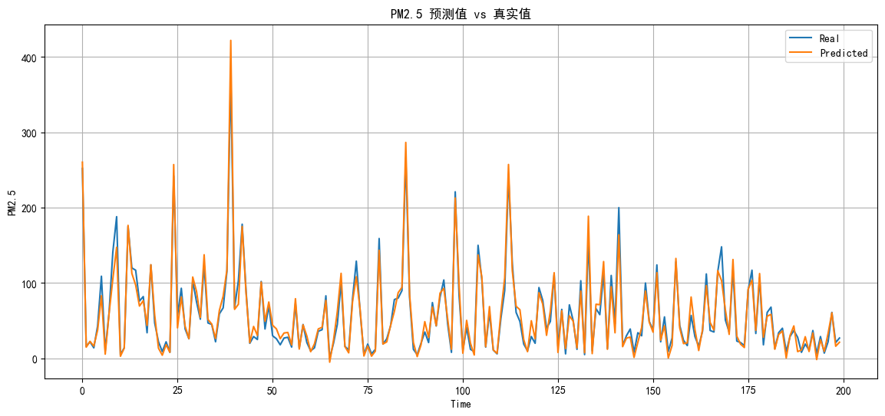
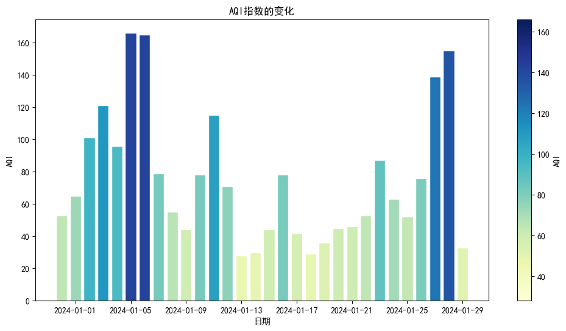

## 概述

​        通过机器学习方法对北京地区的空气质量进行分类预测，以期降低监测成本并 提升预测精度。构建了两个模型：一是基于随机森林算法的分类预测模型，二是基于 长短期记忆网络（LSTM）的时间序列预测模型。在分类模型的构建过程中，对比了随机森林 算法和支持向量机（SVM）算法，并针对这两种算法进行了细致的参数调优，最终，随机森林 模型在测试集上达到了0.817的准确率和0.815的F1分数，而SVM模型在测试集上准确率和 F1 分数均为0.758，随机森林算法因其在测试集上展现出的较高准确率和泛化能力而被选为最 终模型。分类模型的创新之处在于减少了对高成本空气污染物数据的依赖，通过更多 地利用易于获取的气象数据中的有效特征值进行对空气质量等级的预测，有效地降低了测量成 本。而LSTM模型的构建考虑了时间序列数据的特点，利用历史数据对未来各项空气污染物指 数的数值进行了细致的预测，最终模型的预测精度达到了0.977，充分表现了其在实际应用中 的重要价值。未来可以进一步探索模型优化空间，以期达到更高的预测精度和更好的实际应用效果。

## Classification-Algorithm

```python
import numpy as np
import pandas as pd
import matplotlib.pyplot as plt   ##绘图库

plt.rcParams['font.sans-serif'] = ['SimHei']  # 指定默认字体为新宋体。
plt.rcParams['axes.unicode_minus'] = False  # 解决保存图像时'-'显示为方块的问题。

from sklearn.model_selection import train_test_split   ## 划分

import torch

from sklearn.model_selection import train_test_split   #训练集测试集划分
from sklearn.ensemble import RandomForestClassifier    #随机森林相关库
from sklearn.metrics import accuracy_score, recall_score, precision_score, f1_score        #模型精度评分
from sklearn.metrics import confusion_matrix           #混淆矩阵表
from sklearn import svm  #支持向量机

# 检查是否有可用的 GPU
if torch.cuda.is_available():
    device = torch.device("cuda")  # 使用GPU
    print("Using GPU:", torch.cuda.get_device_name(0))
else:
    device = torch.device("cpu")  # 使用 CPU
    print("Using CPU")

```

    Using GPU: NVIDIA GeForce MX450


```python
# 加载 csv文件
merged_data = pd.read_csv('merged_data.csv')

data = merged_data.drop(['AQI','PM2.5','PM10','NO2','CO','SO2','O3_8h'],axis=1)
# 检查结果
data
```


<div>
<style scoped>
    .dataframe tbody tr th:only-of-type {
        vertical-align: middle;
    }


    .dataframe tbody tr th {
        vertical-align: top;
    }
    
    .dataframe thead th {
        text-align: right;
    }

</style>

<table border="1" class="dataframe">
  <thead>
    <tr style="text-align: right;">
      <th></th>
      <th>日期</th>
      <th>气温</th>
      <th>气压</th>
      <th>平均海平面大气压</th>
      <th>气压趋势</th>
      <th>湿度</th>
      <th>风向</th>
      <th>平均风速</th>
      <th>最大阵风</th>
      <th>天气情况</th>
      <th>最低气温</th>
      <th>最高气温</th>
      <th>露点温度</th>
      <th>降水时间</th>
      <th>季节</th>
      <th>质量等级</th>
    </tr>
  </thead>
  <tbody>
    <tr>
      <th>0</th>
      <td>2013-12-02</td>
      <td>3.162</td>
      <td>759.712</td>
      <td>764.462</td>
      <td>-0.013</td>
      <td>45.875</td>
      <td>7.375</td>
      <td>1.375</td>
      <td>7.177</td>
      <td>5.500</td>
      <td>6.896</td>
      <td>18.301</td>
      <td>-8.588</td>
      <td>10.717</td>
      <td>冬</td>
      <td>轻度污染</td>
    </tr>
    <tr>
      <th>1</th>
      <td>2013-12-03</td>
      <td>5.488</td>
      <td>761.725</td>
      <td>766.425</td>
      <td>0.100</td>
      <td>39.000</td>
      <td>8.000</td>
      <td>1.625</td>
      <td>7.177</td>
      <td>4.750</td>
      <td>7.209</td>
      <td>18.314</td>
      <td>-8.900</td>
      <td>10.717</td>
      <td>冬</td>
      <td>良</td>
    </tr>
    <tr>
      <th>2</th>
      <td>2013-12-04</td>
      <td>5.250</td>
      <td>760.300</td>
      <td>764.988</td>
      <td>-0.138</td>
      <td>45.375</td>
      <td>9.375</td>
      <td>1.250</td>
      <td>7.177</td>
      <td>1.750</td>
      <td>7.134</td>
      <td>18.714</td>
      <td>-6.675</td>
      <td>10.717</td>
      <td>冬</td>
      <td>轻度污染</td>
    </tr>
    <tr>
      <th>3</th>
      <td>2013-12-05</td>
      <td>6.150</td>
      <td>763.275</td>
      <td>767.975</td>
      <td>0.250</td>
      <td>30.000</td>
      <td>6.875</td>
      <td>2.250</td>
      <td>7.177</td>
      <td>3.875</td>
      <td>7.759</td>
      <td>18.551</td>
      <td>-10.912</td>
      <td>10.717</td>
      <td>冬</td>
      <td>良</td>
    </tr>
    <tr>
      <th>4</th>
      <td>2013-12-06</td>
      <td>2.925</td>
      <td>760.325</td>
      <td>765.075</td>
      <td>-0.275</td>
      <td>52.750</td>
      <td>4.875</td>
      <td>1.250</td>
      <td>7.177</td>
      <td>1.000</td>
      <td>7.121</td>
      <td>18.239</td>
      <td>-6.350</td>
      <td>10.717</td>
      <td>冬</td>
      <td>中度污染</td>
    </tr>
    <tr>
      <th>...</th>
      <td>...</td>
      <td>...</td>
      <td>...</td>
      <td>...</td>
      <td>...</td>
      <td>...</td>
      <td>...</td>
      <td>...</td>
      <td>...</td>
      <td>...</td>
      <td>...</td>
      <td>...</td>
      <td>...</td>
      <td>...</td>
      <td>...</td>
      <td>...</td>
    </tr>
    <tr>
      <th>3676</th>
      <td>2023-12-26</td>
      <td>-2.050</td>
      <td>770.638</td>
      <td>773.938</td>
      <td>0.925</td>
      <td>54.125</td>
      <td>8.250</td>
      <td>1.500</td>
      <td>7.147</td>
      <td>0.500</td>
      <td>-9.475</td>
      <td>2.588</td>
      <td>-10.862</td>
      <td>12.000</td>
      <td>冬</td>
      <td>良</td>
    </tr>
    <tr>
      <th>3677</th>
      <td>2023-12-27</td>
      <td>-3.888</td>
      <td>771.538</td>
      <td>774.850</td>
      <td>-0.538</td>
      <td>67.750</td>
      <td>7.250</td>
      <td>1.125</td>
      <td>4.250</td>
      <td>0.000</td>
      <td>-8.900</td>
      <td>5.348</td>
      <td>-9.450</td>
      <td>12.000</td>
      <td>冬</td>
      <td>良</td>
    </tr>
    <tr>
      <th>3678</th>
      <td>2023-12-28</td>
      <td>-3.012</td>
      <td>769.138</td>
      <td>772.438</td>
      <td>-0.038</td>
      <td>69.875</td>
      <td>6.625</td>
      <td>1.000</td>
      <td>3.750</td>
      <td>0.375</td>
      <td>-9.100</td>
      <td>3.750</td>
      <td>-8.288</td>
      <td>12.000</td>
      <td>冬</td>
      <td>轻度污染</td>
    </tr>
    <tr>
      <th>3679</th>
      <td>2023-12-29</td>
      <td>-2.800</td>
      <td>765.112</td>
      <td>768.400</td>
      <td>-0.938</td>
      <td>78.125</td>
      <td>5.625</td>
      <td>1.125</td>
      <td>4.147</td>
      <td>2.000</td>
      <td>-6.302</td>
      <td>3.975</td>
      <td>-6.300</td>
      <td>12.000</td>
      <td>冬</td>
      <td>轻度污染</td>
    </tr>
    <tr>
      <th>3680</th>
      <td>2023-12-30</td>
      <td>-1.238</td>
      <td>760.250</td>
      <td>763.512</td>
      <td>0.225</td>
      <td>75.125</td>
      <td>2.625</td>
      <td>1.125</td>
      <td>3.875</td>
      <td>2.000</td>
      <td>-6.562</td>
      <td>2.950</td>
      <td>-5.625</td>
      <td>12.000</td>
      <td>冬</td>
      <td>优</td>
    </tr>
  </tbody>
</table>
<p>3681 rows × 16 columns</p>

</div>


```python
import matplotlib.pyplot as plt
import seaborn as sns
from sklearn.preprocessing import LabelEncoder

# 初始化标签编码器
le = LabelEncoder()

# 对质量等级进行编码
data['质量等级'] = le.fit_transform(data['质量等级'])
data['季节'] = le.fit_transform(data['季节'])

# 选择特定的特征列
selected_features = ['气温', '气压', '平均海平面大气压', '气压趋势', '湿度', '风向', '平均风速', '最大阵风', '天气情况', '最低气温', '最高气温', '露点温度', '降水时间', '季节', '质量等级']

# 计算选定特征列的相关性
correlation = data[selected_features].corr()['质量等级']

correlation = correlation.abs()

# 按照绝对值降序排序
correlation = correlation.reindex(correlation.abs().sort_values(ascending=False).index)

# 创建一个条形图
plt.figure(figsize=(12, 8))
sns.barplot(x=correlation[1:], hue = correlation.index[1:], legend = 'auto', palette='coolwarm')

# 添加标题和标签
plt.title('质量等级的相关性分析')
plt.xlabel('相关性')
plt.ylabel('特征值')

# 显示图表
plt.show()

print(correlation)
```


​    

​    


    质量等级        1.000000
    平均风速        0.164287
    最大阵风        0.113761
    最高气温        0.111750
    气压          0.109454
    平均海平面大气压    0.106138
    露点温度        0.098350
    气温          0.095311
    气压趋势        0.079601
    最低气温        0.076747
    风向          0.070087
    天气情况        0.067813
    降水时间        0.063081
    湿度          0.052930
    季节          0.043512
    Name: 质量等级, dtype: float64


划分训练集，尽可能地减少对难预测的空气污染物成分的依赖


```python
# 将data的值复制到df当中
df = merged_data


# 执行独热编码转换类别字段
df = pd.get_dummies(df, columns=['季节'])


# 预测前，将数据集划分为训练集和验证集，尽可能地减少对难预测的空气污染物成分的依赖
X = df.drop(columns=['质量等级','日期','AQI','O3_8h','NO2','SO2'])
y = df['质量等级']
X_train, X_test, y_train, y_test = train_test_split(X, y, test_size=0.2, random_state=42)


```

使用随机森林的默认状态进行调试

随机森林参数调优


```python
# 使用随机森林分类器进行训练
# classifier = RandomForestClassifier(n_estimators=120, random_state=42)
## 参数调优 
classifier = RandomForestClassifier(n_estimators=50, 
                                    min_samples_leaf=5, 
                                    min_samples_split=10, 
                                    random_state=42)

classifier.fit(X_train, y_train)

# 进行预测并检查准确率
predictions = classifier.predict(X_test)
accuracy = accuracy_score(y_test, predictions)
print("预测的准确率是：", accuracy)
# 概率
predicted_proba = classifier.predict_proba(X_test)

# 计算混淆矩阵并创建热力图
cm = confusion_matrix(y_test, predictions)
plt.figure(figsize=(10, 7))
sns.heatmap(cm, annot = True, cmap = 'Blues')
plt.title('随机森林方法')
plt.xlabel('预测值')
plt.ylabel('真实值')


# 训练集上的预测
train_predictions = classifier.predict(X_train)
# 计算准确率、召回率、精确率 和 F1分数
accuracy_train = classifier.score(X_train, y_train)
recall_train = recall_score(y_train, train_predictions, average='weighted')
precision_train = precision_score(y_train, train_predictions, average='weighted',zero_division=1)
f1_train = f1_score(y_train, train_predictions, average='weighted')
accuracy_test = accuracy
recall_test = recall_score(y_test, predictions, average='weighted')
precision_test = precision_score(y_test, predictions, average='weighted',zero_division=1)
f1_test = f1_score(y_test, predictions, average='weighted')
# 创建 DataFrame
performance = pd.DataFrame({
    '准确率': [accuracy_train, accuracy_test],
    '召回率': [recall_train, recall_test],
    '精确率': [precision_train, precision_test],
    'F1': [f1_train, f1_test]
}, index = ['训练集', '测试集'])
# 显示 performance
performance_styler = performance.style.set_properties(**{'text-align': 'center'})
display(performance_styler)
# 构建预测结果对照表
results = pd.DataFrame({
    '真实值': y_test,
    '预测值': predictions
})

# 获得类别列表，按照模型内部的顺序
class_list = classifier.classes_

# 将预测的概率与其对应的类别关联起来
for i, quality_level in enumerate(class_list):
    results[f'{quality_level}预测概率'] = predicted_proba[:, i]

# 使用 .head() 方法获取前20条数据
results_head = results.head(20)

# 设置数据显示为居中格式
results_styler = results_head.style.set_properties(**{'text-align': 'center'})

# 显示居中对齐的前100条数据
display(results_styler)


```

    预测的准确率是： 0.8168249660786974


<style type="text/css">
#T_5c29b_row0_col0, #T_5c29b_row0_col1, #T_5c29b_row0_col2, #T_5c29b_row0_col3, #T_5c29b_row1_col0, #T_5c29b_row1_col1, #T_5c29b_row1_col2, #T_5c29b_row1_col3 {
  text-align: center;
}
</style>
<table id="T_5c29b">
  <thead>
    <tr>
      <th class="blank level0" >&nbsp;</th>
      <th id="T_5c29b_level0_col0" class="col_heading level0 col0" >准确率</th>
      <th id="T_5c29b_level0_col1" class="col_heading level0 col1" >召回率</th>
      <th id="T_5c29b_level0_col2" class="col_heading level0 col2" >精确率</th>
      <th id="T_5c29b_level0_col3" class="col_heading level0 col3" >F1</th>
    </tr>
  </thead>
  <tbody>
    <tr>
      <th id="T_5c29b_level0_row0" class="row_heading level0 row0" >训练集</th>
      <td id="T_5c29b_row0_col0" class="data row0 col0" >0.920177</td>
      <td id="T_5c29b_row0_col1" class="data row0 col1" >0.920177</td>
      <td id="T_5c29b_row0_col2" class="data row0 col2" >0.921693</td>
      <td id="T_5c29b_row0_col3" class="data row0 col3" >0.918641</td>
    </tr>
    <tr>
      <th id="T_5c29b_level0_row1" class="row_heading level0 row1" >测试集</th>
      <td id="T_5c29b_row1_col0" class="data row1 col0" >0.816825</td>
      <td id="T_5c29b_row1_col1" class="data row1 col1" >0.816825</td>
      <td id="T_5c29b_row1_col2" class="data row1 col2" >0.819219</td>
      <td id="T_5c29b_row1_col3" class="data row1 col3" >0.815129</td>
    </tr>
  </tbody>
</table>


<style type="text/css">
#T_93ae6_row0_col0, #T_93ae6_row0_col1, #T_93ae6_row0_col2, #T_93ae6_row0_col3, #T_93ae6_row0_col4, #T_93ae6_row0_col5, #T_93ae6_row0_col6, #T_93ae6_row0_col7, #T_93ae6_row0_col8, #T_93ae6_row1_col0, #T_93ae6_row1_col1, #T_93ae6_row1_col2, #T_93ae6_row1_col3, #T_93ae6_row1_col4, #T_93ae6_row1_col5, #T_93ae6_row1_col6, #T_93ae6_row1_col7, #T_93ae6_row1_col8, #T_93ae6_row2_col0, #T_93ae6_row2_col1, #T_93ae6_row2_col2, #T_93ae6_row2_col3, #T_93ae6_row2_col4, #T_93ae6_row2_col5, #T_93ae6_row2_col6, #T_93ae6_row2_col7, #T_93ae6_row2_col8, #T_93ae6_row3_col0, #T_93ae6_row3_col1, #T_93ae6_row3_col2, #T_93ae6_row3_col3, #T_93ae6_row3_col4, #T_93ae6_row3_col5, #T_93ae6_row3_col6, #T_93ae6_row3_col7, #T_93ae6_row3_col8, #T_93ae6_row4_col0, #T_93ae6_row4_col1, #T_93ae6_row4_col2, #T_93ae6_row4_col3, #T_93ae6_row4_col4, #T_93ae6_row4_col5, #T_93ae6_row4_col6, #T_93ae6_row4_col7, #T_93ae6_row4_col8, #T_93ae6_row5_col0, #T_93ae6_row5_col1, #T_93ae6_row5_col2, #T_93ae6_row5_col3, #T_93ae6_row5_col4, #T_93ae6_row5_col5, #T_93ae6_row5_col6, #T_93ae6_row5_col7, #T_93ae6_row5_col8, #T_93ae6_row6_col0, #T_93ae6_row6_col1, #T_93ae6_row6_col2, #T_93ae6_row6_col3, #T_93ae6_row6_col4, #T_93ae6_row6_col5, #T_93ae6_row6_col6, #T_93ae6_row6_col7, #T_93ae6_row6_col8, #T_93ae6_row7_col0, #T_93ae6_row7_col1, #T_93ae6_row7_col2, #T_93ae6_row7_col3, #T_93ae6_row7_col4, #T_93ae6_row7_col5, #T_93ae6_row7_col6, #T_93ae6_row7_col7, #T_93ae6_row7_col8, #T_93ae6_row8_col0, #T_93ae6_row8_col1, #T_93ae6_row8_col2, #T_93ae6_row8_col3, #T_93ae6_row8_col4, #T_93ae6_row8_col5, #T_93ae6_row8_col6, #T_93ae6_row8_col7, #T_93ae6_row8_col8, #T_93ae6_row9_col0, #T_93ae6_row9_col1, #T_93ae6_row9_col2, #T_93ae6_row9_col3, #T_93ae6_row9_col4, #T_93ae6_row9_col5, #T_93ae6_row9_col6, #T_93ae6_row9_col7, #T_93ae6_row9_col8, #T_93ae6_row10_col0, #T_93ae6_row10_col1, #T_93ae6_row10_col2, #T_93ae6_row10_col3, #T_93ae6_row10_col4, #T_93ae6_row10_col5, #T_93ae6_row10_col6, #T_93ae6_row10_col7, #T_93ae6_row10_col8, #T_93ae6_row11_col0, #T_93ae6_row11_col1, #T_93ae6_row11_col2, #T_93ae6_row11_col3, #T_93ae6_row11_col4, #T_93ae6_row11_col5, #T_93ae6_row11_col6, #T_93ae6_row11_col7, #T_93ae6_row11_col8, #T_93ae6_row12_col0, #T_93ae6_row12_col1, #T_93ae6_row12_col2, #T_93ae6_row12_col3, #T_93ae6_row12_col4, #T_93ae6_row12_col5, #T_93ae6_row12_col6, #T_93ae6_row12_col7, #T_93ae6_row12_col8, #T_93ae6_row13_col0, #T_93ae6_row13_col1, #T_93ae6_row13_col2, #T_93ae6_row13_col3, #T_93ae6_row13_col4, #T_93ae6_row13_col5, #T_93ae6_row13_col6, #T_93ae6_row13_col7, #T_93ae6_row13_col8, #T_93ae6_row14_col0, #T_93ae6_row14_col1, #T_93ae6_row14_col2, #T_93ae6_row14_col3, #T_93ae6_row14_col4, #T_93ae6_row14_col5, #T_93ae6_row14_col6, #T_93ae6_row14_col7, #T_93ae6_row14_col8, #T_93ae6_row15_col0, #T_93ae6_row15_col1, #T_93ae6_row15_col2, #T_93ae6_row15_col3, #T_93ae6_row15_col4, #T_93ae6_row15_col5, #T_93ae6_row15_col6, #T_93ae6_row15_col7, #T_93ae6_row15_col8, #T_93ae6_row16_col0, #T_93ae6_row16_col1, #T_93ae6_row16_col2, #T_93ae6_row16_col3, #T_93ae6_row16_col4, #T_93ae6_row16_col5, #T_93ae6_row16_col6, #T_93ae6_row16_col7, #T_93ae6_row16_col8, #T_93ae6_row17_col0, #T_93ae6_row17_col1, #T_93ae6_row17_col2, #T_93ae6_row17_col3, #T_93ae6_row17_col4, #T_93ae6_row17_col5, #T_93ae6_row17_col6, #T_93ae6_row17_col7, #T_93ae6_row17_col8, #T_93ae6_row18_col0, #T_93ae6_row18_col1, #T_93ae6_row18_col2, #T_93ae6_row18_col3, #T_93ae6_row18_col4, #T_93ae6_row18_col5, #T_93ae6_row18_col6, #T_93ae6_row18_col7, #T_93ae6_row18_col8, #T_93ae6_row19_col0, #T_93ae6_row19_col1, #T_93ae6_row19_col2, #T_93ae6_row19_col3, #T_93ae6_row19_col4, #T_93ae6_row19_col5, #T_93ae6_row19_col6, #T_93ae6_row19_col7, #T_93ae6_row19_col8 {
  text-align: center;
}
</style>
<table id="T_93ae6">
  <thead>
    <tr>
      <th class="blank level0" >&nbsp;</th>
      <th id="T_93ae6_level0_col0" class="col_heading level0 col0" >真实值</th>
      <th id="T_93ae6_level0_col1" class="col_heading level0 col1" >预测值</th>
      <th id="T_93ae6_level0_col2" class="col_heading level0 col2" >严重污染预测概率</th>
      <th id="T_93ae6_level0_col3" class="col_heading level0 col3" >中度污染预测概率</th>
      <th id="T_93ae6_level0_col4" class="col_heading level0 col4" >优预测概率</th>
      <th id="T_93ae6_level0_col5" class="col_heading level0 col5" >无预测概率</th>
      <th id="T_93ae6_level0_col6" class="col_heading level0 col6" >良预测概率</th>
      <th id="T_93ae6_level0_col7" class="col_heading level0 col7" >轻度污染预测概率</th>
      <th id="T_93ae6_level0_col8" class="col_heading level0 col8" >重度污染预测概率</th>
    </tr>
  </thead>
  <tbody>
    <tr>
      <th id="T_93ae6_level0_row0" class="row_heading level0 row0" >1097</th>
      <td id="T_93ae6_row0_col0" class="data row0 col0" >严重污染</td>
      <td id="T_93ae6_row0_col1" class="data row0 col1" >重度污染</td>
      <td id="T_93ae6_row0_col2" class="data row0 col2" >0.242753</td>
      <td id="T_93ae6_row0_col3" class="data row0 col3" >0.028671</td>
      <td id="T_93ae6_row0_col4" class="data row0 col4" >0.000000</td>
      <td id="T_93ae6_row0_col5" class="data row0 col5" >0.000000</td>
      <td id="T_93ae6_row0_col6" class="data row0 col6" >0.007273</td>
      <td id="T_93ae6_row0_col7" class="data row0 col7" >0.003818</td>
      <td id="T_93ae6_row0_col8" class="data row0 col8" >0.717485</td>
    </tr>
    <tr>
      <th id="T_93ae6_level0_row1" class="row_heading level0 row1" >2784</th>
      <td id="T_93ae6_row1_col0" class="data row1 col0" >优</td>
      <td id="T_93ae6_row1_col1" class="data row1 col1" >优</td>
      <td id="T_93ae6_row1_col2" class="data row1 col2" >0.002857</td>
      <td id="T_93ae6_row1_col3" class="data row1 col3" >0.003500</td>
      <td id="T_93ae6_row1_col4" class="data row1 col4" >0.580033</td>
      <td id="T_93ae6_row1_col5" class="data row1 col5" >0.000000</td>
      <td id="T_93ae6_row1_col6" class="data row1 col6" >0.355595</td>
      <td id="T_93ae6_row1_col7" class="data row1 col7" >0.058015</td>
      <td id="T_93ae6_row1_col8" class="data row1 col8" >0.000000</td>
    </tr>
    <tr>
      <th id="T_93ae6_level0_row2" class="row_heading level0 row2" >2440</th>
      <td id="T_93ae6_row2_col0" class="data row2 col0" >良</td>
      <td id="T_93ae6_row2_col1" class="data row2 col1" >良</td>
      <td id="T_93ae6_row2_col2" class="data row2 col2" >0.000000</td>
      <td id="T_93ae6_row2_col3" class="data row2 col3" >0.035993</td>
      <td id="T_93ae6_row2_col4" class="data row2 col4" >0.159627</td>
      <td id="T_93ae6_row2_col5" class="data row2 col5" >0.002500</td>
      <td id="T_93ae6_row2_col6" class="data row2 col6" >0.588910</td>
      <td id="T_93ae6_row2_col7" class="data row2 col7" >0.212970</td>
      <td id="T_93ae6_row2_col8" class="data row2 col8" >0.000000</td>
    </tr>
    <tr>
      <th id="T_93ae6_level0_row3" class="row_heading level0 row3" >1694</th>
      <td id="T_93ae6_row3_col0" class="data row3 col0" >优</td>
      <td id="T_93ae6_row3_col1" class="data row3 col1" >优</td>
      <td id="T_93ae6_row3_col2" class="data row3 col2" >0.001538</td>
      <td id="T_93ae6_row3_col3" class="data row3 col3" >0.008901</td>
      <td id="T_93ae6_row3_col4" class="data row3 col4" >0.475104</td>
      <td id="T_93ae6_row3_col5" class="data row3 col5" >0.000000</td>
      <td id="T_93ae6_row3_col6" class="data row3 col6" >0.389171</td>
      <td id="T_93ae6_row3_col7" class="data row3 col7" >0.119131</td>
      <td id="T_93ae6_row3_col8" class="data row3 col8" >0.006154</td>
    </tr>
    <tr>
      <th id="T_93ae6_level0_row4" class="row_heading level0 row4" >2494</th>
      <td id="T_93ae6_row4_col0" class="data row4 col0" >良</td>
      <td id="T_93ae6_row4_col1" class="data row4 col1" >良</td>
      <td id="T_93ae6_row4_col2" class="data row4 col2" >0.000000</td>
      <td id="T_93ae6_row4_col3" class="data row4 col3" >0.000000</td>
      <td id="T_93ae6_row4_col4" class="data row4 col4" >0.163351</td>
      <td id="T_93ae6_row4_col5" class="data row4 col5" >0.002500</td>
      <td id="T_93ae6_row4_col6" class="data row4 col6" >0.757525</td>
      <td id="T_93ae6_row4_col7" class="data row4 col7" >0.076624</td>
      <td id="T_93ae6_row4_col8" class="data row4 col8" >0.000000</td>
    </tr>
    <tr>
      <th id="T_93ae6_level0_row5" class="row_heading level0 row5" >2270</th>
      <td id="T_93ae6_row5_col0" class="data row5 col0" >轻度污染</td>
      <td id="T_93ae6_row5_col1" class="data row5 col1" >轻度污染</td>
      <td id="T_93ae6_row5_col2" class="data row5 col2" >0.000000</td>
      <td id="T_93ae6_row5_col3" class="data row5 col3" >0.168943</td>
      <td id="T_93ae6_row5_col4" class="data row5 col4" >0.012083</td>
      <td id="T_93ae6_row5_col5" class="data row5 col5" >0.000000</td>
      <td id="T_93ae6_row5_col6" class="data row5 col6" >0.035368</td>
      <td id="T_93ae6_row5_col7" class="data row5 col7" >0.750467</td>
      <td id="T_93ae6_row5_col8" class="data row5 col8" >0.033139</td>
    </tr>
    <tr>
      <th id="T_93ae6_level0_row6" class="row_heading level0 row6" >3477</th>
      <td id="T_93ae6_row6_col0" class="data row6 col0" >良</td>
      <td id="T_93ae6_row6_col1" class="data row6 col1" >良</td>
      <td id="T_93ae6_row6_col2" class="data row6 col2" >0.000000</td>
      <td id="T_93ae6_row6_col3" class="data row6 col3" >0.008205</td>
      <td id="T_93ae6_row6_col4" class="data row6 col4" >0.188131</td>
      <td id="T_93ae6_row6_col5" class="data row6 col5" >0.001250</td>
      <td id="T_93ae6_row6_col6" class="data row6 col6" >0.676005</td>
      <td id="T_93ae6_row6_col7" class="data row6 col7" >0.125076</td>
      <td id="T_93ae6_row6_col8" class="data row6 col8" >0.001333</td>
    </tr>
    <tr>
      <th id="T_93ae6_level0_row7" class="row_heading level0 row7" >937</th>
      <td id="T_93ae6_row7_col0" class="data row7 col0" >良</td>
      <td id="T_93ae6_row7_col1" class="data row7 col1" >中度污染</td>
      <td id="T_93ae6_row7_col2" class="data row7 col2" >0.000000</td>
      <td id="T_93ae6_row7_col3" class="data row7 col3" >0.530691</td>
      <td id="T_93ae6_row7_col4" class="data row7 col4" >0.000000</td>
      <td id="T_93ae6_row7_col5" class="data row7 col5" >0.000000</td>
      <td id="T_93ae6_row7_col6" class="data row7 col6" >0.141202</td>
      <td id="T_93ae6_row7_col7" class="data row7 col7" >0.304054</td>
      <td id="T_93ae6_row7_col8" class="data row7 col8" >0.024053</td>
    </tr>
    <tr>
      <th id="T_93ae6_level0_row8" class="row_heading level0 row8" >495</th>
      <td id="T_93ae6_row8_col0" class="data row8 col0" >中度污染</td>
      <td id="T_93ae6_row8_col1" class="data row8 col1" >中度污染</td>
      <td id="T_93ae6_row8_col2" class="data row8 col2" >0.064650</td>
      <td id="T_93ae6_row8_col3" class="data row8 col3" >0.449891</td>
      <td id="T_93ae6_row8_col4" class="data row8 col4" >0.012000</td>
      <td id="T_93ae6_row8_col5" class="data row8 col5" >0.000000</td>
      <td id="T_93ae6_row8_col6" class="data row8 col6" >0.082585</td>
      <td id="T_93ae6_row8_col7" class="data row8 col7" >0.196608</td>
      <td id="T_93ae6_row8_col8" class="data row8 col8" >0.194265</td>
    </tr>
    <tr>
      <th id="T_93ae6_level0_row9" class="row_heading level0 row9" >798</th>
      <td id="T_93ae6_row9_col0" class="data row9 col0" >重度污染</td>
      <td id="T_93ae6_row9_col1" class="data row9 col1" >重度污染</td>
      <td id="T_93ae6_row9_col2" class="data row9 col2" >0.120026</td>
      <td id="T_93ae6_row9_col3" class="data row9 col3" >0.219474</td>
      <td id="T_93ae6_row9_col4" class="data row9 col4" >0.015000</td>
      <td id="T_93ae6_row9_col5" class="data row9 col5" >0.000000</td>
      <td id="T_93ae6_row9_col6" class="data row9 col6" >0.092429</td>
      <td id="T_93ae6_row9_col7" class="data row9 col7" >0.229477</td>
      <td id="T_93ae6_row9_col8" class="data row9 col8" >0.323595</td>
    </tr>
    <tr>
      <th id="T_93ae6_level0_row10" class="row_heading level0 row10" >3375</th>
      <td id="T_93ae6_row10_col0" class="data row10 col0" >优</td>
      <td id="T_93ae6_row10_col1" class="data row10 col1" >优</td>
      <td id="T_93ae6_row10_col2" class="data row10 col2" >0.001667</td>
      <td id="T_93ae6_row10_col3" class="data row10 col3" >0.000000</td>
      <td id="T_93ae6_row10_col4" class="data row10 col4" >0.980167</td>
      <td id="T_93ae6_row10_col5" class="data row10 col5" >0.000000</td>
      <td id="T_93ae6_row10_col6" class="data row10 col6" >0.016500</td>
      <td id="T_93ae6_row10_col7" class="data row10 col7" >0.001667</td>
      <td id="T_93ae6_row10_col8" class="data row10 col8" >0.000000</td>
    </tr>
    <tr>
      <th id="T_93ae6_level0_row11" class="row_heading level0 row11" >1747</th>
      <td id="T_93ae6_row11_col0" class="data row11 col0" >优</td>
      <td id="T_93ae6_row11_col1" class="data row11 col1" >优</td>
      <td id="T_93ae6_row11_col2" class="data row11 col2" >0.006000</td>
      <td id="T_93ae6_row11_col3" class="data row11 col3" >0.000000</td>
      <td id="T_93ae6_row11_col4" class="data row11 col4" >0.726175</td>
      <td id="T_93ae6_row11_col5" class="data row11 col5" >0.005778</td>
      <td id="T_93ae6_row11_col6" class="data row11 col6" >0.256968</td>
      <td id="T_93ae6_row11_col7" class="data row11 col7" >0.005079</td>
      <td id="T_93ae6_row11_col8" class="data row11 col8" >0.000000</td>
    </tr>
    <tr>
      <th id="T_93ae6_level0_row12" class="row_heading level0 row12" >1487</th>
      <td id="T_93ae6_row12_col0" class="data row12 col0" >重度污染</td>
      <td id="T_93ae6_row12_col1" class="data row12 col1" >重度污染</td>
      <td id="T_93ae6_row12_col2" class="data row12 col2" >0.151462</td>
      <td id="T_93ae6_row12_col3" class="data row12 col3" >0.156333</td>
      <td id="T_93ae6_row12_col4" class="data row12 col4" >0.000000</td>
      <td id="T_93ae6_row12_col5" class="data row12 col5" >0.000000</td>
      <td id="T_93ae6_row12_col6" class="data row12 col6" >0.003333</td>
      <td id="T_93ae6_row12_col7" class="data row12 col7" >0.012222</td>
      <td id="T_93ae6_row12_col8" class="data row12 col8" >0.676650</td>
    </tr>
    <tr>
      <th id="T_93ae6_level0_row13" class="row_heading level0 row13" >969</th>
      <td id="T_93ae6_row13_col0" class="data row13 col0" >中度污染</td>
      <td id="T_93ae6_row13_col1" class="data row13 col1" >中度污染</td>
      <td id="T_93ae6_row13_col2" class="data row13 col2" >0.005934</td>
      <td id="T_93ae6_row13_col3" class="data row13 col3" >0.564135</td>
      <td id="T_93ae6_row13_col4" class="data row13 col4" >0.003205</td>
      <td id="T_93ae6_row13_col5" class="data row13 col5" >0.000000</td>
      <td id="T_93ae6_row13_col6" class="data row13 col6" >0.034687</td>
      <td id="T_93ae6_row13_col7" class="data row13 col7" >0.221312</td>
      <td id="T_93ae6_row13_col8" class="data row13 col8" >0.170726</td>
    </tr>
    <tr>
      <th id="T_93ae6_level0_row14" class="row_heading level0 row14" >2883</th>
      <td id="T_93ae6_row14_col0" class="data row14 col0" >中度污染</td>
      <td id="T_93ae6_row14_col1" class="data row14 col1" >中度污染</td>
      <td id="T_93ae6_row14_col2" class="data row14 col2" >0.016024</td>
      <td id="T_93ae6_row14_col3" class="data row14 col3" >0.445166</td>
      <td id="T_93ae6_row14_col4" class="data row14 col4" >0.000000</td>
      <td id="T_93ae6_row14_col5" class="data row14 col5" >0.000000</td>
      <td id="T_93ae6_row14_col6" class="data row14 col6" >0.099437</td>
      <td id="T_93ae6_row14_col7" class="data row14 col7" >0.374235</td>
      <td id="T_93ae6_row14_col8" class="data row14 col8" >0.065138</td>
    </tr>
    <tr>
      <th id="T_93ae6_level0_row15" class="row_heading level0 row15" >655</th>
      <td id="T_93ae6_row15_col0" class="data row15 col0" >轻度污染</td>
      <td id="T_93ae6_row15_col1" class="data row15 col1" >轻度污染</td>
      <td id="T_93ae6_row15_col2" class="data row15 col2" >0.000000</td>
      <td id="T_93ae6_row15_col3" class="data row15 col3" >0.108666</td>
      <td id="T_93ae6_row15_col4" class="data row15 col4" >0.000000</td>
      <td id="T_93ae6_row15_col5" class="data row15 col5" >0.000000</td>
      <td id="T_93ae6_row15_col6" class="data row15 col6" >0.220001</td>
      <td id="T_93ae6_row15_col7" class="data row15 col7" >0.654238</td>
      <td id="T_93ae6_row15_col8" class="data row15 col8" >0.017095</td>
    </tr>
    <tr>
      <th id="T_93ae6_level0_row16" class="row_heading level0 row16" >229</th>
      <td id="T_93ae6_row16_col0" class="data row16 col0" >轻度污染</td>
      <td id="T_93ae6_row16_col1" class="data row16 col1" >轻度污染</td>
      <td id="T_93ae6_row16_col2" class="data row16 col2" >0.001538</td>
      <td id="T_93ae6_row16_col3" class="data row16 col3" >0.299135</td>
      <td id="T_93ae6_row16_col4" class="data row16 col4" >0.002857</td>
      <td id="T_93ae6_row16_col5" class="data row16 col5" >0.000000</td>
      <td id="T_93ae6_row16_col6" class="data row16 col6" >0.083248</td>
      <td id="T_93ae6_row16_col7" class="data row16 col7" >0.609888</td>
      <td id="T_93ae6_row16_col8" class="data row16 col8" >0.003333</td>
    </tr>
    <tr>
      <th id="T_93ae6_level0_row17" class="row_heading level0 row17" >1116</th>
      <td id="T_93ae6_row17_col0" class="data row17 col0" >良</td>
      <td id="T_93ae6_row17_col1" class="data row17 col1" >良</td>
      <td id="T_93ae6_row17_col2" class="data row17 col2" >0.000000</td>
      <td id="T_93ae6_row17_col3" class="data row17 col3" >0.013553</td>
      <td id="T_93ae6_row17_col4" class="data row17 col4" >0.084372</td>
      <td id="T_93ae6_row17_col5" class="data row17 col5" >0.000000</td>
      <td id="T_93ae6_row17_col6" class="data row17 col6" >0.880953</td>
      <td id="T_93ae6_row17_col7" class="data row17 col7" >0.016122</td>
      <td id="T_93ae6_row17_col8" class="data row17 col8" >0.005000</td>
    </tr>
    <tr>
      <th id="T_93ae6_level0_row18" class="row_heading level0 row18" >840</th>
      <td id="T_93ae6_row18_col0" class="data row18 col0" >中度污染</td>
      <td id="T_93ae6_row18_col1" class="data row18 col1" >中度污染</td>
      <td id="T_93ae6_row18_col2" class="data row18 col2" >0.020206</td>
      <td id="T_93ae6_row18_col3" class="data row18 col3" >0.757988</td>
      <td id="T_93ae6_row18_col4" class="data row18 col4" >0.000000</td>
      <td id="T_93ae6_row18_col5" class="data row18 col5" >0.000000</td>
      <td id="T_93ae6_row18_col6" class="data row18 col6" >0.004524</td>
      <td id="T_93ae6_row18_col7" class="data row18 col7" >0.162131</td>
      <td id="T_93ae6_row18_col8" class="data row18 col8" >0.055151</td>
    </tr>
    <tr>
      <th id="T_93ae6_level0_row19" class="row_heading level0 row19" >32</th>
      <td id="T_93ae6_row19_col0" class="data row19 col0" >良</td>
      <td id="T_93ae6_row19_col1" class="data row19 col1" >良</td>
      <td id="T_93ae6_row19_col2" class="data row19 col2" >0.000000</td>
      <td id="T_93ae6_row19_col3" class="data row19 col3" >0.016905</td>
      <td id="T_93ae6_row19_col4" class="data row19 col4" >0.008667</td>
      <td id="T_93ae6_row19_col5" class="data row19 col5" >0.000000</td>
      <td id="T_93ae6_row19_col6" class="data row19 col6" >0.895619</td>
      <td id="T_93ae6_row19_col7" class="data row19 col7" >0.078810</td>
      <td id="T_93ae6_row19_col8" class="data row19 col8" >0.000000</td>
    </tr>
  </tbody>
</table>


    


支持向量机分类算法


```python
# 使用支持向量机分类器进行训练
# 默认参数
# classifier = svm.SVC(probability=True)
# classifier.fit(X_train, y_train)


# 参数调优
classifier = svm.SVC(probability=True, C=0.8, kernel='linear', gamma=0.01)
classifier.fit(X_train, y_train)

# 执行预测并计算准确度
predictions = classifier.predict(X_test)
accuracy = accuracy_score(y_test, predictions)
print("预测准确率：", accuracy)

# 概率
predicted_proba = classifier.predict_proba(X_test)

# 进行预测并检查准确率
predictions = classifier.predict(X_test)
accuracy = accuracy_score(y_test, predictions)
print("预测的准确率是：", accuracy)
# 概率
predicted_proba = classifier.predict_proba(X_test)

# 计算混淆矩阵并创建热力图
cm = confusion_matrix(y_test, predictions)
plt.figure(figsize=(10, 7))
sns.heatmap(cm, annot = True, cmap = 'Blues')
plt.title('支持向量机方法')
plt.xlabel('预测值')
plt.ylabel('真实值')


# 训练集上的预测
train_predictions = classifier.predict(X_train)
# 计算准确率、召回率、精确率 和 F1分数
accuracy_train = classifier.score(X_train, y_train)
recall_train = recall_score(y_train, train_predictions, average='weighted')
precision_train = precision_score(y_train, train_predictions, average='weighted',zero_division=1)
f1_train = f1_score(y_train, train_predictions, average='weighted')
accuracy_test = accuracy
recall_test = recall_score(y_test, predictions, average='weighted')
precision_test = precision_score(y_test, predictions, average='weighted',zero_division=1)
f1_test = f1_score(y_test, predictions, average='weighted')
# 创建 DataFrame
performance = pd.DataFrame({
    '准确率': [accuracy_train, accuracy_test],
    '召回率': [recall_train, recall_test],
    '精确率': [precision_train, precision_test],
    'F1': [f1_train, f1_test]
}, index = ['训练集', '测试集'])
# 显示 performance
performance_styler = performance.style.set_properties(**{'text-align': 'center'})
display(performance_styler)
# 构建预测结果对照表
results = pd.DataFrame({
    '真实值': y_test,
    '预测值': predictions
})

# 获得类别列表，按照模型内部的顺序
class_list = classifier.classes_

# 将预测的概率与其对应的类别关联起来
for i, quality_level in enumerate(class_list):
    results[f'{quality_level}预测概率'] = predicted_proba[:, i]

# 使用 .head() 方法获取前20条数据
results_head = results.head(20)

# 设置数据显示为居中格式
results_styler = results_head.style.set_properties(**{'text-align': 'center'})

# 显示居中对齐的前100条数据
display(results_styler)


```

    预测准确率： 0.7584803256445047
    预测的准确率是： 0.7584803256445047


<style type="text/css">
#T_fc809_row0_col0, #T_fc809_row0_col1, #T_fc809_row0_col2, #T_fc809_row0_col3, #T_fc809_row1_col0, #T_fc809_row1_col1, #T_fc809_row1_col2, #T_fc809_row1_col3 {
  text-align: center;
}
</style>
<table id="T_fc809">
  <thead>
    <tr>
      <th class="blank level0" >&nbsp;</th>
      <th id="T_fc809_level0_col0" class="col_heading level0 col0" >准确率</th>
      <th id="T_fc809_level0_col1" class="col_heading level0 col1" >召回率</th>
      <th id="T_fc809_level0_col2" class="col_heading level0 col2" >精确率</th>
      <th id="T_fc809_level0_col3" class="col_heading level0 col3" >F1</th>
    </tr>
  </thead>
  <tbody>
    <tr>
      <th id="T_fc809_level0_row0" class="row_heading level0 row0" >训练集</th>
      <td id="T_fc809_row0_col0" class="data row0 col0" >0.754416</td>
      <td id="T_fc809_row0_col1" class="data row0 col1" >0.754416</td>
      <td id="T_fc809_row0_col2" class="data row0 col2" >0.753321</td>
      <td id="T_fc809_row0_col3" class="data row0 col3" >0.751580</td>
    </tr>
    <tr>
      <th id="T_fc809_level0_row1" class="row_heading level0 row1" >测试集</th>
      <td id="T_fc809_row1_col0" class="data row1 col0" >0.758480</td>
      <td id="T_fc809_row1_col1" class="data row1 col1" >0.758480</td>
      <td id="T_fc809_row1_col2" class="data row1 col2" >0.757210</td>
      <td id="T_fc809_row1_col3" class="data row1 col3" >0.755971</td>
    </tr>
  </tbody>
</table>


<style type="text/css">
#T_0b4e1_row0_col0, #T_0b4e1_row0_col1, #T_0b4e1_row0_col2, #T_0b4e1_row0_col3, #T_0b4e1_row0_col4, #T_0b4e1_row0_col5, #T_0b4e1_row0_col6, #T_0b4e1_row0_col7, #T_0b4e1_row0_col8, #T_0b4e1_row1_col0, #T_0b4e1_row1_col1, #T_0b4e1_row1_col2, #T_0b4e1_row1_col3, #T_0b4e1_row1_col4, #T_0b4e1_row1_col5, #T_0b4e1_row1_col6, #T_0b4e1_row1_col7, #T_0b4e1_row1_col8, #T_0b4e1_row2_col0, #T_0b4e1_row2_col1, #T_0b4e1_row2_col2, #T_0b4e1_row2_col3, #T_0b4e1_row2_col4, #T_0b4e1_row2_col5, #T_0b4e1_row2_col6, #T_0b4e1_row2_col7, #T_0b4e1_row2_col8, #T_0b4e1_row3_col0, #T_0b4e1_row3_col1, #T_0b4e1_row3_col2, #T_0b4e1_row3_col3, #T_0b4e1_row3_col4, #T_0b4e1_row3_col5, #T_0b4e1_row3_col6, #T_0b4e1_row3_col7, #T_0b4e1_row3_col8, #T_0b4e1_row4_col0, #T_0b4e1_row4_col1, #T_0b4e1_row4_col2, #T_0b4e1_row4_col3, #T_0b4e1_row4_col4, #T_0b4e1_row4_col5, #T_0b4e1_row4_col6, #T_0b4e1_row4_col7, #T_0b4e1_row4_col8, #T_0b4e1_row5_col0, #T_0b4e1_row5_col1, #T_0b4e1_row5_col2, #T_0b4e1_row5_col3, #T_0b4e1_row5_col4, #T_0b4e1_row5_col5, #T_0b4e1_row5_col6, #T_0b4e1_row5_col7, #T_0b4e1_row5_col8, #T_0b4e1_row6_col0, #T_0b4e1_row6_col1, #T_0b4e1_row6_col2, #T_0b4e1_row6_col3, #T_0b4e1_row6_col4, #T_0b4e1_row6_col5, #T_0b4e1_row6_col6, #T_0b4e1_row6_col7, #T_0b4e1_row6_col8, #T_0b4e1_row7_col0, #T_0b4e1_row7_col1, #T_0b4e1_row7_col2, #T_0b4e1_row7_col3, #T_0b4e1_row7_col4, #T_0b4e1_row7_col5, #T_0b4e1_row7_col6, #T_0b4e1_row7_col7, #T_0b4e1_row7_col8, #T_0b4e1_row8_col0, #T_0b4e1_row8_col1, #T_0b4e1_row8_col2, #T_0b4e1_row8_col3, #T_0b4e1_row8_col4, #T_0b4e1_row8_col5, #T_0b4e1_row8_col6, #T_0b4e1_row8_col7, #T_0b4e1_row8_col8, #T_0b4e1_row9_col0, #T_0b4e1_row9_col1, #T_0b4e1_row9_col2, #T_0b4e1_row9_col3, #T_0b4e1_row9_col4, #T_0b4e1_row9_col5, #T_0b4e1_row9_col6, #T_0b4e1_row9_col7, #T_0b4e1_row9_col8, #T_0b4e1_row10_col0, #T_0b4e1_row10_col1, #T_0b4e1_row10_col2, #T_0b4e1_row10_col3, #T_0b4e1_row10_col4, #T_0b4e1_row10_col5, #T_0b4e1_row10_col6, #T_0b4e1_row10_col7, #T_0b4e1_row10_col8, #T_0b4e1_row11_col0, #T_0b4e1_row11_col1, #T_0b4e1_row11_col2, #T_0b4e1_row11_col3, #T_0b4e1_row11_col4, #T_0b4e1_row11_col5, #T_0b4e1_row11_col6, #T_0b4e1_row11_col7, #T_0b4e1_row11_col8, #T_0b4e1_row12_col0, #T_0b4e1_row12_col1, #T_0b4e1_row12_col2, #T_0b4e1_row12_col3, #T_0b4e1_row12_col4, #T_0b4e1_row12_col5, #T_0b4e1_row12_col6, #T_0b4e1_row12_col7, #T_0b4e1_row12_col8, #T_0b4e1_row13_col0, #T_0b4e1_row13_col1, #T_0b4e1_row13_col2, #T_0b4e1_row13_col3, #T_0b4e1_row13_col4, #T_0b4e1_row13_col5, #T_0b4e1_row13_col6, #T_0b4e1_row13_col7, #T_0b4e1_row13_col8, #T_0b4e1_row14_col0, #T_0b4e1_row14_col1, #T_0b4e1_row14_col2, #T_0b4e1_row14_col3, #T_0b4e1_row14_col4, #T_0b4e1_row14_col5, #T_0b4e1_row14_col6, #T_0b4e1_row14_col7, #T_0b4e1_row14_col8, #T_0b4e1_row15_col0, #T_0b4e1_row15_col1, #T_0b4e1_row15_col2, #T_0b4e1_row15_col3, #T_0b4e1_row15_col4, #T_0b4e1_row15_col5, #T_0b4e1_row15_col6, #T_0b4e1_row15_col7, #T_0b4e1_row15_col8, #T_0b4e1_row16_col0, #T_0b4e1_row16_col1, #T_0b4e1_row16_col2, #T_0b4e1_row16_col3, #T_0b4e1_row16_col4, #T_0b4e1_row16_col5, #T_0b4e1_row16_col6, #T_0b4e1_row16_col7, #T_0b4e1_row16_col8, #T_0b4e1_row17_col0, #T_0b4e1_row17_col1, #T_0b4e1_row17_col2, #T_0b4e1_row17_col3, #T_0b4e1_row17_col4, #T_0b4e1_row17_col5, #T_0b4e1_row17_col6, #T_0b4e1_row17_col7, #T_0b4e1_row17_col8, #T_0b4e1_row18_col0, #T_0b4e1_row18_col1, #T_0b4e1_row18_col2, #T_0b4e1_row18_col3, #T_0b4e1_row18_col4, #T_0b4e1_row18_col5, #T_0b4e1_row18_col6, #T_0b4e1_row18_col7, #T_0b4e1_row18_col8, #T_0b4e1_row19_col0, #T_0b4e1_row19_col1, #T_0b4e1_row19_col2, #T_0b4e1_row19_col3, #T_0b4e1_row19_col4, #T_0b4e1_row19_col5, #T_0b4e1_row19_col6, #T_0b4e1_row19_col7, #T_0b4e1_row19_col8 {
  text-align: center;
}
</style>
<table id="T_0b4e1">
  <thead>
    <tr>
      <th class="blank level0" >&nbsp;</th>
      <th id="T_0b4e1_level0_col0" class="col_heading level0 col0" >真实值</th>
      <th id="T_0b4e1_level0_col1" class="col_heading level0 col1" >预测值</th>
      <th id="T_0b4e1_level0_col2" class="col_heading level0 col2" >严重污染预测概率</th>
      <th id="T_0b4e1_level0_col3" class="col_heading level0 col3" >中度污染预测概率</th>
      <th id="T_0b4e1_level0_col4" class="col_heading level0 col4" >优预测概率</th>
      <th id="T_0b4e1_level0_col5" class="col_heading level0 col5" >无预测概率</th>
      <th id="T_0b4e1_level0_col6" class="col_heading level0 col6" >良预测概率</th>
      <th id="T_0b4e1_level0_col7" class="col_heading level0 col7" >轻度污染预测概率</th>
      <th id="T_0b4e1_level0_col8" class="col_heading level0 col8" >重度污染预测概率</th>
    </tr>
  </thead>
  <tbody>
    <tr>
      <th id="T_0b4e1_level0_row0" class="row_heading level0 row0" >1097</th>
      <td id="T_0b4e1_row0_col0" class="data row0 col0" >严重污染</td>
      <td id="T_0b4e1_row0_col1" class="data row0 col1" >重度污染</td>
      <td id="T_0b4e1_row0_col2" class="data row0 col2" >0.300962</td>
      <td id="T_0b4e1_row0_col3" class="data row0 col3" >0.053690</td>
      <td id="T_0b4e1_row0_col4" class="data row0 col4" >0.002110</td>
      <td id="T_0b4e1_row0_col5" class="data row0 col5" >0.002733</td>
      <td id="T_0b4e1_row0_col6" class="data row0 col6" >0.001727</td>
      <td id="T_0b4e1_row0_col7" class="data row0 col7" >0.005712</td>
      <td id="T_0b4e1_row0_col8" class="data row0 col8" >0.633066</td>
    </tr>
    <tr>
      <th id="T_0b4e1_level0_row1" class="row_heading level0 row1" >2784</th>
      <td id="T_0b4e1_row1_col0" class="data row1 col0" >优</td>
      <td id="T_0b4e1_row1_col1" class="data row1 col1" >良</td>
      <td id="T_0b4e1_row1_col2" class="data row1 col2" >0.001050</td>
      <td id="T_0b4e1_row1_col3" class="data row1 col3" >0.005165</td>
      <td id="T_0b4e1_row1_col4" class="data row1 col4" >0.331282</td>
      <td id="T_0b4e1_row1_col5" class="data row1 col5" >0.001943</td>
      <td id="T_0b4e1_row1_col6" class="data row1 col6" >0.618779</td>
      <td id="T_0b4e1_row1_col7" class="data row1 col7" >0.041574</td>
      <td id="T_0b4e1_row1_col8" class="data row1 col8" >0.000207</td>
    </tr>
    <tr>
      <th id="T_0b4e1_level0_row2" class="row_heading level0 row2" >2440</th>
      <td id="T_0b4e1_row2_col0" class="data row2 col0" >良</td>
      <td id="T_0b4e1_row2_col1" class="data row2 col1" >良</td>
      <td id="T_0b4e1_row2_col2" class="data row2 col2" >0.001645</td>
      <td id="T_0b4e1_row2_col3" class="data row2 col3" >0.022439</td>
      <td id="T_0b4e1_row2_col4" class="data row2 col4" >0.061227</td>
      <td id="T_0b4e1_row2_col5" class="data row2 col5" >0.001645</td>
      <td id="T_0b4e1_row2_col6" class="data row2 col6" >0.718252</td>
      <td id="T_0b4e1_row2_col7" class="data row2 col7" >0.193896</td>
      <td id="T_0b4e1_row2_col8" class="data row2 col8" >0.000895</td>
    </tr>
    <tr>
      <th id="T_0b4e1_level0_row3" class="row_heading level0 row3" >1694</th>
      <td id="T_0b4e1_row3_col0" class="data row3 col0" >优</td>
      <td id="T_0b4e1_row3_col1" class="data row3 col1" >优</td>
      <td id="T_0b4e1_row3_col2" class="data row3 col2" >0.003246</td>
      <td id="T_0b4e1_row3_col3" class="data row3 col3" >0.005873</td>
      <td id="T_0b4e1_row3_col4" class="data row3 col4" >0.672221</td>
      <td id="T_0b4e1_row3_col5" class="data row3 col5" >0.005097</td>
      <td id="T_0b4e1_row3_col6" class="data row3 col6" >0.286800</td>
      <td id="T_0b4e1_row3_col7" class="data row3 col7" >0.025789</td>
      <td id="T_0b4e1_row3_col8" class="data row3 col8" >0.000974</td>
    </tr>
    <tr>
      <th id="T_0b4e1_level0_row4" class="row_heading level0 row4" >2494</th>
      <td id="T_0b4e1_row4_col0" class="data row4 col0" >良</td>
      <td id="T_0b4e1_row4_col1" class="data row4 col1" >良</td>
      <td id="T_0b4e1_row4_col2" class="data row4 col2" >0.001708</td>
      <td id="T_0b4e1_row4_col3" class="data row4 col3" >0.006182</td>
      <td id="T_0b4e1_row4_col4" class="data row4 col4" >0.043863</td>
      <td id="T_0b4e1_row4_col5" class="data row4 col5" >0.000259</td>
      <td id="T_0b4e1_row4_col6" class="data row4 col6" >0.844592</td>
      <td id="T_0b4e1_row4_col7" class="data row4 col7" >0.101828</td>
      <td id="T_0b4e1_row4_col8" class="data row4 col8" >0.001568</td>
    </tr>
    <tr>
      <th id="T_0b4e1_level0_row5" class="row_heading level0 row5" >2270</th>
      <td id="T_0b4e1_row5_col0" class="data row5 col0" >轻度污染</td>
      <td id="T_0b4e1_row5_col1" class="data row5 col1" >轻度污染</td>
      <td id="T_0b4e1_row5_col2" class="data row5 col2" >0.002498</td>
      <td id="T_0b4e1_row5_col3" class="data row5 col3" >0.370101</td>
      <td id="T_0b4e1_row5_col4" class="data row5 col4" >0.001685</td>
      <td id="T_0b4e1_row5_col5" class="data row5 col5" >0.001179</td>
      <td id="T_0b4e1_row5_col6" class="data row5 col6" >0.161089</td>
      <td id="T_0b4e1_row5_col7" class="data row5 col7" >0.424686</td>
      <td id="T_0b4e1_row5_col8" class="data row5 col8" >0.038762</td>
    </tr>
    <tr>
      <th id="T_0b4e1_level0_row6" class="row_heading level0 row6" >3477</th>
      <td id="T_0b4e1_row6_col0" class="data row6 col0" >良</td>
      <td id="T_0b4e1_row6_col1" class="data row6 col1" >良</td>
      <td id="T_0b4e1_row6_col2" class="data row6 col2" >0.000512</td>
      <td id="T_0b4e1_row6_col3" class="data row6 col3" >0.032570</td>
      <td id="T_0b4e1_row6_col4" class="data row6 col4" >0.332566</td>
      <td id="T_0b4e1_row6_col5" class="data row6 col5" >0.001983</td>
      <td id="T_0b4e1_row6_col6" class="data row6 col6" >0.524911</td>
      <td id="T_0b4e1_row6_col7" class="data row6 col7" >0.104358</td>
      <td id="T_0b4e1_row6_col8" class="data row6 col8" >0.003101</td>
    </tr>
    <tr>
      <th id="T_0b4e1_level0_row7" class="row_heading level0 row7" >937</th>
      <td id="T_0b4e1_row7_col0" class="data row7 col0" >良</td>
      <td id="T_0b4e1_row7_col1" class="data row7 col1" >中度污染</td>
      <td id="T_0b4e1_row7_col2" class="data row7 col2" >0.003020</td>
      <td id="T_0b4e1_row7_col3" class="data row7 col3" >0.459037</td>
      <td id="T_0b4e1_row7_col4" class="data row7 col4" >0.002037</td>
      <td id="T_0b4e1_row7_col5" class="data row7 col5" >0.000806</td>
      <td id="T_0b4e1_row7_col6" class="data row7 col6" >0.056424</td>
      <td id="T_0b4e1_row7_col7" class="data row7 col7" >0.465143</td>
      <td id="T_0b4e1_row7_col8" class="data row7 col8" >0.013532</td>
    </tr>
    <tr>
      <th id="T_0b4e1_level0_row8" class="row_heading level0 row8" >495</th>
      <td id="T_0b4e1_row8_col0" class="data row8 col0" >中度污染</td>
      <td id="T_0b4e1_row8_col1" class="data row8 col1" >中度污染</td>
      <td id="T_0b4e1_row8_col2" class="data row8 col2" >0.014296</td>
      <td id="T_0b4e1_row8_col3" class="data row8 col3" >0.516219</td>
      <td id="T_0b4e1_row8_col4" class="data row8 col4" >0.002520</td>
      <td id="T_0b4e1_row8_col5" class="data row8 col5" >0.002577</td>
      <td id="T_0b4e1_row8_col6" class="data row8 col6" >0.042034</td>
      <td id="T_0b4e1_row8_col7" class="data row8 col7" >0.322502</td>
      <td id="T_0b4e1_row8_col8" class="data row8 col8" >0.099852</td>
    </tr>
    <tr>
      <th id="T_0b4e1_level0_row9" class="row_heading level0 row9" >798</th>
      <td id="T_0b4e1_row9_col0" class="data row9 col0" >重度污染</td>
      <td id="T_0b4e1_row9_col1" class="data row9 col1" >严重污染</td>
      <td id="T_0b4e1_row9_col2" class="data row9 col2" >0.136483</td>
      <td id="T_0b4e1_row9_col3" class="data row9 col3" >0.412313</td>
      <td id="T_0b4e1_row9_col4" class="data row9 col4" >0.015048</td>
      <td id="T_0b4e1_row9_col5" class="data row9 col5" >0.007002</td>
      <td id="T_0b4e1_row9_col6" class="data row9 col6" >0.021073</td>
      <td id="T_0b4e1_row9_col7" class="data row9 col7" >0.056832</td>
      <td id="T_0b4e1_row9_col8" class="data row9 col8" >0.351248</td>
    </tr>
    <tr>
      <th id="T_0b4e1_level0_row10" class="row_heading level0 row10" >3375</th>
      <td id="T_0b4e1_row10_col0" class="data row10 col0" >优</td>
      <td id="T_0b4e1_row10_col1" class="data row10 col1" >优</td>
      <td id="T_0b4e1_row10_col2" class="data row10 col2" >0.000160</td>
      <td id="T_0b4e1_row10_col3" class="data row10 col3" >0.001549</td>
      <td id="T_0b4e1_row10_col4" class="data row10 col4" >0.974973</td>
      <td id="T_0b4e1_row10_col5" class="data row10 col5" >0.001326</td>
      <td id="T_0b4e1_row10_col6" class="data row10 col6" >0.019990</td>
      <td id="T_0b4e1_row10_col7" class="data row10 col7" >0.001005</td>
      <td id="T_0b4e1_row10_col8" class="data row10 col8" >0.000997</td>
    </tr>
    <tr>
      <th id="T_0b4e1_level0_row11" class="row_heading level0 row11" >1747</th>
      <td id="T_0b4e1_row11_col0" class="data row11 col0" >优</td>
      <td id="T_0b4e1_row11_col1" class="data row11 col1" >优</td>
      <td id="T_0b4e1_row11_col2" class="data row11 col2" >0.005040</td>
      <td id="T_0b4e1_row11_col3" class="data row11 col3" >0.002388</td>
      <td id="T_0b4e1_row11_col4" class="data row11 col4" >0.909634</td>
      <td id="T_0b4e1_row11_col5" class="data row11 col5" >0.000909</td>
      <td id="T_0b4e1_row11_col6" class="data row11 col6" >0.074456</td>
      <td id="T_0b4e1_row11_col7" class="data row11 col7" >0.005327</td>
      <td id="T_0b4e1_row11_col8" class="data row11 col8" >0.002246</td>
    </tr>
    <tr>
      <th id="T_0b4e1_level0_row12" class="row_heading level0 row12" >1487</th>
      <td id="T_0b4e1_row12_col0" class="data row12 col0" >重度污染</td>
      <td id="T_0b4e1_row12_col1" class="data row12 col1" >重度污染</td>
      <td id="T_0b4e1_row12_col2" class="data row12 col2" >0.035081</td>
      <td id="T_0b4e1_row12_col3" class="data row12 col3" >0.346609</td>
      <td id="T_0b4e1_row12_col4" class="data row12 col4" >0.002323</td>
      <td id="T_0b4e1_row12_col5" class="data row12 col5" >0.001477</td>
      <td id="T_0b4e1_row12_col6" class="data row12 col6" >0.011112</td>
      <td id="T_0b4e1_row12_col7" class="data row12 col7" >0.045734</td>
      <td id="T_0b4e1_row12_col8" class="data row12 col8" >0.557664</td>
    </tr>
    <tr>
      <th id="T_0b4e1_level0_row13" class="row_heading level0 row13" >969</th>
      <td id="T_0b4e1_row13_col0" class="data row13 col0" >中度污染</td>
      <td id="T_0b4e1_row13_col1" class="data row13 col1" >中度污染</td>
      <td id="T_0b4e1_row13_col2" class="data row13 col2" >0.009966</td>
      <td id="T_0b4e1_row13_col3" class="data row13 col3" >0.667408</td>
      <td id="T_0b4e1_row13_col4" class="data row13 col4" >0.000767</td>
      <td id="T_0b4e1_row13_col5" class="data row13 col5" >0.002853</td>
      <td id="T_0b4e1_row13_col6" class="data row13 col6" >0.006944</td>
      <td id="T_0b4e1_row13_col7" class="data row13 col7" >0.102986</td>
      <td id="T_0b4e1_row13_col8" class="data row13 col8" >0.209076</td>
    </tr>
    <tr>
      <th id="T_0b4e1_level0_row14" class="row_heading level0 row14" >2883</th>
      <td id="T_0b4e1_row14_col0" class="data row14 col0" >中度污染</td>
      <td id="T_0b4e1_row14_col1" class="data row14 col1" >中度污染</td>
      <td id="T_0b4e1_row14_col2" class="data row14 col2" >0.008358</td>
      <td id="T_0b4e1_row14_col3" class="data row14 col3" >0.351996</td>
      <td id="T_0b4e1_row14_col4" class="data row14 col4" >0.007579</td>
      <td id="T_0b4e1_row14_col5" class="data row14 col5" >0.006394</td>
      <td id="T_0b4e1_row14_col6" class="data row14 col6" >0.056464</td>
      <td id="T_0b4e1_row14_col7" class="data row14 col7" >0.448937</td>
      <td id="T_0b4e1_row14_col8" class="data row14 col8" >0.120271</td>
    </tr>
    <tr>
      <th id="T_0b4e1_level0_row15" class="row_heading level0 row15" >655</th>
      <td id="T_0b4e1_row15_col0" class="data row15 col0" >轻度污染</td>
      <td id="T_0b4e1_row15_col1" class="data row15 col1" >轻度污染</td>
      <td id="T_0b4e1_row15_col2" class="data row15 col2" >0.001423</td>
      <td id="T_0b4e1_row15_col3" class="data row15 col3" >0.113934</td>
      <td id="T_0b4e1_row15_col4" class="data row15 col4" >0.002714</td>
      <td id="T_0b4e1_row15_col5" class="data row15 col5" >0.000850</td>
      <td id="T_0b4e1_row15_col6" class="data row15 col6" >0.231265</td>
      <td id="T_0b4e1_row15_col7" class="data row15 col7" >0.637323</td>
      <td id="T_0b4e1_row15_col8" class="data row15 col8" >0.012491</td>
    </tr>
    <tr>
      <th id="T_0b4e1_level0_row16" class="row_heading level0 row16" >229</th>
      <td id="T_0b4e1_row16_col0" class="data row16 col0" >轻度污染</td>
      <td id="T_0b4e1_row16_col1" class="data row16 col1" >中度污染</td>
      <td id="T_0b4e1_row16_col2" class="data row16 col2" >0.002663</td>
      <td id="T_0b4e1_row16_col3" class="data row16 col3" >0.525737</td>
      <td id="T_0b4e1_row16_col4" class="data row16 col4" >0.000823</td>
      <td id="T_0b4e1_row16_col5" class="data row16 col5" >0.000796</td>
      <td id="T_0b4e1_row16_col6" class="data row16 col6" >0.023640</td>
      <td id="T_0b4e1_row16_col7" class="data row16 col7" >0.428292</td>
      <td id="T_0b4e1_row16_col8" class="data row16 col8" >0.018049</td>
    </tr>
    <tr>
      <th id="T_0b4e1_level0_row17" class="row_heading level0 row17" >1116</th>
      <td id="T_0b4e1_row17_col0" class="data row17 col0" >良</td>
      <td id="T_0b4e1_row17_col1" class="data row17 col1" >良</td>
      <td id="T_0b4e1_row17_col2" class="data row17 col2" >0.000173</td>
      <td id="T_0b4e1_row17_col3" class="data row17 col3" >0.002357</td>
      <td id="T_0b4e1_row17_col4" class="data row17 col4" >0.047882</td>
      <td id="T_0b4e1_row17_col5" class="data row17 col5" >0.000070</td>
      <td id="T_0b4e1_row17_col6" class="data row17 col6" >0.918638</td>
      <td id="T_0b4e1_row17_col7" class="data row17 col7" >0.030178</td>
      <td id="T_0b4e1_row17_col8" class="data row17 col8" >0.000702</td>
    </tr>
    <tr>
      <th id="T_0b4e1_level0_row18" class="row_heading level0 row18" >840</th>
      <td id="T_0b4e1_row18_col0" class="data row18 col0" >中度污染</td>
      <td id="T_0b4e1_row18_col1" class="data row18 col1" >中度污染</td>
      <td id="T_0b4e1_row18_col2" class="data row18 col2" >0.014819</td>
      <td id="T_0b4e1_row18_col3" class="data row18 col3" >0.517901</td>
      <td id="T_0b4e1_row18_col4" class="data row18 col4" >0.001452</td>
      <td id="T_0b4e1_row18_col5" class="data row18 col5" >0.000666</td>
      <td id="T_0b4e1_row18_col6" class="data row18 col6" >0.015056</td>
      <td id="T_0b4e1_row18_col7" class="data row18 col7" >0.252036</td>
      <td id="T_0b4e1_row18_col8" class="data row18 col8" >0.198070</td>
    </tr>
    <tr>
      <th id="T_0b4e1_level0_row19" class="row_heading level0 row19" >32</th>
      <td id="T_0b4e1_row19_col0" class="data row19 col0" >良</td>
      <td id="T_0b4e1_row19_col1" class="data row19 col1" >良</td>
      <td id="T_0b4e1_row19_col2" class="data row19 col2" >0.000178</td>
      <td id="T_0b4e1_row19_col3" class="data row19 col3" >0.012099</td>
      <td id="T_0b4e1_row19_col4" class="data row19 col4" >0.004606</td>
      <td id="T_0b4e1_row19_col5" class="data row19 col5" >0.000033</td>
      <td id="T_0b4e1_row19_col6" class="data row19 col6" >0.797791</td>
      <td id="T_0b4e1_row19_col7" class="data row19 col7" >0.183794</td>
      <td id="T_0b4e1_row19_col8" class="data row19 col8" >0.001499</td>
    </tr>
  </tbody>
</table>


    


## LSTM-Algorithm

```python
import numpy as np
import pandas as pd
import matplotlib.pyplot as plt   ##绘图库
import seaborn as sns ##图片风格扩展
from datetime import timedelta  #时间
from sklearn.preprocessing import LabelEncoder  ##label编码
from matplotlib import font_manager  ##解决plot中文字符显示问题             
plt.rcParams['font.sans-serif'] = ['SimHei']  # 指定默认字体为新宋体。
plt.rcParams['axes.unicode_minus'] = False  # 解决保存图像时'-'显示为方块的问题。
from matplotlib import colors
from sklearn.preprocessing import MinMaxScaler
from sklearn.model_selection import train_test_split   ## 划分
from sklearn.metrics import r2_score
import torch
## 代替keras库,LSTM模型
from torch import nn
from sklearn.preprocessing import MinMaxScaler

# 检查是否有可用的 GPU
if torch.cuda.is_available():
    device = torch.device("cuda")  # 使用GPU
    print("Using GPU:", torch.cuda.get_device_name(0))
else:
    device = torch.device("cpu")  # 使用 CPU
    print("Using CPU")


```

    Using GPU: NVIDIA GeForce MX450


整理天气数据 - 缺失值和异常值处理 - 对列重命名


```python
# 加载 csv文件
weather_data = pd.read_csv('weatherdata.csv')

# 将时间列转化为日期时间格式
weather_data['当地时间 北京'] = pd.to_datetime(weather_data['当地时间 北京'], format='%d.%m.%Y %H:%M')  # 处理中文版本csv文件 

# 遍历数据集中的每一个列
for col in weather_data.columns:
    # 如果数据类型是非数值型并且列名不是'当地时间 北京'
    if pd.api.types.is_string_dtype(weather_data[col]) and col != '当地时间 北京':  # 对中文版csv文件操作
        # 使用factorize对非数值型的列进行编码
        weather_data[col] = pd.factorize(weather_data[col])[0]

# 下面的步骤只会对数值类型的列进行操作
numeric_columns = weather_data.columns[weather_data.dtypes != 'object']

# 使用每列的平均值填充对应列的缺失值
weather_data[numeric_columns] = weather_data[numeric_columns].fillna(weather_data[numeric_columns].mean())
# 删除含有 NaN 的列
weather_data = weather_data.dropna(axis=1)

# 定义新的列名
column_dict = {'当地时间 北京':'日期','T': '气温', 'Po': '气压', 'P': '平均海平面大气压', 'Pa': '气压趋势', 'U': '湿度', 'DD': '风向', 'Ff': '平均风速', 'ff3': '最大阵风', 'WW': '天气情况', 'Tn': '最低气温', 'Tx': '最高气温', 'Td': '露点温度', 'tR': '降水时间'}

# 更改列名
weather_data = weather_data.rename(columns=column_dict)

# 从'日期'列中提取日期
weather_data['日期'] = pd.to_datetime(weather_data['日期']).dt.date

# 计算每日平均值
daily_avg_data = weather_data.groupby('日期').mean().reset_index()

daily_avg_data = daily_avg_data.round(3)

# 检查结果
daily_avg_data
```


<div>
<style scoped>
    .dataframe tbody tr th:only-of-type {
        vertical-align: middle;
    }

    .dataframe tbody tr th {
        vertical-align: top;
    }
    
    .dataframe thead th {
        text-align: right;
    }
</style>
<table border="1" class="dataframe">
  <thead>
    <tr style="text-align: right;">
      <th></th>
      <th>日期</th>
      <th>气温</th>
      <th>气压</th>
      <th>平均海平面大气压</th>
      <th>气压趋势</th>
      <th>湿度</th>
      <th>风向</th>
      <th>平均风速</th>
      <th>最大阵风</th>
      <th>天气情况</th>
      <th>最低气温</th>
      <th>最高气温</th>
      <th>露点温度</th>
      <th>降水时间</th>
    </tr>
  </thead>
  <tbody>
    <tr>
      <th>0</th>
      <td>2013-12-02</td>
      <td>3.162</td>
      <td>759.712</td>
      <td>764.462</td>
      <td>-0.013</td>
      <td>45.875</td>
      <td>7.375</td>
      <td>1.375</td>
      <td>7.177</td>
      <td>5.500</td>
      <td>6.896</td>
      <td>18.301</td>
      <td>-8.588</td>
      <td>10.717</td>
    </tr>
    <tr>
      <th>1</th>
      <td>2013-12-03</td>
      <td>5.488</td>
      <td>761.725</td>
      <td>766.425</td>
      <td>0.100</td>
      <td>39.000</td>
      <td>8.000</td>
      <td>1.625</td>
      <td>7.177</td>
      <td>4.750</td>
      <td>7.209</td>
      <td>18.314</td>
      <td>-8.900</td>
      <td>10.717</td>
    </tr>
    <tr>
      <th>2</th>
      <td>2013-12-04</td>
      <td>5.250</td>
      <td>760.300</td>
      <td>764.988</td>
      <td>-0.138</td>
      <td>45.375</td>
      <td>9.375</td>
      <td>1.250</td>
      <td>7.177</td>
      <td>1.750</td>
      <td>7.134</td>
      <td>18.714</td>
      <td>-6.675</td>
      <td>10.717</td>
    </tr>
    <tr>
      <th>3</th>
      <td>2013-12-05</td>
      <td>6.150</td>
      <td>763.275</td>
      <td>767.975</td>
      <td>0.250</td>
      <td>30.000</td>
      <td>6.875</td>
      <td>2.250</td>
      <td>7.177</td>
      <td>3.875</td>
      <td>7.759</td>
      <td>18.551</td>
      <td>-10.912</td>
      <td>10.717</td>
    </tr>
    <tr>
      <th>4</th>
      <td>2013-12-06</td>
      <td>2.925</td>
      <td>760.325</td>
      <td>765.075</td>
      <td>-0.275</td>
      <td>52.750</td>
      <td>4.875</td>
      <td>1.250</td>
      <td>7.177</td>
      <td>1.000</td>
      <td>7.121</td>
      <td>18.239</td>
      <td>-6.350</td>
      <td>10.717</td>
    </tr>
    <tr>
      <th>...</th>
      <td>...</td>
      <td>...</td>
      <td>...</td>
      <td>...</td>
      <td>...</td>
      <td>...</td>
      <td>...</td>
      <td>...</td>
      <td>...</td>
      <td>...</td>
      <td>...</td>
      <td>...</td>
      <td>...</td>
      <td>...</td>
    </tr>
    <tr>
      <th>3676</th>
      <td>2023-12-26</td>
      <td>-2.050</td>
      <td>770.638</td>
      <td>773.938</td>
      <td>0.925</td>
      <td>54.125</td>
      <td>8.250</td>
      <td>1.500</td>
      <td>7.147</td>
      <td>0.500</td>
      <td>-9.475</td>
      <td>2.588</td>
      <td>-10.862</td>
      <td>12.000</td>
    </tr>
    <tr>
      <th>3677</th>
      <td>2023-12-27</td>
      <td>-3.888</td>
      <td>771.538</td>
      <td>774.850</td>
      <td>-0.538</td>
      <td>67.750</td>
      <td>7.250</td>
      <td>1.125</td>
      <td>4.250</td>
      <td>0.000</td>
      <td>-8.900</td>
      <td>5.348</td>
      <td>-9.450</td>
      <td>12.000</td>
    </tr>
    <tr>
      <th>3678</th>
      <td>2023-12-28</td>
      <td>-3.012</td>
      <td>769.138</td>
      <td>772.438</td>
      <td>-0.038</td>
      <td>69.875</td>
      <td>6.625</td>
      <td>1.000</td>
      <td>3.750</td>
      <td>0.375</td>
      <td>-9.100</td>
      <td>3.750</td>
      <td>-8.288</td>
      <td>12.000</td>
    </tr>
    <tr>
      <th>3679</th>
      <td>2023-12-29</td>
      <td>-2.800</td>
      <td>765.112</td>
      <td>768.400</td>
      <td>-0.938</td>
      <td>78.125</td>
      <td>5.625</td>
      <td>1.125</td>
      <td>4.147</td>
      <td>2.000</td>
      <td>-6.302</td>
      <td>3.975</td>
      <td>-6.300</td>
      <td>12.000</td>
    </tr>
    <tr>
      <th>3680</th>
      <td>2023-12-30</td>
      <td>-1.238</td>
      <td>760.250</td>
      <td>763.512</td>
      <td>0.225</td>
      <td>75.125</td>
      <td>2.625</td>
      <td>1.125</td>
      <td>3.875</td>
      <td>2.000</td>
      <td>-6.562</td>
      <td>2.950</td>
      <td>-5.625</td>
      <td>12.000</td>
    </tr>
  </tbody>
</table>
<p>3681 rows × 14 columns</p>
</div>


合并天气数据与空气质量数据


```python
# 确保两个 DataFrame 的日期列都是日期格式
aqi_data = pd.read_csv('SeasonAdded.csv')

aqi_data['日期'] = pd.to_datetime(aqi_data['日期'])
daily_avg_data['日期'] = pd.to_datetime(daily_avg_data['日期'])

# 合并两个 DataFrame
merged_data = pd.merge(daily_avg_data, aqi_data, on='日期', how='inner')

merged_data.to_csv('merged_data.csv', index=False)

merged_data
```


<div>
<style scoped>
    .dataframe tbody tr th:only-of-type {
        vertical-align: middle;
    }

    .dataframe tbody tr th {
        vertical-align: top;
    }
    
    .dataframe thead th {
        text-align: right;
    }
</style>
<table border="1" class="dataframe">
  <thead>
    <tr style="text-align: right;">
      <th></th>
      <th>日期</th>
      <th>气温</th>
      <th>气压</th>
      <th>平均海平面大气压</th>
      <th>气压趋势</th>
      <th>湿度</th>
      <th>风向</th>
      <th>平均风速</th>
      <th>最大阵风</th>
      <th>天气情况</th>
      <th>...</th>
      <th>降水时间</th>
      <th>季节</th>
      <th>AQI</th>
      <th>质量等级</th>
      <th>PM2.5</th>
      <th>PM10</th>
      <th>NO2</th>
      <th>CO</th>
      <th>SO2</th>
      <th>O3_8h</th>
    </tr>
  </thead>
  <tbody>
    <tr>
      <th>0</th>
      <td>2013-12-02</td>
      <td>3.162</td>
      <td>759.712</td>
      <td>764.462</td>
      <td>-0.013</td>
      <td>45.875</td>
      <td>7.375</td>
      <td>1.375</td>
      <td>7.177</td>
      <td>5.500</td>
      <td>...</td>
      <td>10.717</td>
      <td>冬</td>
      <td>142</td>
      <td>轻度污染</td>
      <td>109</td>
      <td>138</td>
      <td>88</td>
      <td>2.6</td>
      <td>61</td>
      <td>11</td>
    </tr>
    <tr>
      <th>1</th>
      <td>2013-12-03</td>
      <td>5.488</td>
      <td>761.725</td>
      <td>766.425</td>
      <td>0.100</td>
      <td>39.000</td>
      <td>8.000</td>
      <td>1.625</td>
      <td>7.177</td>
      <td>4.750</td>
      <td>...</td>
      <td>10.717</td>
      <td>冬</td>
      <td>86</td>
      <td>良</td>
      <td>64</td>
      <td>86</td>
      <td>54</td>
      <td>1.6</td>
      <td>38</td>
      <td>45</td>
    </tr>
    <tr>
      <th>2</th>
      <td>2013-12-04</td>
      <td>5.250</td>
      <td>760.300</td>
      <td>764.988</td>
      <td>-0.138</td>
      <td>45.375</td>
      <td>9.375</td>
      <td>1.250</td>
      <td>7.177</td>
      <td>1.750</td>
      <td>...</td>
      <td>10.717</td>
      <td>冬</td>
      <td>109</td>
      <td>轻度污染</td>
      <td>82</td>
      <td>101</td>
      <td>62</td>
      <td>2.0</td>
      <td>42</td>
      <td>23</td>
    </tr>
    <tr>
      <th>3</th>
      <td>2013-12-05</td>
      <td>6.150</td>
      <td>763.275</td>
      <td>767.975</td>
      <td>0.250</td>
      <td>30.000</td>
      <td>6.875</td>
      <td>2.250</td>
      <td>7.177</td>
      <td>3.875</td>
      <td>...</td>
      <td>10.717</td>
      <td>冬</td>
      <td>56</td>
      <td>良</td>
      <td>39</td>
      <td>56</td>
      <td>38</td>
      <td>1.2</td>
      <td>30</td>
      <td>52</td>
    </tr>
    <tr>
      <th>4</th>
      <td>2013-12-06</td>
      <td>2.925</td>
      <td>760.325</td>
      <td>765.075</td>
      <td>-0.275</td>
      <td>52.750</td>
      <td>4.875</td>
      <td>1.250</td>
      <td>7.177</td>
      <td>1.000</td>
      <td>...</td>
      <td>10.717</td>
      <td>冬</td>
      <td>169</td>
      <td>中度污染</td>
      <td>128</td>
      <td>162</td>
      <td>78</td>
      <td>2.5</td>
      <td>48</td>
      <td>15</td>
    </tr>
    <tr>
      <th>...</th>
      <td>...</td>
      <td>...</td>
      <td>...</td>
      <td>...</td>
      <td>...</td>
      <td>...</td>
      <td>...</td>
      <td>...</td>
      <td>...</td>
      <td>...</td>
      <td>...</td>
      <td>...</td>
      <td>...</td>
      <td>...</td>
      <td>...</td>
      <td>...</td>
      <td>...</td>
      <td>...</td>
      <td>...</td>
      <td>...</td>
      <td>...</td>
    </tr>
    <tr>
      <th>3676</th>
      <td>2023-12-26</td>
      <td>-2.050</td>
      <td>770.638</td>
      <td>773.938</td>
      <td>0.925</td>
      <td>54.125</td>
      <td>8.250</td>
      <td>1.500</td>
      <td>7.147</td>
      <td>0.500</td>
      <td>...</td>
      <td>12.000</td>
      <td>冬</td>
      <td>55</td>
      <td>良</td>
      <td>26</td>
      <td>46</td>
      <td>44</td>
      <td>0.7</td>
      <td>3</td>
      <td>0</td>
    </tr>
    <tr>
      <th>3677</th>
      <td>2023-12-27</td>
      <td>-3.888</td>
      <td>771.538</td>
      <td>774.850</td>
      <td>-0.538</td>
      <td>67.750</td>
      <td>7.250</td>
      <td>1.125</td>
      <td>4.250</td>
      <td>0.000</td>
      <td>...</td>
      <td>12.000</td>
      <td>冬</td>
      <td>64</td>
      <td>良</td>
      <td>45</td>
      <td>71</td>
      <td>51</td>
      <td>0.8</td>
      <td>3</td>
      <td>34</td>
    </tr>
    <tr>
      <th>3678</th>
      <td>2023-12-28</td>
      <td>-3.012</td>
      <td>769.138</td>
      <td>772.438</td>
      <td>-0.038</td>
      <td>69.875</td>
      <td>6.625</td>
      <td>1.000</td>
      <td>3.750</td>
      <td>0.375</td>
      <td>...</td>
      <td>12.000</td>
      <td>冬</td>
      <td>129</td>
      <td>轻度污染</td>
      <td>98</td>
      <td>132</td>
      <td>69</td>
      <td>1.2</td>
      <td>3</td>
      <td>21</td>
    </tr>
    <tr>
      <th>3679</th>
      <td>2023-12-29</td>
      <td>-2.800</td>
      <td>765.112</td>
      <td>768.400</td>
      <td>-0.938</td>
      <td>78.125</td>
      <td>5.625</td>
      <td>1.125</td>
      <td>4.147</td>
      <td>2.000</td>
      <td>...</td>
      <td>12.000</td>
      <td>冬</td>
      <td>150</td>
      <td>轻度污染</td>
      <td>115</td>
      <td>145</td>
      <td>62</td>
      <td>1.2</td>
      <td>3</td>
      <td>45</td>
    </tr>
    <tr>
      <th>3680</th>
      <td>2023-12-30</td>
      <td>-1.238</td>
      <td>760.250</td>
      <td>763.512</td>
      <td>0.225</td>
      <td>75.125</td>
      <td>2.625</td>
      <td>1.125</td>
      <td>3.875</td>
      <td>2.000</td>
      <td>...</td>
      <td>12.000</td>
      <td>冬</td>
      <td>32</td>
      <td>优</td>
      <td>12</td>
      <td>29</td>
      <td>21</td>
      <td>0.3</td>
      <td>2</td>
      <td>64</td>
    </tr>
  </tbody>
</table>
<p>3681 rows × 23 columns</p>
</div>


探究各种空气质量指数与天气特征的相关性


```python
# 定义你需要的列
columns = ['气温', '气压', '平均海平面大气压', '气压趋势', '湿度', '风向', '平均风速', '最大阵风', '天气情况', '最低气温', '最高气温', '露点温度', '降水时间', '季节', 'PM2.5', 'PM10', 'NO2', 'CO', 'SO2', 'O3_8h']

# 初始化编码器
encoder = LabelEncoder()

# 对"季节"进行标签编码
merged_data['季节'] = encoder.fit_transform(merged_data['季节'])

# 目标列列表
targets = ['PM2.5', 'PM10', 'NO2', 'CO', 'SO2', 'O3_8h']

# 对每个目标列进行相关性分析
for target in targets:

    # 暂时移除其他目标列
    temp_columns = [c for c in columns if c not in targets or c == target]

    # 选择这些列进行相关性分析
    selected_data = merged_data[temp_columns]
    correlation = selected_data.corr()

    # 找到与目标列相关的列并按相关性的绝对值进行降序排列
    target_correlation_abs = correlation[target].abs().sort_values(ascending=False)

    # 打印结果
    print(f'\n{target}的相关性分析结果：\n')
    print(target_correlation_abs)

    # 创建一个新的图像并设置其大小
    plt.figure(figsize=(10,10))

    # 创建颜色映射，使用颜色渐变。取决对系数值的绝对值创建颜色映射，以表示相关性强度
    color_map = colors.LinearSegmentedColormap.from_list("", ["green","yellow","red"])

    # 创建条形图，并用颜色映射来设置每个条的颜色
    ## sns.barplot(x=target_correlation_abs.values, y=target_correlation_abs.index, palette=sns.color_palette("coolwarm", len(target_correlation_abs)))
    sns.barplot(x=target_correlation_abs.values, hue = target_correlation_abs.index, legend=True, palette=sns.color_palette("coolwarm", len(target_correlation_abs)))

    # 添加标题和标签
    plt.title(f'{target}的相关性系数条形图')
    plt.xlabel('相关系数值')
    plt.ylabel('特征')

    # 显示图像
    plt.show()

```


    PM2.5的相关性分析结果：
    
    PM2.5       1.000000
    平均风速        0.288130
    湿度          0.254683
    风向          0.181265
    气温          0.156376
    气压趋势        0.154640
    最大阵风        0.146046
    平均海平面大气压    0.105068
    最低气温        0.100934
    最高气温        0.088201
    气压          0.075170
    降水时间        0.048521
    季节          0.035743
    天气情况        0.015611
    露点温度        0.000350
    Name: PM2.5, dtype: float64


    


​    
    PM10的相关性分析结果：
    
    PM10        1.000000
    平均风速        0.183021
    气压趋势        0.160852
    气温          0.124652
    风向          0.116126
    最低气温        0.104165
    最大阵风        0.087421
    露点温度        0.071516
    最高气温        0.056746
    平均海平面大气压    0.052922
    湿度          0.049332
    天气情况        0.035941
    降水时间        0.033476
    气压          0.027195
    季节          0.016593
    Name: PM10, dtype: float64


    


​    
    NO2的相关性分析结果：
    
    NO2         1.000000
    气温          0.313374
    平均风速        0.305270
    平均海平面大气压    0.297695
    气压          0.253524
    最低气温        0.227680
    露点温度        0.223513
    最高气温        0.197564
    气压趋势        0.167140
    风向          0.118285
    最大阵风        0.115511
    降水时间        0.100632
    天气情况        0.099558
    湿度          0.011815
    季节          0.011596
    Name: NO2, dtype: float64


    


​    
    CO的相关性分析结果：
    
    CO          1.000000
    平均风速        0.290830
    气温          0.247104
    湿度          0.232125
    风向          0.213775
    平均海平面大气压    0.178089
    季节          0.156474
    气压          0.142585
    最大阵风        0.119038
    气压趋势        0.102697
    天气情况        0.085846
    最高气温        0.080423
    露点温度        0.077970
    降水时间        0.074248
    最低气温        0.073578
    Name: CO, dtype: float64


    


​    
    SO2的相关性分析结果：
    
    SO2         1.000000
    气温          0.306540
    露点温度        0.254694
    平均海平面大气压    0.233613
    季节          0.227524
    气压          0.198480
    风向          0.131312
    平均风速        0.075902
    湿度          0.075378
    最低气温        0.073285
    最高气温        0.072347
    气压趋势        0.066544
    降水时间        0.013580
    天气情况        0.011971
    最大阵风        0.003593
    Name: SO2, dtype: float64


    


​    
    O3_8h的相关性分析结果：
    
    O3_8h       1.000000
    气温          0.740916
    平均海平面大气压    0.685109
    气压          0.682996
    露点温度        0.616646
    最高气温        0.500138
    最低气温        0.460675
    降水时间        0.140944
    湿度          0.113398
    季节          0.060095
    平均风速        0.059269
    气压趋势        0.026255
    天气情况        0.007104
    最大阵风        0.004726
    风向          0.001602
    Name: O3_8h, dtype: float64


    


```python
merged_data
```


<div>
<style scoped>
    .dataframe tbody tr th:only-of-type {
        vertical-align: middle;
    }

    .dataframe tbody tr th {
        vertical-align: top;
    }
    
    .dataframe thead th {
        text-align: right;
    }
</style>
<table border="1" class="dataframe">
  <thead>
    <tr style="text-align: right;">
      <th></th>
      <th>日期</th>
      <th>气温</th>
      <th>气压</th>
      <th>平均海平面大气压</th>
      <th>气压趋势</th>
      <th>湿度</th>
      <th>风向</th>
      <th>平均风速</th>
      <th>最大阵风</th>
      <th>天气情况</th>
      <th>...</th>
      <th>降水时间</th>
      <th>季节</th>
      <th>AQI</th>
      <th>质量等级</th>
      <th>PM2.5</th>
      <th>PM10</th>
      <th>NO2</th>
      <th>CO</th>
      <th>SO2</th>
      <th>O3_8h</th>
    </tr>
  </thead>
  <tbody>
    <tr>
      <th>0</th>
      <td>2013-12-02</td>
      <td>3.162</td>
      <td>759.712</td>
      <td>764.462</td>
      <td>-0.013</td>
      <td>45.875</td>
      <td>7.375</td>
      <td>1.375</td>
      <td>7.177</td>
      <td>5.500</td>
      <td>...</td>
      <td>10.717</td>
      <td>0</td>
      <td>142</td>
      <td>轻度污染</td>
      <td>109</td>
      <td>138</td>
      <td>88</td>
      <td>2.6</td>
      <td>61</td>
      <td>11</td>
    </tr>
    <tr>
      <th>1</th>
      <td>2013-12-03</td>
      <td>5.488</td>
      <td>761.725</td>
      <td>766.425</td>
      <td>0.100</td>
      <td>39.000</td>
      <td>8.000</td>
      <td>1.625</td>
      <td>7.177</td>
      <td>4.750</td>
      <td>...</td>
      <td>10.717</td>
      <td>0</td>
      <td>86</td>
      <td>良</td>
      <td>64</td>
      <td>86</td>
      <td>54</td>
      <td>1.6</td>
      <td>38</td>
      <td>45</td>
    </tr>
    <tr>
      <th>2</th>
      <td>2013-12-04</td>
      <td>5.250</td>
      <td>760.300</td>
      <td>764.988</td>
      <td>-0.138</td>
      <td>45.375</td>
      <td>9.375</td>
      <td>1.250</td>
      <td>7.177</td>
      <td>1.750</td>
      <td>...</td>
      <td>10.717</td>
      <td>0</td>
      <td>109</td>
      <td>轻度污染</td>
      <td>82</td>
      <td>101</td>
      <td>62</td>
      <td>2.0</td>
      <td>42</td>
      <td>23</td>
    </tr>
    <tr>
      <th>3</th>
      <td>2013-12-05</td>
      <td>6.150</td>
      <td>763.275</td>
      <td>767.975</td>
      <td>0.250</td>
      <td>30.000</td>
      <td>6.875</td>
      <td>2.250</td>
      <td>7.177</td>
      <td>3.875</td>
      <td>...</td>
      <td>10.717</td>
      <td>0</td>
      <td>56</td>
      <td>良</td>
      <td>39</td>
      <td>56</td>
      <td>38</td>
      <td>1.2</td>
      <td>30</td>
      <td>52</td>
    </tr>
    <tr>
      <th>4</th>
      <td>2013-12-06</td>
      <td>2.925</td>
      <td>760.325</td>
      <td>765.075</td>
      <td>-0.275</td>
      <td>52.750</td>
      <td>4.875</td>
      <td>1.250</td>
      <td>7.177</td>
      <td>1.000</td>
      <td>...</td>
      <td>10.717</td>
      <td>0</td>
      <td>169</td>
      <td>中度污染</td>
      <td>128</td>
      <td>162</td>
      <td>78</td>
      <td>2.5</td>
      <td>48</td>
      <td>15</td>
    </tr>
    <tr>
      <th>...</th>
      <td>...</td>
      <td>...</td>
      <td>...</td>
      <td>...</td>
      <td>...</td>
      <td>...</td>
      <td>...</td>
      <td>...</td>
      <td>...</td>
      <td>...</td>
      <td>...</td>
      <td>...</td>
      <td>...</td>
      <td>...</td>
      <td>...</td>
      <td>...</td>
      <td>...</td>
      <td>...</td>
      <td>...</td>
      <td>...</td>
      <td>...</td>
    </tr>
    <tr>
      <th>3676</th>
      <td>2023-12-26</td>
      <td>-2.050</td>
      <td>770.638</td>
      <td>773.938</td>
      <td>0.925</td>
      <td>54.125</td>
      <td>8.250</td>
      <td>1.500</td>
      <td>7.147</td>
      <td>0.500</td>
      <td>...</td>
      <td>12.000</td>
      <td>0</td>
      <td>55</td>
      <td>良</td>
      <td>26</td>
      <td>46</td>
      <td>44</td>
      <td>0.7</td>
      <td>3</td>
      <td>0</td>
    </tr>
    <tr>
      <th>3677</th>
      <td>2023-12-27</td>
      <td>-3.888</td>
      <td>771.538</td>
      <td>774.850</td>
      <td>-0.538</td>
      <td>67.750</td>
      <td>7.250</td>
      <td>1.125</td>
      <td>4.250</td>
      <td>0.000</td>
      <td>...</td>
      <td>12.000</td>
      <td>0</td>
      <td>64</td>
      <td>良</td>
      <td>45</td>
      <td>71</td>
      <td>51</td>
      <td>0.8</td>
      <td>3</td>
      <td>34</td>
    </tr>
    <tr>
      <th>3678</th>
      <td>2023-12-28</td>
      <td>-3.012</td>
      <td>769.138</td>
      <td>772.438</td>
      <td>-0.038</td>
      <td>69.875</td>
      <td>6.625</td>
      <td>1.000</td>
      <td>3.750</td>
      <td>0.375</td>
      <td>...</td>
      <td>12.000</td>
      <td>0</td>
      <td>129</td>
      <td>轻度污染</td>
      <td>98</td>
      <td>132</td>
      <td>69</td>
      <td>1.2</td>
      <td>3</td>
      <td>21</td>
    </tr>
    <tr>
      <th>3679</th>
      <td>2023-12-29</td>
      <td>-2.800</td>
      <td>765.112</td>
      <td>768.400</td>
      <td>-0.938</td>
      <td>78.125</td>
      <td>5.625</td>
      <td>1.125</td>
      <td>4.147</td>
      <td>2.000</td>
      <td>...</td>
      <td>12.000</td>
      <td>0</td>
      <td>150</td>
      <td>轻度污染</td>
      <td>115</td>
      <td>145</td>
      <td>62</td>
      <td>1.2</td>
      <td>3</td>
      <td>45</td>
    </tr>
    <tr>
      <th>3680</th>
      <td>2023-12-30</td>
      <td>-1.238</td>
      <td>760.250</td>
      <td>763.512</td>
      <td>0.225</td>
      <td>75.125</td>
      <td>2.625</td>
      <td>1.125</td>
      <td>3.875</td>
      <td>2.000</td>
      <td>...</td>
      <td>12.000</td>
      <td>0</td>
      <td>32</td>
      <td>优</td>
      <td>12</td>
      <td>29</td>
      <td>21</td>
      <td>0.3</td>
      <td>2</td>
      <td>64</td>
    </tr>
  </tbody>
</table>
<p>3681 rows × 23 columns</p>
</div>


构建合适的特征变量组，从各个目标的最相关特征值中按照频次提取出最常见的特征


```python
from collections import Counter

feature_dict = {
    'PM2.5': ['平均风速', '湿度', '风向', '气温', '气压趋势', '最大阵风', '平均海平面大气压', '最低气温'],
    'PM10': ['平均风速', '气压趋势', '气温', '风向', '最低气温'],
    'NO2': ['气温', '平均风速', '平均海平面大气压', '气压', '最低气温', '露点温度', '最高气温', '气压趋势', '风向', '最大阵风', '降水时间'],
    'CO': ['平均风速', '气温', '湿度', '风向', '平均海平面大气压', '季节', '气压', '最大阵风', '气压趋势'],
    'SO2': ['气温', '露点温度', '平均海平面大气压', '季节', '气压', '风向'],
    'O3_8h': ['气温', '平均海平面大气压', '气压', '露点温度', '最高气温', '最低气温', '降水时间', '湿度']
}

# 提取所有特征
all_features = [feature for sublist in feature_dict.values() for feature in sublist]

# 计算每个特征的频率
feature_counts = Counter(all_features)


# 提取最常见的特征
common_features = [feature[0] for feature in feature_counts.most_common()]

#添加到feature_cols
feature_cols = common_features + ['PM2.5', 'PM10', 'NO2', 'CO', 'SO2', 'O3_8h']

```

时间序列模型预测未来数据, 通过调整参数发现设置时序步长为1时，预测效果最好


```python


# 特征和目标变量选择
feature_cols = ['气温', '平均风速', '平均海平面大气压', '气压', '最低气温', '露点温度', '最高气温', '气压趋势', '风向', '最大阵风', '降水时间','季节','PM2.5', 'PM10', 'NO2', 'CO', 'SO2', 'O3_8h'] 
target_cols = ['PM2.5', 'PM10', 'NO2', 'CO', 'SO2', 'O3_8h']

X = merged_data[feature_cols].values
y = merged_data[target_cols].values

# 数据规范化
scaler = MinMaxScaler(feature_range=(0, 1))
X = scaler.fit_transform(X)
y = scaler.fit_transform(y)

# 划分训练集和测试集
X_train, X_test, y_train, y_test = train_test_split(X, y, test_size=0.2, random_state=42)

# 转换输入形状为(samples, time steps, features)
X_train = np.reshape(X_train, (X_train.shape[0], 1, X_train.shape[1]))
X_test = np.reshape(X_test, (X_test.shape[0], 1, X_test.shape[1]))

class LSTMModel(nn.Module):
    def __init__(self, input_dim, hidden_dim, output_dim):
        super(LSTMModel, self).__init__()
        self.hidden_dim = hidden_dim
        self.output_dim = output_dim
        self.lstm = nn.LSTM(input_dim, hidden_dim, batch_first=True)
        self.fc = nn.Linear(hidden_dim, output_dim)

    def forward(self, x):
        x = torch.Tensor(x)
        output, (hn, cn) = self.lstm(x)
        hn = hn.view(-1, self.hidden_dim)
        out = self.fc(hn)
        return out
    
model = LSTMModel(X_train.shape[2], 128, len(target_cols))
criterion = torch.nn.MSELoss()
optimizer = torch.optim.Adam(model.parameters(), lr=0.01, weight_decay=1e-8) # 加入了权重衰减项

epochs = 90
for epoch in range(epochs):
    optimizer.zero_grad()
    outputs = model.forward(X_train)
    optimizer.zero_grad()
    loss = criterion(outputs, torch.Tensor(y_train))
    loss.backward()
    optimizer.step()
    if epoch % 1 == 0:  # print loss every 1 epochs
        print(f'Epoch: {epoch} \tLoss: {loss.item()}')

with torch.no_grad():
    y_train_pred = model.forward(X_train)
    y_test_pred = model.forward(X_test)
train_loss = criterion(y_train_pred, torch.Tensor(y_train)).item() 
test_loss = criterion(y_test_pred, torch.Tensor(y_test)).item()

# 训练集和测试集上的损失
print("Train loss: %.3f" % train_loss)
print("Test loss: %.3f" % test_loss)


# 获取预测结果，并进行反归一化
y_train_pred = model(X_train).detach().numpy()
y_test_pred = model(X_test).detach().numpy()
y_train_pred = scaler.inverse_transform(y_train_pred)
y_test_pred = scaler.inverse_transform(y_test_pred)

# 对真实结果进行反归一化
y_train_real = scaler.inverse_transform(y_train)
y_test_real = scaler.inverse_transform(y_test)

# 为预测结果和真实结果创建DataFrame
train_dict = {}
test_dict = {}
for idx, col in enumerate(target_cols):
    train_dict[col+'_pred'] = y_train_pred[:, idx]
    train_dict[col+'_real'] = y_train_real[:, idx]
    test_dict[col+'_pred'] = y_test_pred[:, idx]
    test_dict[col+'_real'] = y_test_real[:, idx]
train_result = pd.DataFrame(train_dict)
test_result = pd.DataFrame(test_dict)

# 计算RMSE
train_rmse = np.sqrt(train_loss)
test_rmse = np.sqrt(test_loss)

print("Train RMSE: %.3f" % train_rmse)
print("Test RMSE: %.3f" % test_rmse)

# 训练集的R2 score
r2_train = r2_score(y_train_real, y_train_pred)
print("Train R^2: %.3f" % r2_train)

# 测试集的R2 score
r2_test = r2_score(y_test_real, y_test_pred)
print("Test R^2: %.3f" % r2_test)

# 显示结果
test_result.to_csv('测试集结果.csv')

# 使用全量的数据进行预测
all_data = X  # 注意这里直接使用了全部的X数据

all_data = np.reshape(all_data, (all_data.shape[0], 1, all_data.shape[1]))  # 调整数据形状以符合模型输入要求
with torch.no_grad():
    all_data_pred = model(all_data)  # 使用模型进行预测
    
all_data_pred = all_data_pred.detach().numpy()
all_data_pred = scaler.inverse_transform(all_data_pred)  # 将预测数据进行反归一化

# 获取未来xx天的预测数据
last_30_days_predictions = all_data_pred[-30:, :]
predictions_df = pd.DataFrame(last_30_days_predictions, columns=target_cols)
predictions_df = predictions_df.select_dtypes(include=['int', 'float','float64']).astype(float)
predictions_df = predictions_df.round(3)   ##保留三位小数
predictions_df[predictions_df<0] = 0   ## 去除负数


test_result
```

    Epoch: 0 	Loss: 0.06279667466878891
    Epoch: 1 	Loss: 0.03268563747406006
    Epoch: 2 	Loss: 0.016131838783621788
    Epoch: 3 	Loss: 0.020107517018914223
    Epoch: 4 	Loss: 0.019965996965765953
    Epoch: 5 	Loss: 0.016072137281298637
    Epoch: 6 	Loss: 0.015939587727189064
    Epoch: 7 	Loss: 0.0146373575553298
    Epoch: 8 	Loss: 0.01211472973227501
    Epoch: 9 	Loss: 0.01126999780535698
    Epoch: 10 	Loss: 0.01241952646523714
    Epoch: 11 	Loss: 0.012912060134112835
    Epoch: 12 	Loss: 0.01120476983487606
    Epoch: 13 	Loss: 0.008758388459682465
    Epoch: 14 	Loss: 0.007574760355055332
    Epoch: 15 	Loss: 0.0078633613884449
    Epoch: 16 	Loss: 0.00812815222889185
    Epoch: 17 	Loss: 0.007398997433483601
    Epoch: 18 	Loss: 0.006387569010257721
    Epoch: 19 	Loss: 0.005937131587415934
    Epoch: 20 	Loss: 0.005659068934619427
    Epoch: 21 	Loss: 0.0049650222063064575
    Epoch: 22 	Loss: 0.004351222887635231
    Epoch: 23 	Loss: 0.004472789354622364
    Epoch: 24 	Loss: 0.004842758644372225
    Epoch: 25 	Loss: 0.004543093033134937
    Epoch: 26 	Loss: 0.003780539147555828
    Epoch: 27 	Loss: 0.0034654217306524515
    Epoch: 28 	Loss: 0.003692377358675003
    Epoch: 29 	Loss: 0.0037616209592670202
    Epoch: 30 	Loss: 0.0034925437066704035
    Epoch: 31 	Loss: 0.0032813141588121653
    Epoch: 32 	Loss: 0.003235272131860256
    Epoch: 33 	Loss: 0.003155637299641967
    Epoch: 34 	Loss: 0.0030356040224432945
    Epoch: 35 	Loss: 0.003006354672834277
    Epoch: 36 	Loss: 0.0030242251232266426
    Epoch: 37 	Loss: 0.002940405858680606
    Epoch: 38 	Loss: 0.002780000679194927
    Epoch: 39 	Loss: 0.0026939152739942074
    Epoch: 40 	Loss: 0.002677084179595113
    Epoch: 41 	Loss: 0.002596325008198619
    Epoch: 42 	Loss: 0.0024548254441469908
    Epoch: 43 	Loss: 0.0023730238899588585
    Epoch: 44 	Loss: 0.0023465296253561974
    Epoch: 45 	Loss: 0.002263784408569336
    Epoch: 46 	Loss: 0.0021349024027585983
    Epoch: 47 	Loss: 0.002071073977276683
    Epoch: 48 	Loss: 0.002063565421849489
    Epoch: 49 	Loss: 0.0020039009395986795
    Epoch: 50 	Loss: 0.0018945776391774416
    Epoch: 51 	Loss: 0.0018265795661136508
    Epoch: 52 	Loss: 0.0017962786369025707
    Epoch: 53 	Loss: 0.001734274672344327
    Epoch: 54 	Loss: 0.0016526338877156377
    Epoch: 55 	Loss: 0.0015956064453348517
    Epoch: 56 	Loss: 0.0015411977656185627
    Epoch: 57 	Loss: 0.0014713113196194172
    Epoch: 58 	Loss: 0.0014099245890974998
    Epoch: 59 	Loss: 0.0013530300930142403
    Epoch: 60 	Loss: 0.0012927282368764281
    Epoch: 61 	Loss: 0.001241533667780459
    Epoch: 62 	Loss: 0.0011791670694947243
    Epoch: 63 	Loss: 0.0011202717432752252
    Epoch: 64 	Loss: 0.0010907152900472283
    Epoch: 65 	Loss: 0.001041788375005126
    Epoch: 66 	Loss: 0.0009955406421795487
    Epoch: 67 	Loss: 0.0009633706649765372
    Epoch: 68 	Loss: 0.0009349179454147816
    Epoch: 69 	Loss: 0.0009026097250171006
    Epoch: 70 	Loss: 0.0008717221789993346
    Epoch: 71 	Loss: 0.0008441174868494272
    Epoch: 72 	Loss: 0.0008267457014881074
    Epoch: 73 	Loss: 0.0007946713594719768
    Epoch: 74 	Loss: 0.0007775386329740286
    Epoch: 75 	Loss: 0.0007490086136385798
    Epoch: 76 	Loss: 0.0007301571895368397
    Epoch: 77 	Loss: 0.0007017483003437519
    Epoch: 78 	Loss: 0.0006775397341698408
    Epoch: 79 	Loss: 0.0006535137072205544
    Epoch: 80 	Loss: 0.0006273516337387264
    Epoch: 81 	Loss: 0.0006005215109325945
    Epoch: 82 	Loss: 0.0005815316108055413
    Epoch: 83 	Loss: 0.0005547624314203858
    Epoch: 84 	Loss: 0.0005313107394613326
    Epoch: 85 	Loss: 0.0005118245608173311
    Epoch: 86 	Loss: 0.0004902610089629889
    Epoch: 87 	Loss: 0.0004675433156080544
    Epoch: 88 	Loss: 0.00045090654748491943
    Epoch: 89 	Loss: 0.0004318800347391516
    Train loss: 0.000
    Test loss: 0.000
    Train RMSE: 0.020
    Test RMSE: 0.021
    Train R^2: 0.965
    Test R^2: 0.961


<div>
<style scoped>
    .dataframe tbody tr th:only-of-type {
        vertical-align: middle;
    }

    .dataframe tbody tr th {
        vertical-align: top;
    }
    
    .dataframe thead th {
        text-align: right;
    }
</style>
<table border="1" class="dataframe">
  <thead>
    <tr style="text-align: right;">
      <th></th>
      <th>PM2.5_pred</th>
      <th>PM2.5_real</th>
      <th>PM10_pred</th>
      <th>PM10_real</th>
      <th>NO2_pred</th>
      <th>NO2_real</th>
      <th>CO_pred</th>
      <th>CO_real</th>
      <th>SO2_pred</th>
      <th>SO2_real</th>
      <th>O3_8h_pred</th>
      <th>O3_8h_real</th>
    </tr>
  </thead>
  <tbody>
    <tr>
      <th>0</th>
      <td>260.290833</td>
      <td>252.0</td>
      <td>300.762695</td>
      <td>284.0</td>
      <td>101.588753</td>
      <td>104.0</td>
      <td>3.581058</td>
      <td>3.6</td>
      <td>19.884743</td>
      <td>18.0</td>
      <td>9.184221</td>
      <td>17.0</td>
    </tr>
    <tr>
      <th>1</th>
      <td>14.866858</td>
      <td>16.0</td>
      <td>35.614517</td>
      <td>26.0</td>
      <td>12.507151</td>
      <td>12.0</td>
      <td>0.653138</td>
      <td>0.6</td>
      <td>3.453637</td>
      <td>3.0</td>
      <td>72.833450</td>
      <td>71.0</td>
    </tr>
    <tr>
      <th>2</th>
      <td>22.591690</td>
      <td>22.0</td>
      <td>43.702221</td>
      <td>40.0</td>
      <td>16.390390</td>
      <td>18.0</td>
      <td>0.568127</td>
      <td>0.6</td>
      <td>3.025825</td>
      <td>2.0</td>
      <td>157.727448</td>
      <td>159.0</td>
    </tr>
    <tr>
      <th>3</th>
      <td>16.380686</td>
      <td>14.0</td>
      <td>21.891182</td>
      <td>18.0</td>
      <td>17.284372</td>
      <td>17.0</td>
      <td>0.636918</td>
      <td>0.5</td>
      <td>1.324495</td>
      <td>3.0</td>
      <td>63.488735</td>
      <td>55.0</td>
    </tr>
    <tr>
      <th>4</th>
      <td>37.445534</td>
      <td>43.0</td>
      <td>57.895954</td>
      <td>47.0</td>
      <td>31.493208</td>
      <td>28.0</td>
      <td>0.538045</td>
      <td>0.6</td>
      <td>0.203518</td>
      <td>2.0</td>
      <td>62.715031</td>
      <td>59.0</td>
    </tr>
    <tr>
      <th>...</th>
      <td>...</td>
      <td>...</td>
      <td>...</td>
      <td>...</td>
      <td>...</td>
      <td>...</td>
      <td>...</td>
      <td>...</td>
      <td>...</td>
      <td>...</td>
      <td>...</td>
      <td>...</td>
    </tr>
    <tr>
      <th>732</th>
      <td>34.874565</td>
      <td>28.0</td>
      <td>68.627998</td>
      <td>75.0</td>
      <td>37.168175</td>
      <td>41.0</td>
      <td>0.463779</td>
      <td>0.4</td>
      <td>5.629795</td>
      <td>5.0</td>
      <td>139.438385</td>
      <td>142.0</td>
    </tr>
    <tr>
      <th>733</th>
      <td>15.659326</td>
      <td>16.0</td>
      <td>18.800871</td>
      <td>21.0</td>
      <td>37.032345</td>
      <td>34.0</td>
      <td>0.719412</td>
      <td>0.6</td>
      <td>16.122654</td>
      <td>19.0</td>
      <td>46.495991</td>
      <td>40.0</td>
    </tr>
    <tr>
      <th>734</th>
      <td>0.740011</td>
      <td>5.0</td>
      <td>13.212113</td>
      <td>16.0</td>
      <td>21.989586</td>
      <td>13.0</td>
      <td>0.122255</td>
      <td>0.2</td>
      <td>0.011574</td>
      <td>2.0</td>
      <td>62.865829</td>
      <td>63.0</td>
    </tr>
    <tr>
      <th>735</th>
      <td>25.367023</td>
      <td>18.0</td>
      <td>41.213257</td>
      <td>47.0</td>
      <td>44.415665</td>
      <td>48.0</td>
      <td>0.583967</td>
      <td>0.5</td>
      <td>4.592342</td>
      <td>3.0</td>
      <td>67.892738</td>
      <td>70.0</td>
    </tr>
    <tr>
      <th>736</th>
      <td>12.220972</td>
      <td>14.0</td>
      <td>51.202724</td>
      <td>38.0</td>
      <td>20.120926</td>
      <td>19.0</td>
      <td>0.363505</td>
      <td>0.4</td>
      <td>2.447656</td>
      <td>3.0</td>
      <td>51.515011</td>
      <td>58.0</td>
    </tr>
  </tbody>
</table>
<p>737 rows × 12 columns</p>
</div>


绘制拟合曲线


```python
# 选择目标变量
target_var = 'PM2.5'
# 选择要绘制的数据条数
n_points = 200

plt.figure(figsize=(14, 6))
plt.plot(test_result[target_var + '_real'].values[:n_points], label='Real')
plt.plot(test_result[target_var + '_pred'].values[:n_points], label='Predicted')
plt.xlabel('Time')
plt.ylabel(target_var)
plt.legend()
plt.title(f'{target_var} 预测值 vs 真实值')
plt.grid(True)
plt.show()
```


​    

​    


绘制误差图


```python
# 计算预测与真实值间的差值
y_diff_train = train_result[target_var+'_real'] - train_result[target_var+'_pred']
y_diff_test = test_result[target_var+'_real'] - test_result[target_var+'_pred']

# 设定图形尺寸
plt.figure(figsize=(14, 6))

# 绘制训练集误差图
plt.plot(y_diff_train.values[:200], 'b-', label='训练数据', alpha=0.6)
plt.fill_between(np.arange(200), y_diff_train[:200], color='blue', alpha=0.3)

# 绘制测试集误差图
plt.plot(y_diff_test.values[:200], 'r-', label='测试数据', alpha=0.6)
plt.fill_between(np.arange(200), y_diff_test[:200], color='red', alpha=0.3)

# 设置标题和标签
plt.xlabel('时间戳')
plt.ylabel('误差')
plt.legend(loc='upper right')

plt.grid(True)  # 添加网格线
plt.show()
```


​    

​    


预测出的未来30天的天气数据


```python
last_day = pd.to_datetime("2023-12-30")  # 最后一天的日期
date_range = pd.date_range(start=last_day + pd.DateOffset(days=1), periods=30)
predictions_df.index = date_range
predictions_df
```


<div>
<style scoped>
    .dataframe tbody tr th:only-of-type {
        vertical-align: middle;
    }

    .dataframe tbody tr th {
        vertical-align: top;
    }
    
    .dataframe thead th {
        text-align: right;
    }
</style>
<table border="1" class="dataframe">
  <thead>
    <tr style="text-align: right;">
      <th></th>
      <th>PM2.5</th>
      <th>PM10</th>
      <th>NO2</th>
      <th>CO</th>
      <th>SO2</th>
      <th>O3_8h</th>
    </tr>
  </thead>
  <tbody>
    <tr>
      <th>2023-12-31</th>
      <td>35.268</td>
      <td>55.408</td>
      <td>37.076</td>
      <td>0.600</td>
      <td>3.823</td>
      <td>56.100</td>
    </tr>
    <tr>
      <th>2024-01-01</th>
      <td>47.289</td>
      <td>62.437</td>
      <td>46.951</td>
      <td>0.896</td>
      <td>4.110</td>
      <td>33.773</td>
    </tr>
    <tr>
      <th>2024-01-02</th>
      <td>75.626</td>
      <td>103.339</td>
      <td>53.415</td>
      <td>1.216</td>
      <td>6.150</td>
      <td>25.145</td>
    </tr>
    <tr>
      <th>2024-01-03</th>
      <td>91.936</td>
      <td>123.706</td>
      <td>56.581</td>
      <td>1.357</td>
      <td>5.109</td>
      <td>22.094</td>
    </tr>
    <tr>
      <th>2024-01-04</th>
      <td>62.691</td>
      <td>141.266</td>
      <td>21.805</td>
      <td>0.542</td>
      <td>0.000</td>
      <td>66.851</td>
    </tr>
    <tr>
      <th>2024-01-05</th>
      <td>126.241</td>
      <td>239.232</td>
      <td>53.348</td>
      <td>1.266</td>
      <td>2.239</td>
      <td>28.074</td>
    </tr>
    <tr>
      <th>2024-01-06</th>
      <td>125.366</td>
      <td>202.559</td>
      <td>55.826</td>
      <td>1.452</td>
      <td>4.422</td>
      <td>30.151</td>
    </tr>
    <tr>
      <th>2024-01-07</th>
      <td>58.408</td>
      <td>94.358</td>
      <td>35.112</td>
      <td>0.865</td>
      <td>1.120</td>
      <td>39.813</td>
    </tr>
    <tr>
      <th>2024-01-08</th>
      <td>36.252</td>
      <td>60.305</td>
      <td>33.400</td>
      <td>0.871</td>
      <td>5.222</td>
      <td>26.231</td>
    </tr>
    <tr>
      <th>2024-01-09</th>
      <td>27.063</td>
      <td>44.213</td>
      <td>28.812</td>
      <td>0.600</td>
      <td>1.435</td>
      <td>43.265</td>
    </tr>
    <tr>
      <th>2024-01-10</th>
      <td>57.066</td>
      <td>70.538</td>
      <td>38.374</td>
      <td>0.928</td>
      <td>1.353</td>
      <td>24.144</td>
    </tr>
    <tr>
      <th>2024-01-11</th>
      <td>87.188</td>
      <td>96.541</td>
      <td>46.062</td>
      <td>1.215</td>
      <td>1.138</td>
      <td>21.397</td>
    </tr>
    <tr>
      <th>2024-01-12</th>
      <td>51.797</td>
      <td>68.873</td>
      <td>29.828</td>
      <td>0.847</td>
      <td>3.088</td>
      <td>41.904</td>
    </tr>
    <tr>
      <th>2024-01-13</th>
      <td>10.964</td>
      <td>28.064</td>
      <td>13.281</td>
      <td>0.322</td>
      <td>0.000</td>
      <td>15.794</td>
    </tr>
    <tr>
      <th>2024-01-14</th>
      <td>7.373</td>
      <td>29.943</td>
      <td>14.160</td>
      <td>0.230</td>
      <td>0.000</td>
      <td>11.704</td>
    </tr>
    <tr>
      <th>2024-01-15</th>
      <td>20.184</td>
      <td>43.908</td>
      <td>28.214</td>
      <td>0.403</td>
      <td>1.184</td>
      <td>9.095</td>
    </tr>
    <tr>
      <th>2024-01-16</th>
      <td>57.648</td>
      <td>76.877</td>
      <td>49.969</td>
      <td>0.919</td>
      <td>4.052</td>
      <td>6.342</td>
    </tr>
    <tr>
      <th>2024-01-17</th>
      <td>23.801</td>
      <td>41.559</td>
      <td>23.137</td>
      <td>0.419</td>
      <td>0.025</td>
      <td>16.249</td>
    </tr>
    <tr>
      <th>2024-01-18</th>
      <td>6.101</td>
      <td>28.667</td>
      <td>17.021</td>
      <td>0.227</td>
      <td>0.000</td>
      <td>11.612</td>
    </tr>
    <tr>
      <th>2024-01-19</th>
      <td>8.630</td>
      <td>35.534</td>
      <td>19.632</td>
      <td>0.193</td>
      <td>0.000</td>
      <td>13.358</td>
    </tr>
    <tr>
      <th>2024-01-20</th>
      <td>23.818</td>
      <td>41.332</td>
      <td>35.717</td>
      <td>0.483</td>
      <td>1.306</td>
      <td>8.622</td>
    </tr>
    <tr>
      <th>2024-01-21</th>
      <td>26.983</td>
      <td>46.250</td>
      <td>30.273</td>
      <td>0.506</td>
      <td>1.484</td>
      <td>16.506</td>
    </tr>
    <tr>
      <th>2024-01-22</th>
      <td>37.338</td>
      <td>51.321</td>
      <td>38.070</td>
      <td>0.629</td>
      <td>1.249</td>
      <td>12.827</td>
    </tr>
    <tr>
      <th>2024-01-23</th>
      <td>64.536</td>
      <td>75.616</td>
      <td>55.692</td>
      <td>1.063</td>
      <td>4.004</td>
      <td>7.494</td>
    </tr>
    <tr>
      <th>2024-01-24</th>
      <td>45.481</td>
      <td>56.737</td>
      <td>40.346</td>
      <td>0.773</td>
      <td>1.411</td>
      <td>12.047</td>
    </tr>
    <tr>
      <th>2024-01-25</th>
      <td>36.227</td>
      <td>45.540</td>
      <td>40.347</td>
      <td>0.822</td>
      <td>1.926</td>
      <td>6.843</td>
    </tr>
    <tr>
      <th>2024-01-26</th>
      <td>56.105</td>
      <td>67.965</td>
      <td>46.040</td>
      <td>0.919</td>
      <td>3.578</td>
      <td>39.221</td>
    </tr>
    <tr>
      <th>2024-01-27</th>
      <td>106.544</td>
      <td>128.567</td>
      <td>61.658</td>
      <td>1.450</td>
      <td>2.996</td>
      <td>24.674</td>
    </tr>
    <tr>
      <th>2024-01-28</th>
      <td>118.371</td>
      <td>147.475</td>
      <td>57.756</td>
      <td>1.412</td>
      <td>2.956</td>
      <td>48.443</td>
    </tr>
    <tr>
      <th>2024-01-29</th>
      <td>20.742</td>
      <td>29.503</td>
      <td>22.414</td>
      <td>0.347</td>
      <td>0.000</td>
      <td>65.227</td>
    </tr>
  </tbody>
</table>
</div>


```python
import pandas as pd
import numpy as np

# 首先，定义一个函数来计算每种污染物的AQI
def cal_IAQI(pollutant, concentration):
    standard = {
        'PM2.5': [(0, 35), (35, 75), (75, 115), (115, 150), (150, 250), (250, 350), (350, 500)],
        'PM10': [(0, 50), (50, 150), (150, 250), (250, 350), (350, 420), (420, 500), (500, 600)],
        'SO2': [(0, 50), (50, 150), (150, 475), (475, 800), (800, 1600), (1601, 2100), (2100, 2620)],
        'NO2': [(0, 40), (40, 80), (80, 180), (180, 280), (280, 565), (565, 750), (750, 940)],
        'CO': [(0, 5), (5, 10), (10, 35), (35, 60), (60, 90), (90, 120), (120, 150)],
        'O3_8h': [(0, 100), (100, 160), (160, 215), (215, 265), (265, 800)]}
    IAQI = [(0, 50), (50, 100), (100, 150), (150, 200), (200, 300), (300, 400), (400, 500)]
    BP = standard[pollutant]

    for i in range(len(BP)):
        if BP[i][0] <= concentration <= BP[i][1]:
            return ( (IAQI[i][1] - IAQI[i][0]) / (BP[i][1] - BP[i][0]) ) * (concentration - BP[i][0]) + IAQI[i][0]
    return np.nan  # 返回NaN，之后可以方便地替换成AQI的均值

# 定义一个函数来计算总的AQI
def cal_AQI(row):
    pollutants = ['PM2.5', 'PM10', 'SO2', 'NO2', 'CO', 'O3_8h']
    IAQIs = [cal_IAQI(pollutant, row[pollutant]) for pollutant in pollutants]
    return max(IAQIs)

# 计算AQI
predictions_df['calculated_AQI'] = predictions_df.apply(cal_AQI, axis=1)

# 处理异常值：用AQI的均值替换NaN
predictions_df.loc[:, 'calculated_AQI'] = predictions_df.loc[:, 'calculated_AQI'].fillna(predictions_df['calculated_AQI'].mean())


predictions_df['calculated_AQI'] = predictions_df['calculated_AQI'].round(3)

# AQI到空气质量等级的映射
aqi_to_air_quality = [(0, 50, '优'), (51, 100, '良'), (101, 150, '轻度污染'), (151, 200, '中度污染'), 
                      (201, 300, '重度污染'), (301, 500, '严重污染'), (501, float('inf'), '超出范围')]

# 根据AQI值获取空气质量等级
def get_air_quality(aqi):
    for low, high, quality in aqi_to_air_quality:
        if low <= aqi <= high:
            return quality
    return quality

# 计算空气质量等级列
predictions_df['air_quality'] = predictions_df['calculated_AQI'].apply(get_air_quality)

predictions_df.round(3)
predictions_df.to_csv('pred.csv')

predictions_df
```


<div>
<style scoped>
    .dataframe tbody tr th:only-of-type {
        vertical-align: middle;
    }

    .dataframe tbody tr th {
        vertical-align: top;
    }
    
    .dataframe thead th {
        text-align: right;
    }
</style>
<table border="1" class="dataframe">
  <thead>
    <tr style="text-align: right;">
      <th></th>
      <th>PM2.5</th>
      <th>PM10</th>
      <th>NO2</th>
      <th>CO</th>
      <th>SO2</th>
      <th>O3_8h</th>
      <th>calculated_AQI</th>
      <th>air_quality</th>
    </tr>
  </thead>
  <tbody>
    <tr>
      <th>2023-12-31</th>
      <td>35.268</td>
      <td>55.408</td>
      <td>37.076</td>
      <td>0.600</td>
      <td>3.823</td>
      <td>56.100</td>
      <td>52.704</td>
      <td>良</td>
    </tr>
    <tr>
      <th>2024-01-01</th>
      <td>47.289</td>
      <td>62.437</td>
      <td>46.951</td>
      <td>0.896</td>
      <td>4.110</td>
      <td>33.773</td>
      <td>65.361</td>
      <td>良</td>
    </tr>
    <tr>
      <th>2024-01-02</th>
      <td>75.626</td>
      <td>103.339</td>
      <td>53.415</td>
      <td>1.216</td>
      <td>6.150</td>
      <td>25.145</td>
      <td>100.782</td>
      <td>超出范围</td>
    </tr>
    <tr>
      <th>2024-01-03</th>
      <td>91.936</td>
      <td>123.706</td>
      <td>56.581</td>
      <td>1.357</td>
      <td>5.109</td>
      <td>22.094</td>
      <td>121.170</td>
      <td>轻度污染</td>
    </tr>
    <tr>
      <th>2024-01-04</th>
      <td>62.691</td>
      <td>141.266</td>
      <td>21.805</td>
      <td>0.542</td>
      <td>0.000</td>
      <td>66.851</td>
      <td>95.633</td>
      <td>良</td>
    </tr>
    <tr>
      <th>2024-01-05</th>
      <td>126.241</td>
      <td>239.232</td>
      <td>53.348</td>
      <td>1.266</td>
      <td>2.239</td>
      <td>28.074</td>
      <td>166.059</td>
      <td>中度污染</td>
    </tr>
    <tr>
      <th>2024-01-06</th>
      <td>125.366</td>
      <td>202.559</td>
      <td>55.826</td>
      <td>1.452</td>
      <td>4.422</td>
      <td>30.151</td>
      <td>164.809</td>
      <td>中度污染</td>
    </tr>
    <tr>
      <th>2024-01-07</th>
      <td>58.408</td>
      <td>94.358</td>
      <td>35.112</td>
      <td>0.865</td>
      <td>1.120</td>
      <td>39.813</td>
      <td>79.260</td>
      <td>良</td>
    </tr>
    <tr>
      <th>2024-01-08</th>
      <td>36.252</td>
      <td>60.305</td>
      <td>33.400</td>
      <td>0.871</td>
      <td>5.222</td>
      <td>26.231</td>
      <td>55.152</td>
      <td>良</td>
    </tr>
    <tr>
      <th>2024-01-09</th>
      <td>27.063</td>
      <td>44.213</td>
      <td>28.812</td>
      <td>0.600</td>
      <td>1.435</td>
      <td>43.265</td>
      <td>44.213</td>
      <td>优</td>
    </tr>
    <tr>
      <th>2024-01-10</th>
      <td>57.066</td>
      <td>70.538</td>
      <td>38.374</td>
      <td>0.928</td>
      <td>1.353</td>
      <td>24.144</td>
      <td>77.583</td>
      <td>良</td>
    </tr>
    <tr>
      <th>2024-01-11</th>
      <td>87.188</td>
      <td>96.541</td>
      <td>46.062</td>
      <td>1.215</td>
      <td>1.138</td>
      <td>21.397</td>
      <td>115.235</td>
      <td>轻度污染</td>
    </tr>
    <tr>
      <th>2024-01-12</th>
      <td>51.797</td>
      <td>68.873</td>
      <td>29.828</td>
      <td>0.847</td>
      <td>3.088</td>
      <td>41.904</td>
      <td>70.996</td>
      <td>良</td>
    </tr>
    <tr>
      <th>2024-01-13</th>
      <td>10.964</td>
      <td>28.064</td>
      <td>13.281</td>
      <td>0.322</td>
      <td>0.000</td>
      <td>15.794</td>
      <td>28.064</td>
      <td>优</td>
    </tr>
    <tr>
      <th>2024-01-14</th>
      <td>7.373</td>
      <td>29.943</td>
      <td>14.160</td>
      <td>0.230</td>
      <td>0.000</td>
      <td>11.704</td>
      <td>29.943</td>
      <td>优</td>
    </tr>
    <tr>
      <th>2024-01-15</th>
      <td>20.184</td>
      <td>43.908</td>
      <td>28.214</td>
      <td>0.403</td>
      <td>1.184</td>
      <td>9.095</td>
      <td>43.908</td>
      <td>优</td>
    </tr>
    <tr>
      <th>2024-01-16</th>
      <td>57.648</td>
      <td>76.877</td>
      <td>49.969</td>
      <td>0.919</td>
      <td>4.052</td>
      <td>6.342</td>
      <td>78.310</td>
      <td>良</td>
    </tr>
    <tr>
      <th>2024-01-17</th>
      <td>23.801</td>
      <td>41.559</td>
      <td>23.137</td>
      <td>0.419</td>
      <td>0.025</td>
      <td>16.249</td>
      <td>41.559</td>
      <td>优</td>
    </tr>
    <tr>
      <th>2024-01-18</th>
      <td>6.101</td>
      <td>28.667</td>
      <td>17.021</td>
      <td>0.227</td>
      <td>0.000</td>
      <td>11.612</td>
      <td>28.667</td>
      <td>优</td>
    </tr>
    <tr>
      <th>2024-01-19</th>
      <td>8.630</td>
      <td>35.534</td>
      <td>19.632</td>
      <td>0.193</td>
      <td>0.000</td>
      <td>13.358</td>
      <td>35.534</td>
      <td>优</td>
    </tr>
    <tr>
      <th>2024-01-20</th>
      <td>23.818</td>
      <td>41.332</td>
      <td>35.717</td>
      <td>0.483</td>
      <td>1.306</td>
      <td>8.622</td>
      <td>44.646</td>
      <td>优</td>
    </tr>
    <tr>
      <th>2024-01-21</th>
      <td>26.983</td>
      <td>46.250</td>
      <td>30.273</td>
      <td>0.506</td>
      <td>1.484</td>
      <td>16.506</td>
      <td>46.250</td>
      <td>优</td>
    </tr>
    <tr>
      <th>2024-01-22</th>
      <td>37.338</td>
      <td>51.321</td>
      <td>38.070</td>
      <td>0.629</td>
      <td>1.249</td>
      <td>12.827</td>
      <td>52.922</td>
      <td>良</td>
    </tr>
    <tr>
      <th>2024-01-23</th>
      <td>64.536</td>
      <td>75.616</td>
      <td>55.692</td>
      <td>1.063</td>
      <td>4.004</td>
      <td>7.494</td>
      <td>86.920</td>
      <td>良</td>
    </tr>
    <tr>
      <th>2024-01-24</th>
      <td>45.481</td>
      <td>56.737</td>
      <td>40.346</td>
      <td>0.773</td>
      <td>1.411</td>
      <td>12.047</td>
      <td>63.101</td>
      <td>良</td>
    </tr>
    <tr>
      <th>2024-01-25</th>
      <td>36.227</td>
      <td>45.540</td>
      <td>40.347</td>
      <td>0.822</td>
      <td>1.926</td>
      <td>6.843</td>
      <td>51.534</td>
      <td>良</td>
    </tr>
    <tr>
      <th>2024-01-26</th>
      <td>56.105</td>
      <td>67.965</td>
      <td>46.040</td>
      <td>0.919</td>
      <td>3.578</td>
      <td>39.221</td>
      <td>76.381</td>
      <td>良</td>
    </tr>
    <tr>
      <th>2024-01-27</th>
      <td>106.544</td>
      <td>128.567</td>
      <td>61.658</td>
      <td>1.450</td>
      <td>2.996</td>
      <td>24.674</td>
      <td>139.430</td>
      <td>轻度污染</td>
    </tr>
    <tr>
      <th>2024-01-28</th>
      <td>118.371</td>
      <td>147.475</td>
      <td>57.756</td>
      <td>1.412</td>
      <td>2.956</td>
      <td>48.443</td>
      <td>154.816</td>
      <td>中度污染</td>
    </tr>
    <tr>
      <th>2024-01-29</th>
      <td>20.742</td>
      <td>29.503</td>
      <td>22.414</td>
      <td>0.347</td>
      <td>0.000</td>
      <td>65.227</td>
      <td>32.614</td>
      <td>优</td>
    </tr>
  </tbody>
</table>
</div>


通过各项指标计算预测数据的最终的AQI


```python
import matplotlib.pyplot as plt
import numpy as np

# 假设 predictions_df 是包含上述数据的DataFrame
quality_levels = ['优', '良', '轻度污染', '中度污染', '重度污染', '严重污染']

# 在这里定义AQI质量等级的颜色
color_dict = {'优': 'green', 
              '良': 'yellow', 
              '轻度污染': 'orange', 
              '中度污染': 'red', 
              '重度污染': 'purple', 
              '严重污染': 'brown'}

# 计算每个等级的频率
quality_counts = predictions_df['air_quality'].value_counts()

# 创建图形和子图
fig, ax = plt.subplots(figsize=(6, 6))  # 这行是新增的

# 绘制饼图
explode = [0]*len(quality_counts)  # 创建全零的列表，长度与quality_counts相同
explode[quality_counts.index.get_loc('优')] = 0.1  # 只让'良'凸出

ax.pie(quality_counts, 
       labels=quality_counts.index, 
       colors=[color_dict[quality] for quality in quality_counts.index],
       autopct='%1.1f%%',  # 显示百分比
       startangle=140,
       explode=explode,  # 设置凸出部分
       shadow=True)  # 添加阴影

plt.show()
```


​    

​    


```python
import matplotlib.pyplot as plt

# 列表，包括要展示的空气质量参数
pollutants = ['PM2.5', 'PM10', 'CO', 'SO2', 'NO2', 'O3_8h']

# 创建一个新的绘图窗口
plt.figure(figsize=(12, 6))

# 对每个污染物的浓度进行绘图
for i, pollutant in enumerate(pollutants):
    plt.plot(predictions_df.index, predictions_df[pollutant], label=pollutant, linestyle=['-', '--', '-.', ':'][i%4], linewidth=2)

# 添加标签
plt.xlabel('日期')
plt.ylabel('指数')
plt.title('各空气污染物浓度变化')
plt.legend(loc='upper left', bbox_to_anchor=(1, 1))

# 添加网格线
plt.grid(True, which='both', linestyle='--', linewidth=0.5)

# 调整x轴刻度
plt.xticks(rotation=45)

# 显示图形
plt.tight_layout()
plt.show()
```


​    

​    


```python
import matplotlib.pyplot as plt
import matplotlib.cm as cm
import numpy as np

# 创建绘图窗口
fig, ax = plt.subplots(figsize=(12, 6))

# 绘制AQI的变化
bars = ax.bar(predictions_df.index, predictions_df['calculated_AQI'], 
              color=predictions_df['calculated_AQI'].apply(lambda x: cm.YlGnBu(x/200)),  # 使用YlGnBu调色板，绿色到黄色
              alpha=1,        # 透明度
              edgecolor='w')    # 条形的边缘颜色

# 设置颜色条
norm = plt.Normalize(predictions_df['calculated_AQI'].min(), predictions_df['calculated_AQI'].max())
sm = cm.ScalarMappable(cmap='YlGnBu', norm=norm)
sm.set_array([])
cbar = plt.colorbar(sm, ax=ax)
cbar.set_label('AQI')

# 设置轴标签和标题
ax.set_xlabel('日期')
ax.set_ylabel('AQI')
ax.set_title('AQI指数的变化')

# 显示图形
plt.show()
```


​    

​    

